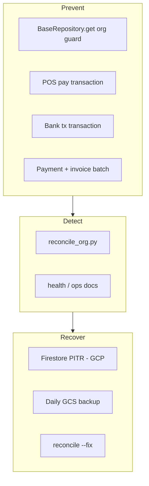

# Design: Data Integrity Wave

## Architecture



---

## D1. Tenant guard (`base.py`)

```python
def get(self, doc_id: str) -> Optional[dict]:
    ...
    if data.get("org_id") != self.org_id:
        return None
```

Optional future: audit log on mismatch (v2).

---

## D2. Firestore transactions

### D2a. Banking (`banking.py` + `services/bank_transactions.py`)

Extract `create_bank_transaction_atomic(org_id, payload)`:

```python
@firestore.transactional
def _create(txn, ...):
    txn.set(tx_ref, tx_data)
    txn.update(account_ref, {"current_balance": new_balance, ...})
```

### D2b. Invoice payment (`invoices.py`)

Use batch:
1. `PaymentReceivedRepository.create`
2. `InvoiceRepository.update` balance in same batch OR transactional read-write on invoice doc.

Firestore transactions require reads before writes on same docs — pattern:

```python
transaction = db.transaction()
@firestore.transactional
def apply_payment(transaction, inv_ref, pay_ref, ...):
    inv_snap = inv_ref.get(transaction=transaction)
    ...
    transaction.update(inv_ref, {...})
    transaction.set(pay_ref, {...})
```

### D2c. POS pay (`pos.py` + `pos_inventory.py`)

`pay_order`: after payment records, call `deduct_inventory_for_order` inside `@firestore.transactional` block that also sets order state — or single service `pos_checkout_atomic`.

Pragmatic v1: use `db.transaction()` wrapping order update + each stock movement read/update.

---

## D3. Reconciliation (`services/reconciliation.py` + `scripts/reconcile_org.py`)

Pure functions:

- `compute_invoice_balance_drift(invoice, payments) -> DriftRow | None`
- `compute_stock_drift(item, movements) -> DriftRow | None`
- `compute_bank_drift(account, transactions) -> DriftRow | None`

CLI prints table + JSON summary file optional `reconcile-{org_id}-{date}.json`.

---

## D4. Ops

- Document PITR in `OPERATIONS_RUNBOOK.md` § Firestore PITR
- Weekly cron: `python scripts/reconcile_org.py --org-id $ORG` for each prod org (or all orgs iterator)

---

## Risk / rollback

- Org guard may surface hidden bugs (404s) where APIs relied on cross-id — fix routes.
- `--fix` only on denormalized fields; never auto-create missing payments.

---

## File map

| File | Action |
|------|--------|
| `backend/app/firestore/base.py` | org guard + list quota log |
| `backend/app/services/bank_transactions.py` | new atomic create |
| `backend/app/api/banking.py` | use service |
| `backend/app/services/invoice_payments.py` | new atomic payment |
| `backend/app/api/invoices.py` | use service |
| `backend/app/services/pos_checkout.py` | new atomic pay |
| `backend/app/api/pos.py` | use pos_checkout |
| `backend/app/services/reconciliation.py` | drift math |
| `backend/scripts/reconcile_org.py` | CLI |
| `backend/tests/test_*` | coverage |
