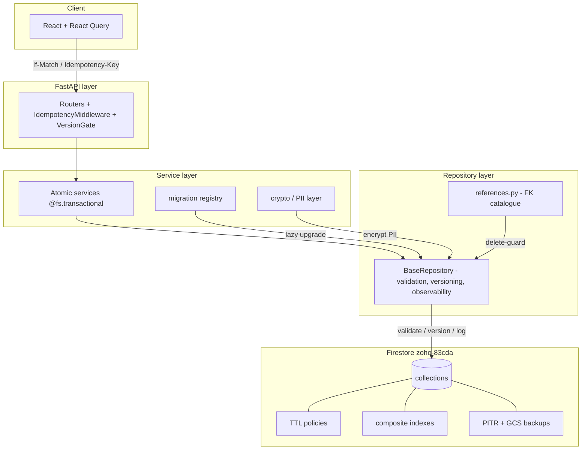

# Design: Database Foundation Excellence

## Architecture overview



---

## V — Schema validation

### Pattern

```python
from pydantic import BaseModel, ConfigDict, Field
from typing import ClassVar

class InvoiceWriteModel(BaseModel):
    model_config = ConfigDict(extra="forbid")
    contact_id: str
    date: str  # YYYY-MM-DD ISO
    due_date: str | None = None
    status: str = Field(default="draft", pattern=r"^(draft|sent|open|paid|void|partially_paid)$")
    total: float = Field(ge=0)
    balance_due: float | None = None
    currency_code: str = Field(default="IQD", min_length=3, max_length=3)
    # ... only fields the API may set
    schema_version: int = 1


class InvoiceRepository(BaseRepository):
    collection_name = "invoices"
    WRITE_MODEL: ClassVar[type[BaseModel]] = InvoiceWriteModel
```

`BaseRepository.create` and `.update` call `cls.WRITE_MODEL.model_validate(payload).model_dump(exclude_unset=True)` before touching Firestore.

### Standard audit fields

Auto-injected by `BaseRepository`:

```python
data["org_id"] = self.org_id
data["created_at"] = data.get("created_at") or fs.SERVER_TIMESTAMP
data["updated_at"] = fs.SERVER_TIMESTAMP
data["created_by"] = self.actor_user_id
data["_version"] = 1
data["schema_version"] = cls.WRITE_MODEL.model_fields["schema_version"].default
```

### Date typing decision matrix

| Field | Type | Reason |
|-------|------|--------|
| `date`, `due_date`, `bill_date`, `payment_date`, `period_start/end` | ISO string `YYYY-MM-DD` | report compatibility, locale-safe |
| `created_at`, `updated_at`, `deleted_at`, `completed_at`, `posted_at` | Firestore `Timestamp` | monotonic, server-side |
| `scheduled_at`, `expires_at` (TTL targets) | Firestore `Timestamp` | required by TTL policy |

### CI lint

`tools/lint_field_types.py` parses every API call to `repo.create({...})` / `repo.update(...)` and flags type-mismatch heuristically (string passed where Timestamp expected, etc.).

---

## S — Schema versioning & migrations

### Registry

```
backend/app/firestore/migrations/
  __init__.py              # MIGRATIONS = {"invoices": [m_v2, m_v3], "contacts": [...]}
  invoices_v2.py           # def migrate(doc) -> dict
  contacts_v2.py
  ...
```

Each migration:

```python
TARGET_VERSION = 2

def migrate(doc: dict) -> dict:
    # idempotent upgrade
    doc["currency_code"] = doc.get("currency_code") or "IQD"
    return doc
```

### Lazy upgrade on read

`BaseRepository.get` after fetch:

```python
current = data.get("schema_version", 1)
target = self.SCHEMA_TARGET_VERSION
if current < target:
    for fn in MIGRATIONS[self.collection_name][current:target]:
        data = fn(data)
    data["schema_version"] = target
    self.collection.document(doc_id).update({"schema_version": target, **changed_fields})
```

### Bulk migration CLI

```bash
python scripts/migrate_collection.py --collection invoices --target 3 --org-id all --apply
```

- Dry-run by default (counts only)
- `--apply` writes
- Streams via `stream_org_docs` (no list cap)
- Resumable via `--resume-from <doc-id>`

---

## C — Optimistic concurrency

### Repository API

```python
class VersionConflict(Exception):
    def __init__(self, current_version: int):
        self.current_version = current_version

def update_versioned(self, doc_id, data, expected_version) -> dict:
    @fs.transactional
    def _tx(tx):
        snap = self.collection.document(doc_id).get(transaction=tx)
        if not snap.exists or snap.to_dict().get("org_id") != self.org_id:
            raise NotFound()
        current = snap.to_dict().get("_version", 1)
        if current != expected_version:
            raise VersionConflict(current)
        tx.update(snap.reference, {**data, "_version": current + 1, "updated_at": fs.SERVER_TIMESTAMP})
        return {"id": doc_id, **snap.to_dict(), **data, "_version": current + 1}
    return _tx(self.db.transaction())
```

### API contract

- Client sends `If-Match: <version>` header **or** `expected_version` body field
- 409 with `{"code":"version_conflict","current_version":N}` body
- Frontend `React Query` mutation:

```ts
const onMutate = async (payload) => {
  const current = qc.getQueryData(['invoice', id]);
  return { previous: current, ifMatch: current._version };
};
```

### Migration plan

1. Phase 1: add `_version` default 1 on next write (no API change)
2. Phase 2: `update_versioned` wrapper alongside `update`
3. Phase 3: API routes switch (invoices, bills, contacts first)
4. Phase 4: legacy `update` deprecated

---

## R — Referential integrity

### FK catalogue (`app/firestore/references.py`)

```python
REFERENCES: dict[str, list[ForeignKey]] = {
    "invoices": [
        FK(field="contact_id", target="contacts", on_delete="restrict"),
        FK(field="account_id_lines.account_id", target="accounts", on_delete="restrict"),
    ],
    "bills": [FK(field="vendor_id", target="contacts", on_delete="restrict")],
    "items": [FK(field="category_id", target="item_categories", on_delete="set_null")],
    # ... full registry
}
```

### Delete guard

`BaseRepository.delete` consults reverse-index `REVERSED[collection]` and:

- `restrict` → raises `ReferenceConflict(referenced_by=[...])`
- `cascade` → opens a transaction batch (warned for large)
- `set_null` → updates referencing docs to null
- `soft_cascade` → marks parent + children `deleted_at`

### Orphan scanner

```bash
python scripts/check_orphans.py --org-id <org>
```

Streams every collection, validates every FK field has a live target. Output: `audit/ORPHANS_<org>.md` + non-zero exit if any.

---

## T — TTL & lifecycle

### Firestore TTL config

`firestore.indexes.json` extension:

```json
"fieldOverrides": [
  { "collectionGroup": "idempotency_keys", "fieldPath": "expires_at",
    "ttl": true,
    "indexes": [{ "queryScope": "COLLECTION", "order": "ASCENDING" }] },
  { "collectionGroup": "sessions", "fieldPath": "expires_at", "ttl": true, "indexes": [...] },
  { "collectionGroup": "rate_limit_buckets", "fieldPath": "expires_at", "ttl": true, "indexes": [...] },
  { "collectionGroup": "ocr_cache", "fieldPath": "expires_at", "ttl": true, "indexes": [...] }
]
```

Deployed via `firebase deploy --only firestore:indexes`.

### Soft-delete purge

`scripts/purge_soft_deleted.py --apply` already exists. Add to scheduler weekly.

---

## A — Distributed counters

### Sharded pattern

```python
NUM_SHARDS = 10

def increment_sharded(org_id: str, counter: str, delta: int = 1):
    shard = random.randint(0, NUM_SHARDS - 1)
    ref = db.collection("counters_sharded").document(f"{org_id}_{counter}_{shard}")
    ref.set({"value": fs.Increment(delta), "org_id": org_id}, merge=True)

def read_sharded(org_id: str, counter: str) -> int:
    docs = db.collection("counters_sharded").where("org_id", "==", org_id) \
        .where(filter=fs.FieldFilter("counter_name","==", counter)).stream()
    return sum(d.to_dict().get("value", 0) for d in docs)
```

Targets: `audit_logs/day`, `chatter_messages`, `posts`, `pos_orders`, `attendance`.

### Materialised GL balances

```
gl_account_balances/{org_id}_{period}_{account_id}
  org_id, account_id, period (YYYY-MM), debit_total, credit_total, balance, updated_at
```

- Updated by `update_gl_balance_atomic` inside JE atomic
- Nightly reconcile job: `scripts/reconcile_gl_balances.py --org X`
- Reports read from materialisation instead of streaming JE lines

---

## I — Idempotency

### Middleware

```python
class IdempotencyMiddleware:
    async def __call__(self, request, call_next):
        key = request.headers.get("Idempotency-Key")
        if not key or request.method not in {"POST","PUT","PATCH","DELETE"}:
            return await call_next(request)
        body_hash = sha256(await request.body()).hexdigest()
        record = idem_repo.get(key)
        if record:
            if record["body_hash"] != body_hash:
                return JSONResponse({"code":"idempotency_conflict"}, 409)
            return JSONResponse(record["response"], record["status"])
        response = await call_next(request)
        idem_repo.create({
            "id": key, "org_id": org_id, "body_hash": body_hash,
            "response": response.body, "status": response.status_code,
            "expires_at": now + timedelta(hours=24),
        })
        return response
```

### Outbox for webhooks

New collection `outbox_events`:

```
{ id, org_id, event_type, payload, dispatched_at, attempts, status }
```

Scheduler dispatches every minute; PoS / e-invoice posting goes through outbox for exactly-once.

---

## E — PII / encryption

### Registry

```python
PII_FIELDS = {
    "users": ["email", "phone", "totp_secret", "backup_codes"],
    "contacts": ["phone", "email", "tax_id", "national_id"],
    "hr_employees": ["national_id", "passport_no", "bank_account", "phone"],
    "iraq_gateway_config": ["api_key", "secret"],
}
```

### Encrypted mixin extension

```python
class ContactRepository(EncryptedFieldsMixin, BaseRepository):
    collection_name = "contacts"
    _ENCRYPTED_FIELDS = ("phone", "email", "tax_id", "national_id")
```

### Audit script

```bash
python scripts/audit_pii_coverage.py
```

Walks `PII_FIELDS` × `BaseRepository` subclasses → flags missing `EncryptedFieldsMixin` or missing `_ENCRYPTED_FIELDS` entry.

### GDPR delete walker

```python
def delete_user_data(org_id, user_id):
    manifest = []
    for coll, fks in REFERENCES.items():
        for fk in fks:
            if fk.target in ("users","contacts") and fk.is_pii_owner:
                docs = repo_for(coll, org_id).find_by(fk.field, user_id)
                for d in docs:
                    repo_for(coll, org_id).anonymise(d["id"], fk.pii_fields)
                    manifest.append({"coll": coll, "id": d["id"]})
    return manifest
```

Manifest signed and stored in GCS for audit.

---

## B — Backup & DR

### Daily backup verification probe

```yaml
# .github/workflows/backup-verify.yml
on: { schedule: [{ cron: '0 6 * * 1' }] }
jobs:
  verify:
    steps:
      - run: python scripts/verify_latest_backup.py --bucket $BACKUP_BUCKET --org-id $PROBE_ORG
```

Script restores latest snapshot to non-prod project, runs accounting smoke (`pytest tests/test_accounting_balance.py`), reports green / red to Slack.

### GCS lifecycle (`infra/gcs/backup-lifecycle.json`)

```json
{ "lifecycle": { "rule": [
  { "action": { "type": "SetStorageClass", "storageClass": "NEARLINE" }, "condition": { "age": 30 } },
  { "action": { "type": "SetStorageClass", "storageClass": "COLDLINE" }, "condition": { "age": 365 } },
  { "action": { "type": "Delete" }, "condition": { "age": 2555 } }
] } }
```

### Cold archive

`archive_fiscal_year.py --org X --year 2024`:
- Copies JE + lines to `journal_entries_archive_2024/` collection
- Reads still route to active collection by year filter; archive query for old data

---

## O — Observability

### Per-request read counter

`get_db()` wrapped:

```python
class CountingFirestore:
    def __init__(self, inner): self.inner, self.reads, self.writes = inner, 0, 0
    def collection(self, name): return CountingCollection(self.inner.collection(name), self)
```

Stored in `contextvars`. Middleware reads counter on response, adds `X-FS-Reads` header and structured log line.

### Slow query log

When `fs_reads > 1000` OR `duration_ms > 500`:

```json
{"level":"WARN","event":"slow_firestore_query","path":"/api/reports/general-ledger",
 "fs_reads":3421,"duration_ms":2150,"org_id":"...","user_id":"..."}
```

### Doc size check

`BaseRepository.create / update`:

```python
size = len(json.dumps(data, default=str).encode("utf-8"))
if size > 600 * 1024:
    logger.warning("doc_size_warning", extra={"coll": self.collection_name, "size": size})
if size > 950 * 1024:
    raise ValueError("doc_size_exceeded")
```

### SLO dashboard

`infra/monitoring/dashboard.json` for Cloud Monitoring:
- p50/p95/p99 list latency per route group
- error rate per route
- Firestore reads/writes per minute
- `list_truncated` counter
- `meta.degraded` counter
- Transaction retry counter

Alert policies in `infra/monitoring/alerts.yaml`.

---

## D — Document size & sub-collection policy

`docs/architecture/COLLECTION_POLICY.md`:

| Collection | Layout | Why |
|------------|--------|-----|
| invoices | root + sub `lines/`, sub `messages/` (chatter) | size + atomic header/lines |
| journal_entries | root + sub `lines/` | already; preserved |
| stock_movements | root | high volume, never embed |
| chatter_messages | root with `parent_collection` + `parent_id` index OR sub-collection per parent | size guarantee |
| audit_logs | root, immutable, TTL | append-only |

### Chatter migration

If any `*.messages` array is found embedded → migration moves to sub-collection (S-registry migration `chatter_split_v2`).

---

## N — Naming lint

`tools/lint_naming.py` (CI):

- Walk `app/firestore/*.py` find `collection_name = "..."` — assert snake_case plural
- Walk every WRITE_MODEL → fields must use `_id` suffix for references (lookup REFERENCES)
- Forbid `tenant_id`, `organization_id`, `companyId` (camelCase), …

---

## Q — Per-tenant quotas

`slowapi` already integrated. New tier:

```python
@limiter.limit("60/minute", key_func=lambda r: f"{r.state.org_id}:pos_sync")
async def pos_sync(...): ...
```

Per-tenant Memorystore (Redis) key namespace `rl:{org_id}:{route}`.

Org usage endpoint:

```
GET /api/platform/orgs/{id}/usage
{ "month": "2026-05", "writes": 12340, "reads": 89231,
  "documents": { "invoices": 421, "bills": 287, ... } }
```

---

## M — Migration framework boot

```python
# app/main.py
@app.on_event("startup")
async def startup():
    if settings.RUN_MIGRATIONS_ON_BOOT:
        from app.firestore.migrations import run_pending
        run_pending(dry_run=not settings.APPLY_MIGRATIONS)
```

Disabled by default in prod (run via dedicated CI job). Tests enable for ephemeral.

---

## K — Testing strategy

### Contract test template

```python
@pytest.mark.parametrize("repo_cls", ALL_REPOS)
def test_repo_create_assigns_required_fields(repo_cls, fake_db):
    repo = repo_cls("org-1")
    payload = sample_payload(repo_cls.WRITE_MODEL)
    out = repo.create(payload)
    assert out["org_id"] == "org-1"
    assert out["_version"] == 1
    assert out["schema_version"] == repo_cls.WRITE_MODEL.model_fields["schema_version"].default
    assert "created_at" in out and "updated_at" in out
```

### Snapshot test for reports

```python
def test_trial_balance_matches_snapshot(seeded_org):
    out = client.get(f"/api/reports/trial-balance?org={seeded_org}").json()
    assert out == load_snapshot("trial_balance.json")
```

Snapshots regenerated only via explicit `pytest --snapshot-update`.

### Property-based balance laws

```python
@given(je_strategy())
def test_je_lines_sum_to_zero(je):
    assert sum(l["debit"] - l["credit"] for l in je.lines) == 0
```

---

## Roll-out order (waves inside this spec)

```
V (validation)   N (naming) Q (quotas)
       \           |          /
       T (TTL)  O (observability)  D (size policy)
              \    |   /
              S (versioning) → M (migration framework)
                       |
                       C (concurrency) ←→ R (refs integrity)
                       |
                       A (distributed counters)  I (idempotency)
                       |
                       E (PII / GDPR coverage)  B (backup verify)
                       |
                       K (test infra + snapshot + property)
```

Most can run in parallel; **S + M** must precede **V** roll-out across all repos.

---

## Out-of-scope (deferred)

- BigQuery exports for analytics — separate spec
- Full event sourcing — too invasive; outbox is the chosen middle ground
- Cassandra / Spanner migration — Firestore is the target store for this product
- Real-time client subscriptions (Firestore listeners) — UX concern, separate spec
