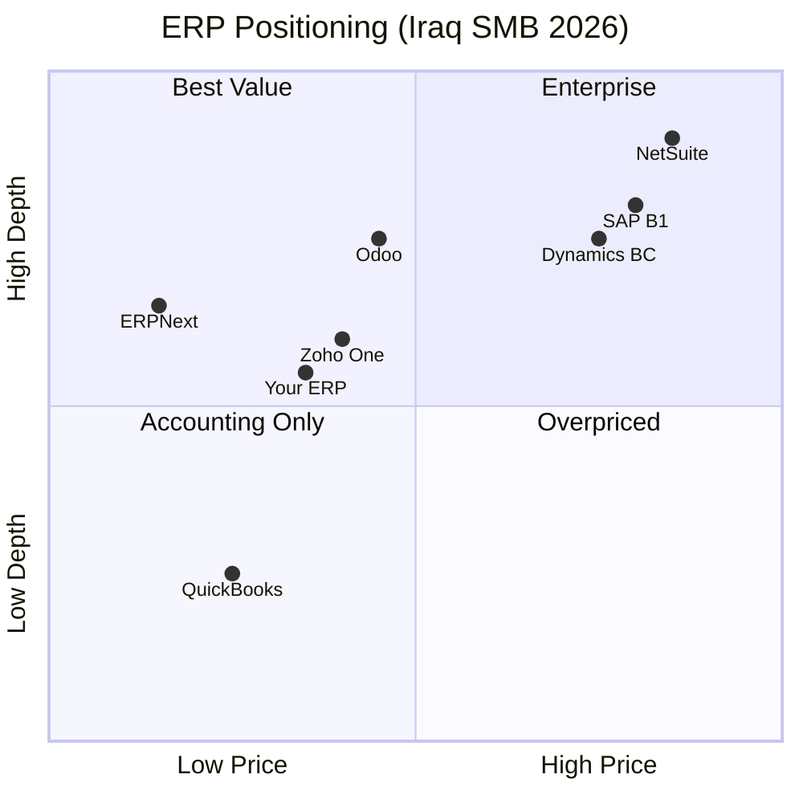

# Design: ERP Competitive Benchmark & Gap Closure

**Version:** 1.0  
**Companion:** `requirements.md`, `tasks.md`

---

## 1. Strategic Position Map



**Target quadrant:** Best Value — depth of unified ERP at Zoho/Odoo price with **Iraq-native** compliance.

---

## 2. Architecture: Maturity Tiers

```
┌─────────────────────────────────────────────────────────────┐
│ Tier 5 — Market-leading (NetSuite/Odoo Enterprise class)    │
├─────────────────────────────────────────────────────────────┤
│ Tier 4 — Production (LAUNCH_DECISION certified)             │
│   accounting, invoices, bills, PO, inventory, POS, RBAC   │
├─────────────────────────────────────────────────────────────┤
│ Tier 3 — Functional (usable with gaps)                      │
│   CRM, HR/payroll, banking, manufacturing basics, reports   │
├─────────────────────────────────────────────────────────────┤
│ Tier 2 — Partial / Preview integrations                     │
│   e-invoice, WhatsApp, OCR, multi-entity UI                │
├─────────────────────────────────────────────────────────────┤
│ Tier 1 — Scaffold (API+page, thin logic)                    │
│   Wave A–D: helpdesk, verticals, IoT, social, eLearning     │
└─────────────────────────────────────────────────────────────┘
```

### Module tier assignment (current)

| Tier | Modules |
|------|---------|
| **4** | GL, AR/AP, inventory, POS terminal, audit, backup, platform console, onboarding |
| **3** | CRM, HR, payroll, banking, taxes, manufacturing nav, projects, marketing basics |
| **2** | e-invoice, WhatsApp, Iraq payments, multi-entity, AI pages, automation rules UI |
| **1** | helpdesk SLA, field service dispatch, subscriptions MRR, healthcare, construction, hotel, social, live chat |

**Design rule:** Nav visibility ≤ tier visibility. Tier 1 hidden from default onboarding.

---

## 3. Feature Comparison Matrix (Detailed)

### 3.1 Core Finance

| Feature | You | Odoo | Zoho | NetSuite | Gap action |
|---------|-----|------|------|----------|------------|
| Double-entry GL | ✅ T4 | ✅ | ✅ | ✅ | Maintain |
| Period lock / close | ✅ | ✅ | ✅ | ✅ | Maintain |
| Multi-currency + reval | ✅ | ✅ | ✅ | ✅ | Maintain |
| Budgets / analytic | ✅ | ✅ | ✅ | ✅ | Polish UX |
| Fixed assets + depreciation | ✅ | ✅ | Add-on | ✅ | Maintain |
| Consolidation | ⚠️ T2 | ✅ Ent | ❌ | ✅ OneWorld | **G-07** |
| Cash flow forecast | ✅ | ✅ | ✅ | ✅ | Maintain |
| Inter-company JE | ❌ | ✅ | ❌ | ✅ | Phase 2 |

### 3.2 Sales & CRM

| Feature | You | Odoo | Zoho | Gap action |
|---------|-----|------|------|------------|
| Quotes → SO → Invoice | ✅ | ✅ | ✅ | Maintain |
| Recurring invoices | ✅ | ✅ | ✅ | Maintain |
| Credit notes | ✅ | ✅ | ✅ | Maintain |
| Pipeline / leads | ✅ T3 | ✅ | ✅✅ | Improve commissions |
| CPQ / configurators | ❌ | ✅ | Add-on | Defer |
| Sales teams / territories | ⚠️ | ✅ | ✅ | Phase 2 |
| Customer portal | ⚠️ | ✅ | ✅ | **Expand portal** |

### 3.3 Inventory & Manufacturing

| Feature | You | Odoo | Zoho | Gap action |
|---------|-----|------|------|------------|
| Multi-warehouse | ✅ | ✅ | ✅ | Maintain |
| Lot/serial tracking | ✅ | ✅ | ✅ | Maintain |
| Barcode | ⚠️ | ✅ | ✅ | Mobile scan **G-08** |
| BOM / MO | ⚠️ T3 | ✅ | ❌/ERP✅ | Deepen MRP |
| MRP scheduler | ❌ | ✅ | ERP only | Phase 2 |
| Quality / CAPA | T1 scaffold | ✅ | ❌ | Wave A when customer |

### 3.4 Platform & Cross-Cutting (Biggest gap vs Odoo)

| Feature | You | Odoo | Priority |
|---------|-----|------|----------|
| Universal Chatter | Partial | ✅ | **P0 G-01** |
| Activities | CRM only | ✅ | **P0 G-02** |
| Followers | ❌ | ✅ | P1 |
| Automated actions | ❌ | ✅ | **P0 G-03** |
| Server actions | ❌ | ✅ | P1 |
| Scheduled jobs UI | Hidden | ✅ | P1 (job-runs exists) |
| Email threading | ❌ | ✅ | P1 G-06 |
| Webhooks out | Partial | ✅ | **P0 G-04** |
| Webhooks in | Partial | ✅ | P1 |
| Studio no-code | T1 page | ✅ | P2 |
| Mail templates | ⚠️ | ✅ | P1 |

Ref: `MASTER_AUDIT_REPORTS/odoo-cross-cutting-2026-q2.md`

---

## 4. Configuration vs Missing Matrix

| Item | Code exists? | Production configured? | Blocker |
|------|--------------|------------------------|---------|
| E-invoice ITA | ✅ | ❌ preview | Portal URL, XSD, credentials |
| WhatsApp | ✅ | ❌ preview | Meta Business API token |
| FIB/Zain payments | ✅ | ❌ stub | Merchant keys |
| Firebase Blaze | ✅ | ⚠️ user upgraded | Monitor quota |
| FIELD_ENCRYPTION_KEY | ✅ | ⚠️ env | Production secret |
| 2FA TOTP | ✅ | ✅ demo owner/admin | — |
| Multi-org switch | ❌ UI | N/A | Not built |
| v1 public API | ⚠️ 5 resources | Partial | Expand G-05 |
| Landing/marketing page | ⚠️ spec | Partial | erp-complete-system Req 1 |

---

## 5. Competitive SWOT

### Strengths
- **Breadth-first architecture** — one codebase, one org_id, module licensing
- **Iraq l10n** ahead of global SaaS (Zoho has GCC not Iraq)
- **Security maturity** — audit hash chain, field encryption, RBAC tests
- **Platform console** — super_admin, impersonation, license editor, module requests
- **UX** — role-adaptive glass, ku/ar/en, 12 persona homes
- **Test discipline** — 585+ pytest, scenario E2E, launch decision documented

### Weaknesses
- **Nav oversells capability** — ~120 routes, ~22% Odoo endpoint coverage
- **Integration surface immature** — API v1 tiny, webhooks partial
- **No mobile app** — responsive web only
- **Automation** — rules UI without universal engine
- **BI** — no Zoho Analytics equivalent
- **Wave modules** — scaffold damages trust if not labeled

### Opportunities
- Zoho ERP India-only 2026 — **MENA window** before Zoho unified ERP arrives
- Iraq digitization — e-invoice, digital payments
- Odoo needs partner for Iraq — you ship turnkey
- Businesses outgrowing QuickBooks
- ERPNext users want better UX

### Threats
- Odoo partners localizing Iraq
- Zoho GCC payroll/VAT for UAE/KSA customers (not Iraq but nearby)
- NetSuite/Odoo on enterprise Iraqi subsidiaries
- Firestore cost at scale vs PostgreSQL ERPs

---

## 6. Recommended Roadmap (Design)

### Horizon 0 — Launch (now)
**Scope:** `production_core` only  
**Message:** "Iraq-ready accounting + sales + inventory + POS"  
**Hide:** Wave tier-1 from default nav profiles

### Horizon 1 — 90 days (Close sale blockers)
| Initiative | Closes gap | Effort |
|------------|------------|--------|
| Integration Health dashboard | Config visibility | S |
| Webhooks tenant UI + events | G-04 | M |
| API v1 → 10 resource groups | G-05 | L |
| Chatter on invoice/bill/PO/item | G-01 | M |
| Module maturity badges | Req 4 | S |
| E-invoice production runbook | Config | S |

### Horizon 2 — 6 months (Competitive parity SMB)
| Initiative | vs competitor |
|------------|---------------|
| Automation engine v1 | Odoo Studio lite |
| Subscriptions + dunning | Zoho Billing |
| Multi-entity switch + basic IC | NetSuite lite |
| Activities universal | Odoo |
| Email outbound templates | All |
| PWA offline POS | Odoo/Zoho mobile |

### Horizon 3 — 12 months (Vertical wins)
Pick **2 verticals** with paying customers only:
- Construction + job costing (KRG growth), OR
- Restaurant complete (KDS + delivery), OR
- Trading/distribution (your core)

Defer: healthcare EMR, hospital, government unless contracted.

---

## 7. Integration Health Panel (Design)

**Location:** Settings → System → Integrations health

```
┌──────────────────────────────────────────────────┐
│ Integration          Status      Action           │
├──────────────────────────────────────────────────┤
│ E-Invoice (ITA)      ⚠ Preview   Configure →     │
│ WhatsApp Business    ⚠ Preview   Add token →     │
│ FIB Payments         ❌ Missing  Setup guide →   │
│ Zain Cash            ❌ Missing  Setup guide →   │
│ SMTP Email           ✅ OK       Test send       │
│ Webhooks outbound    ⚠ Partial   Manage →        │
│ Public API v1        ⚠ Limited   View docs →     │
└──────────────────────────────────────────────────┘
```

**Backend:** `GET /api/settings/integration-health` aggregates config flags from settings bag + env.

---

## 8. API v1 Expansion Design

Current: 5 resources (`v1/router.py`)

Target minimum competitive surface:

```
/api/v1/contacts
/api/v1/items
/api/v1/invoices
/api/v1/bills
/api/v1/purchase-orders
/api/v1/sales-orders
/api/v1/payments
/api/v1/inventory-moves
/api/v1/accounts
/api/v1/journal-entries
```

Pattern: thin controllers → existing services; RFC 7807 errors; cursor pagination; OpenAPI tags.

---

## 9. Documentation Deliverables

| File | Purpose |
|------|---------|
| `docs/strategy/COMPETITIVE_SCORECARD.md` | Living scorecard |
| `docs/ux/MODULE_MATURITY.md` | Tier per module |
| `docs/ops/INTEGRATION_RUNBOOK.md` | Production config steps |
| Link from `docs/ux/ROLES.md` | Strategy cross-ref |

---

## 10. Success Metrics

| Metric | Baseline | 90-day target | 12-month target |
|--------|----------|---------------|-----------------|
| production_core pytest | 585 | 620 | 700 |
| API v1 resources | 5 | 10 | 20 |
| Modules tier ≥3 | ~15 | 18 | 25 |
| Scaffold modules default-hidden | 0 | 100% tier-1 | 100% |
| E-invoice production submits | 0 | 1 pilot org | 10 orgs |
| Competitive score (weighted) | 3.1 | 3.4 | 3.8 |

**Note:** Score 4.0+ requires Wave A depth — don't inflate by nav count alone.

---

## 11. References

- Internal: `MASTER_AUDIT_REPORTS/_MASTER_ROADMAP_TO_100.md` (full Odoo parity — 14mo plan)
- Internal: `LAUNCH_DECISION.md`
- Internal: `.kiro/specs/role-navbar-settings-audit/` (UX audit)
- External: Odoo 19 docs, Zoho ERP India launch 2026, NetSuite OneWorld
