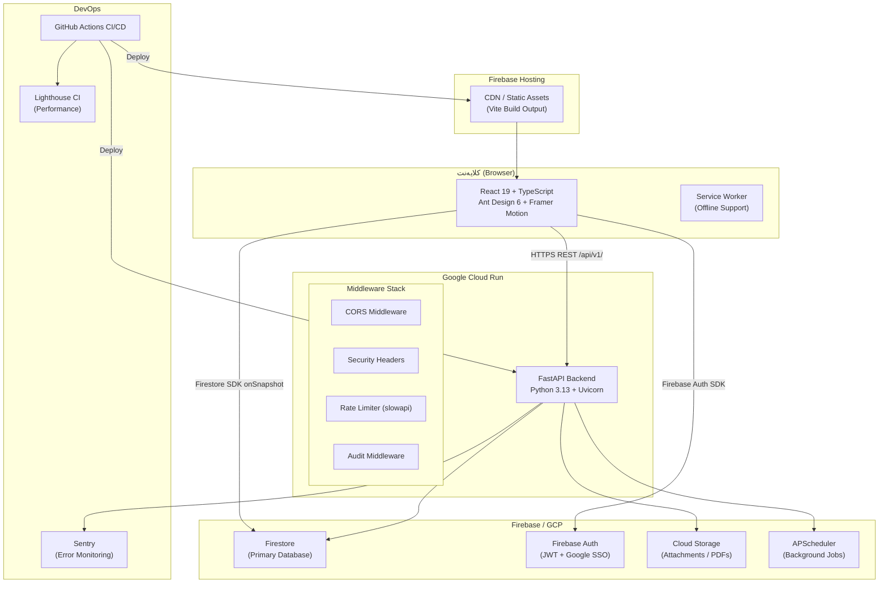
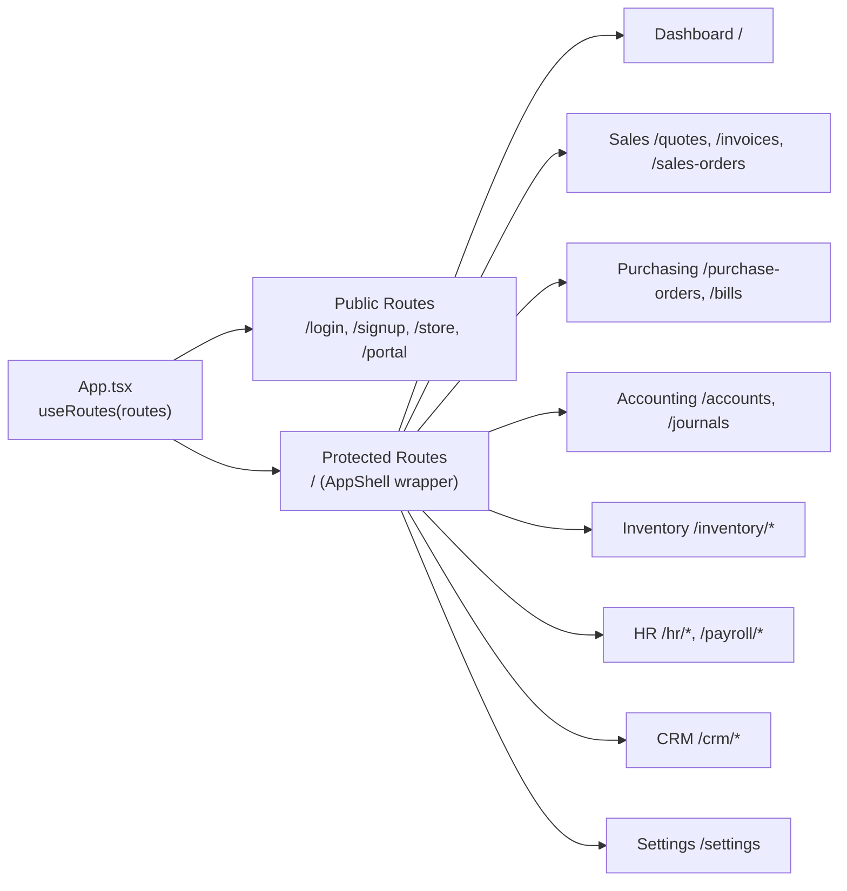
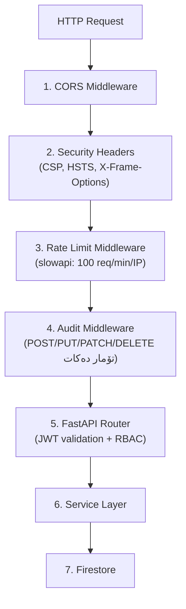
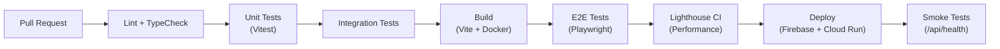
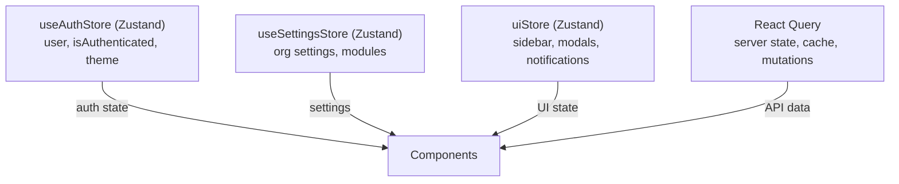
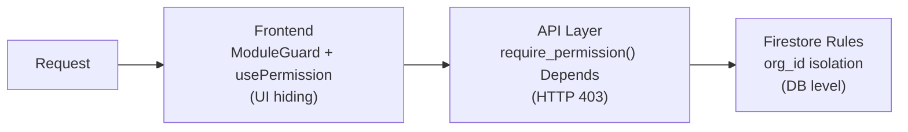
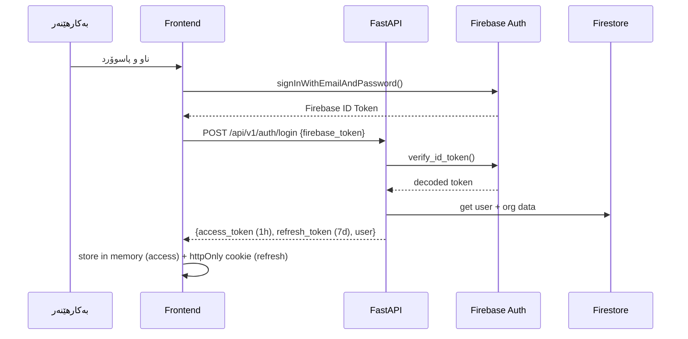
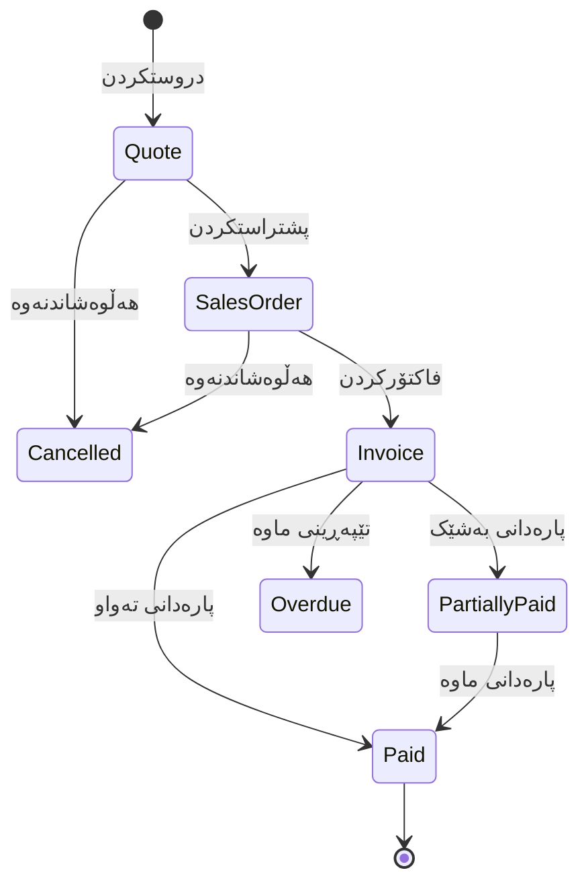
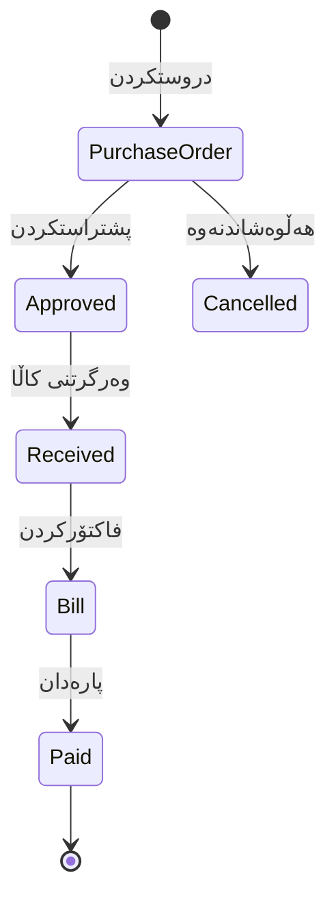
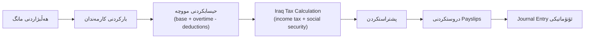

# دۆکیومێنتی دیزاینی تەکنیکی — سیستەمی ERP تەواو

## Overview

ئەم دۆکیومێنتە دیزاینی تەکنیکی تەواوی سیستەمی ERP دیاری دەکات کە لەسەر پرۆژەی ئێستا (React 19/TypeScript + Python/FastAPI + Firebase/Firestore) دروست دەکرێت. ئامانجەکە گەیشتن بە ئاستی پرۆدەکشن لە هەموو لایەنەکاندا — UI/UX، پێرفۆرمانس، سیکوریتی، داتابەیس، مۆدیوڵەکانی کارگێڕی، و تێستینگ.

سیستەمەکە پێکدێت لە:
- **فرۆنتێند:** React 19 SPA لەسەر Firebase Hosting، لەگەڵ Ant Design 6، Framer Motion، و React Router DOM 7
- **بەکێند:** FastAPI (Python 3.13) لەسەر Google Cloud Run، لەگەڵ Firestore وەکو داتابەیسی سەرەکی
- **Auth:** Firebase Auth (JWT + Google SSO + TOTP MFA)
- **مۆدیوڵەکان:** فرۆشتن، کڕین، ئەکاونتینگ، ئینڤێنتۆری، HR/Payroll، CRM

---

## Architecture

### دیاگرامی ئاستی بەرز



### لایەرەکانی سیستەم

| لایەر | تەکنەلۆجیا | ئەرک |
|-------|-----------|------|
| UI Layer | React 19, Ant Design 6, Framer Motion 12 | نیشاندانی ناوەڕۆک، ئینتەراکشن |
| State Layer | Zustand 5, React Query (TanStack) | بەڕێوەبردنی دۆخ، cache |
| Routing Layer | React Router DOM 7 (`useRoutes`) | ناڤبار، code splitting |
| API Layer | FastAPI + Pydantic v2 | REST endpoints، validation |
| Service Layer | Python services | business logic |
| Data Layer | Firestore + firebase-admin | CRUD، real-time |
| Auth Layer | Firebase Auth + python-jose | JWT، SSO، MFA |
| Security Layer | slowapi، CSP headers، RBAC | پاراستن |

### ستراتیژی ڕووتینگ

هەموو ڕووتەکان لە `App.routes.tsx` دیاری دەکرێن و بە `useRoutes` لە `App.tsx` بەکاردێن. ئەمە ئەوەی دەگرێتەوە کە audit script و Playwright sweep هەمان array بەکاردەهێنن.



**Code Splitting:** هەموو پەیجەکان بە `lazy()` wrapper ی کەستەم بارکرێن. Initial bundle < 200KB (gzipped).

### Middleware Stack (ڕیزی جێبەجێکردن)



### CI/CD Pipeline



---

## Components and Interfaces

### فرۆنتێند — پێکهاتەی کۆمپۆنێنت

```
frontend/src/
├── design-system/          # کۆمپۆنێنتە بنچینەییەکان
├── layouts/                # AppShell, SideNav, TopBar, Breadcrumb, CommandPalette
├── components/             # کۆمپۆنێنتە هاوبەشەکان
├── pages/                  # پەیجەکان (100+ پەیج)
├── hooks/                  # useCRUD, usePermission, useFeatureFlag, useFirestoreLive
├── store.ts                # useAuthStore (Zustand)
├── store/settingsStore.ts  # useSettingsStore (Zustand)
└── App.routes.tsx          # ڕووتی سەرەکی
```

**Design System کۆمپۆنێنتە گرینگەکان:**

| کۆمپۆنێنت | بەکارهێنان |
|-----------|-----------|
| `DataTable` | هەموو لیستەکان لەگەڵ sorting، filtering، pagination |
| `PageHeader` | سەرووی هەموو پەیجێک لەگەڵ breadcrumb و actions |
| `KpiCard` | KPI metrics لە داشبۆردەکاندا |
| `FormLayout` | فۆرمەکانی CRUD |
| `EmptyState` | کاتێک داتا نییە |
| `LoadingSkeleton` | skeleton loading بۆ هەموو بەشەکان |
| `StatusTag` | نیشاندانی دۆخی ڕێکۆردەکان |

**State Management:**



**ڕێنمایی:**
- **Zustand:** تەنها بۆ client-side state (auth، UI، settings)
- **React Query:** هەموو server state (API calls، caching، mutations)
- **stale-while-revalidate:** داتای کۆن نیشان دەدرێت تا داتای نوێ دێت

### بەکێند — پێکهاتەی Service Layer

```
backend/app/
├── main.py              # FastAPI app، middleware، router registration
├── config.py            # Pydantic Settings (env vars)
├── firebase_client.py   # Firebase Admin SDK initialization
├── api/                 # 100+ router files
├── services/            # Business logic
├── firestore/           # Data access layer
├── middleware/          # audit.py، rate_limit.py
├── security/            # dependencies.py، permissions.py، roles.py
├── schemas/             # Pydantic models
└── seed/                # chart_of_accounts، currencies، tax_rates
```

**پاتێرنی API Endpoint:**

```python
# api/invoices.py
@router.post("/api/v1/invoices", response_model=InvoiceResponse)
async def create_invoice(
    payload: InvoiceCreate,
    current_user: User = Depends(get_current_user),
    _: None = Depends(require_permission("invoices", "create")),
):
    service = InvoiceService(get_db(), current_user.org_id)
    return await service.create(payload, created_by=current_user.id)
```

**فۆرماتی هەڵەی ستاندارد (RFC 7807):**
```json
{
  "type": "https://erp.example.com/errors/validation-error",
  "title": "Validation Error",
  "status": 422,
  "detail": "Invoice total does not match line items",
  "instance": "/api/v1/invoices/INV-001"
}
```

### API Versioning و Pagination

- هەموو endpoints: `/api/v1/{resource}`
- Authentication: `Authorization: Bearer <JWT>` header
- Cursor-based pagination:

```json
{
  "items": [...],
  "next_cursor": "abc123",
  "has_more": true,
  "total": 450
}
```

### گروپبەندی Endpoints ی گرینگ

| گروپ | Prefix | نموونە |
|------|--------|--------|
| Auth | `/api/v1/auth` | login، register، refresh، logout |
| Sales | `/api/v1/quotes`, `/api/v1/invoices` | CRUD + workflow |
| Purchasing | `/api/v1/purchase-orders`, `/api/v1/bills` | CRUD + 3-way match |
| Accounting | `/api/v1/accounts`, `/api/v1/journals` | CRUD + reports |
| Inventory | `/api/v1/inventory`, `/api/v1/warehouses` | CRUD + movements |
| HR | `/api/v1/hr/employees`, `/api/v1/payroll` | CRUD + runs |
| CRM | `/api/v1/crm/leads`, `/api/v1/crm/pipeline` | CRUD + Kanban |
| RBAC | `/api/v1/rbac/roles` | role management |
| System | `/api/health`, `/api/ready`, `/api/metrics` | ops probes |

### RBAC Enforcement Layers



**Frontend Guard:**
```typescript
const ModuleGuard: React.FC<{ module: string; action: string }> = ({ module, action, children }) => {
  const { can } = usePermission();
  if (!can(module, action)) return <AccessDenied />;
  return <>{children}</>;
};
```

**Firestore Security Rules:**
```javascript
rules_version = '2';
service cloud.firestore {
  match /databases/{database}/documents {
    match /organizations/{orgId}/{document=**} {
      allow read, write: if request.auth != null
        && request.auth.token.org_id == orgId;
    }
  }
}
```

### JWT Auth Flow



### مۆدیوڵی فرۆشتن — Workflow



### مۆدیوڵی کڕین — Workflow



### مۆدیوڵی HR — Payroll Run Flow



### ئەنیمەیشن Strategy (Framer Motion)

```typescript
// PageTransition — هەموو پەیجەکان
const pageVariants = {
  initial: { opacity: 0, y: 8 },
  animate: { opacity: 1, y: 0, transition: { duration: 0.3 } },
  exit: { opacity: 0, y: -8, transition: { duration: 0.2 } }
};

// Modal — scale + fade
const modalVariants = {
  initial: { opacity: 0, scale: 0.95 },
  animate: { opacity: 1, scale: 1, transition: { duration: 0.2 } },
  exit: { opacity: 0, scale: 0.95 }
};

// List stagger — هەر ئایتەمێک 100ms دواکەوتن
const listVariants = {
  animate: { transition: { staggerChildren: 0.1 } }
};
```

### RTL و i18n

```typescript
// App.tsx — ConfigProvider drives all Ant Design RTL
<ConfigProvider direction={isRTL ? 'rtl' : 'ltr'}
  theme={{ token: { fontFamily: isRTL ? "'Noto Sans Arabic'" : "'Inter'" } }}>

// utils/formatters.ts
export const formatMoney = (amount: number, currency = 'IQD') => {
  const locale = i18n.language === 'ku' ? 'ar-IQ' : 'en-US';
  return new Intl.NumberFormat(locale, { style: 'currency', currency }).format(amount);
};
```

---

## Data Models

### ستراکچەری Collection ی Firestore

```
organizations/{org_id}/
├── users/{user_id}
├── contacts/{contact_id}
├── items/{item_id}
├── invoices/{invoice_id}
│   └── lines/{line_id}
├── journal_entries/{entry_id}
│   └── lines/{line_id}
├── stock_moves/{move_id}
├── employees/{employee_id}
├── crm_leads/{lead_id}
├── purchase_orders/{po_id}
├── sales_orders/{so_id}
├── audit_logs/{log_id}
└── settings/{setting_key}
```

### Schema ی `invoices/{invoice_id}`

```typescript
{
  id: string,
  org_id: string,
  number: string,           // INV-2026-0001
  contact_id: string,
  status: 'draft' | 'sent' | 'paid' | 'overdue' | 'cancelled',
  currency: string,         // IQD, USD, EUR
  exchange_rate: number,
  subtotal: number,
  tax_amount: number,
  discount_amount: number,
  total: number,            // P1: = subtotal + tax_amount - discount_amount
  due_date: Timestamp,
  is_deleted: boolean,      // soft delete
  created_by: string,
  created_at: Timestamp,
  updated_at: Timestamp,
}
// lines subcollection: { item_id, description, quantity, unit_price, amount }
```

### Schema ی `journal_entries/{entry_id}`

```typescript
{
  id: string,
  org_id: string,
  number: string,
  date: Timestamp,
  reference: string,
  status: 'draft' | 'posted',
  total_debit: number,      // P2: must equal total_credit
  total_credit: number,
  is_deleted: boolean,
  created_by: string,
  created_at: Timestamp,
}
// lines subcollection: { account_id, debit, credit, description }
```

### Schema ی `stock_moves/{move_id}`

```typescript
{
  id: string,
  org_id: string,
  product_id: string,
  warehouse_id: string,
  location_id: string,
  move_type: 'in' | 'out' | 'transfer',
  quantity: number,
  unit_cost: number,
  reference_type: 'sale' | 'purchase' | 'adjustment' | 'transfer',
  reference_id: string,
  lot_number?: string,
  serial_number?: string,
  is_deleted: boolean,
  created_at: Timestamp,
}
```

### Schema ی `employees/{employee_id}`

```typescript
{
  id: string,
  org_id: string,
  name: string,
  email: string,
  department: string,
  job_title: string,
  hire_date: Timestamp,
  contract_type: 'full_time' | 'part_time' | 'contract',
  base_salary: number,
  currency: string,
  social_security_number?: string,  // Iraq compliance
  is_active: boolean,
  is_deleted: boolean,
}
```

### Schema ی `crm_leads/{lead_id}`

```typescript
{
  id: string,
  org_id: string,
  name: string,
  contact_id?: string,
  stage: 'new' | 'qualified' | 'proposal' | 'negotiation' | 'won' | 'lost',
  probability: number,      // 0-100
  expected_revenue: number,
  assigned_to: string,
  score: number,            // lead scoring
  source: string,
  is_deleted: boolean,
  created_at: Timestamp,
}
```

### Firestore Indexes

```
# Composite indexes پێویست
invoices: [org_id ASC, status ASC, due_date DESC]
invoices: [org_id ASC, contact_id ASC, created_at DESC]
journal_entries: [org_id ASC, date DESC, status ASC]
stock_moves: [org_id ASC, product_id ASC, created_at DESC]
stock_moves: [org_id ASC, warehouse_id ASC, move_type ASC]
crm_leads: [org_id ASC, stage ASC, assigned_to ASC]
audit_logs: [org_id ASC, user_id ASC, created_at DESC]
```

### Double-Entry Accounting Pattern

```python
# هەموو کردارە دارایییەکان journal entry دروست دەکەن
# نموونە: فرۆشتن
debit:  Accounts Receivable  +100,000 IQD
credit: Sales Revenue        +100,000 IQD

# نموونە: پارەدان
debit:  Cash/Bank            +100,000 IQD
credit: Accounts Receivable  +100,000 IQD
```

### Stock Balance Calculation

```python
# services/inventory.py
def get_stock_balance(product_id: str, warehouse_id: str) -> Decimal:
    moves = get_stock_moves(product_id, warehouse_id)
    initial = get_initial_stock(product_id, warehouse_id)
    in_qty = sum(m.quantity for m in moves if m.move_type == 'in')
    out_qty = sum(m.quantity for m in moves if m.move_type == 'out')
    return initial + in_qty - out_qty  # P3 invariant
```

---

## Correctness Properties

تایبەتمەندییەکانی دروستی کە دەبێت بە property-based testing پشتراست بکرێن:

### Property 1: دروستی Invoice Total

**Validates: Requirements 8.1, 8.2, 8.4**

```
∀ invoice i: i.total = sum(i.lines[*].amount) + i.tax_amount - i.discount_amount
```

**جێبەجێکردن:** `computeInvoiceTotal()` لە `frontend/src/utils/formatters.ts`

```typescript
// fast-check PBT
test('P1: invoice total = subtotal + tax - discount', () => {
  fc.assert(fc.property(
    fc.record({
      lines: fc.array(fc.record({
        quantity: fc.float({ min: 0.01, max: 1000 }),
        unit_price: fc.float({ min: 0, max: 1_000_000 }),
      }), { minLength: 1 }),
      tax_rate: fc.float({ min: 0, max: 0.25 }),
      discount_amount: fc.float({ min: 0, max: 100_000 }),
    }),
    ({ lines, tax_rate, discount_amount }) => {
      const subtotal = lines.reduce((s, l) => s + l.quantity * l.unit_price, 0);
      const tax_amount = subtotal * tax_rate;
      const total = subtotal + tax_amount - discount_amount;
      const computed = computeInvoiceTotal(lines, tax_rate, discount_amount);
      return Math.abs(computed.total - total) < 0.01;
    }
  ));
});
```

### Property 2: هاوسەنگی Journal Entry

**Validates: Requirements 10.1, 10.3**

```
∀ journal_entry j: sum(j.debits) = sum(j.credits)
```

**جێبەجێکردن:** `validateJournalBalance()` لە `backend/app/services/accounting.py`

```typescript
// fast-check PBT
test('P2: journal entry debits = credits', () => {
  fc.assert(fc.property(
    fc.array(fc.record({
      debit: fc.float({ min: 0, max: 1_000_000 }),
      credit: fc.float({ min: 0, max: 1_000_000 }),
    }), { minLength: 2 }),
    (lines) => {
      const totalDebit = lines.reduce((s, l) => s + l.debit, 0);
      const totalCredit = lines.reduce((s, l) => s + l.credit, 0);
      const entry = createJournalEntry(lines);
      return entry.is_balanced === (Math.abs(totalDebit - totalCredit) < 0.01);
    }
  ));
});
```

### Property 3: دروستی Stock Balance

**Validates: Requirements 11.1, 11.7**

```
∀ product p, warehouse w: stock_balance(p, w) = initial_stock + sum(in_movements) - sum(out_movements)
```

**جێبەجێکردن:** `computeStockBalance()` لە `backend/app/services/inventory.py`

```typescript
test('P3: stock balance = initial + in - out', () => {
  fc.assert(fc.property(
    fc.record({
      initial: fc.float({ min: 0, max: 10_000 }),
      moves: fc.array(fc.record({
        type: fc.constantFrom('in', 'out'),
        qty: fc.float({ min: 0.01, max: 1000 }),
      }), { minLength: 0, maxLength: 50 }),
    }),
    ({ initial, moves }) => {
      const inQty = moves.filter(m => m.type === 'in').reduce((s, m) => s + m.qty, 0);
      const outQty = moves.filter(m => m.type === 'out').reduce((s, m) => s + m.qty, 0);
      const expected = initial + inQty - outQty;
      const computed = computeStockBalance(initial, moves);
      return Math.abs(computed - expected) < 0.001;
    }
  ));
});
```

### Property 4: RBAC Invariants

**Validates: Requirements 14.1, 14.4, 14.7**

```
∀ user u, resource r, action a:
  can_access(u, r, a) ↔ ∃ role ∈ u.roles: permission(role, r, a) = true
```

**جێبەجێکردن:** `checkPermission()` لە `backend/app/security/permissions.py`

```typescript
test('P4: access iff role has permission', () => {
  fc.assert(fc.property(
    fc.record({
      roles: fc.array(fc.constantFrom('admin', 'manager', 'viewer', 'accountant'), { minLength: 1 }),
      resource: fc.constantFrom('invoices', 'journals', 'employees'),
      action: fc.constantFrom('create', 'read', 'update', 'delete'),
    }),
    ({ roles, resource, action }) => {
      const canAccess = checkPermission(roles, resource, action);
      const hasRole = roles.some(r => ROLE_PERMISSIONS[r]?.[resource]?.includes(action));
      return canAccess === hasRole;
    }
  ));
});
```

### Property 5: دروستی Audit Trail

**Validates: Requirements 6.6, 14.8**

```
∀ action a performed by user u: ∃ audit_log_entry e: e.user_id = u.id ∧ e.action = a ∧ e.timestamp ≤ now()
```

**جێبەجێکردن:** `audit_middleware` لە `backend/app/middleware/audit.py`

```python
# Hypothesis PBT
@given(
    action=st.sampled_from(['create', 'update', 'delete']),
    resource=st.sampled_from(['invoices', 'journals', 'employees']),
)
def test_p5_audit_trail_completeness(action, resource, test_client, auth_headers):
    response = test_client.post(f"/api/v1/{resource}", headers=auth_headers, json={})
    logs = get_audit_logs(resource_type=resource)
    assert any(l.action == action for l in logs)
```

### Property 6: دروستی Token Expiry

**Validates: Requirements 2.8, 6.3**

```
∀ JWT token t: is_valid(t) ↔ t.exp > now() ∧ t.signature_valid ∧ ¬is_revoked(t)
```

**جێبەجێکردن:** `verify_token()` لە `backend/app/services/auth.py`

```python
@given(exp_offset=st.integers(min_value=-3600, max_value=3600))
def test_p6_jwt_validity(exp_offset):
    token = create_token(exp_offset=exp_offset)
    is_valid = verify_token(token)
    expected_valid = exp_offset > 0
    assert is_valid == expected_valid
```

---

## Error Handling

### فرۆنتێند — Error Handling Strategy

**1. API Errors (React Query):**
```typescript
// هەموو mutations بە onError callback
const mutation = useMutation({
  mutationFn: createInvoice,
  onError: (error: ApiError) => {
    if (error.status === 422) {
      // Validation errors — نیشاندانی inline لە فۆرم
      setFieldErrors(error.detail);
    } else if (error.status === 403) {
      message.error(t('errors.access_denied'));
    } else {
      message.error(t('errors.server_error'));
      Sentry.captureException(error);
    }
  },
});
```

**2. ErrorBoundary:**
```typescript
// components/ErrorBoundary.tsx — هەموو پەیجەکان پێچاوپێچ دەکرێن
// کاتی crash: friendly error page نیشان دەدرێت + Sentry report
```

**3. Network Offline:**
```typescript
// design-system/ConnectionStatus.tsx
// WHERE بەکارهێنەر ئینتەرنێتی لەدەست دات، offline indicator نیشان دەدرێت
```

**4. 404 و Navigation Errors:**
```typescript
// pages/NotFound.tsx — catch-all route { path: '*' }
// جوان و لەگەڵ لینکی گەڕانەوە بۆ داشبۆرد
```

### بەکێند — Error Handling Strategy

**1. Validation Errors (Pydantic):**
```python
# FastAPI automatically returns 422 with field-level errors
# Pydantic v2 validators بۆ business rules
@validator('total')
def validate_total(cls, v, values):
    expected = values.get('subtotal', 0) + values.get('tax_amount', 0) - values.get('discount_amount', 0)
    if abs(v - expected) > 0.01:
        raise ValueError('Invoice total does not match line items')
    return v
```

**2. Business Logic Errors:**
```python
# services/ — custom exceptions
class InsufficientStockError(Exception): ...
class UnbalancedJournalError(Exception): ...
class DuplicateInvoiceError(Exception): ...

# api/ — exception handlers
@app.exception_handler(InsufficientStockError)
async def stock_error_handler(request, exc):
    return JSONResponse(status_code=400, content={
        "type": "insufficient-stock",
        "title": "Insufficient Stock",
        "status": 400,
        "detail": str(exc)
    })
```

**3. Auth Errors:**
```python
# 401: token expired یان invalid
# 403: permission denied
# 429: rate limit exceeded (slowapi)
```

**4. Firestore Errors:**
```python
# Retry logic بۆ transient errors
# Circuit breaker pattern بۆ extended outages
```

---

## Testing Strategy

### Test Pyramid

```
         /\
        /E2E\          Playwright (critical paths)
       /------\
      /  Integ  \      Vitest + Testing Library (API + components)
     /------------\
    /   Unit Tests  \  Vitest (utils, services, hooks)
   /------------------\
  /  Property-Based    \ fast-check + Hypothesis (P1-P6 invariants)
 /----------------------\
```

### Unit Tests (Vitest)

- هەموو utility functions لە `frontend/src/utils/`
- هەموو custom hooks لە `frontend/src/hooks/`
- هەموو Zustand stores
- هەموو Python services لە `backend/app/services/`
- کەمترین ٨٠٪ coverage

### Integration Tests

**Frontend:**
```typescript
// Vitest + Testing Library
// هەموو form components لەگەڵ validation
// هەموو API hooks لەگەڵ MSW mocking
```

**Backend:**
```python
# pytest + httpx TestClient
# هەموو API endpoints لەگەڵ Firestore emulator
# هەموو services لەگەڵ mock Firestore
```

### E2E Tests (Playwright)

```typescript
// tests/e2e/critical-paths.spec.ts
test.describe('Critical User Journeys', () => {
  test('Sales: Quote → Invoice → Payment', async ({ page }) => { ... });
  test('Purchasing: PO → Receive → Bill → Pay', async ({ page }) => { ... });
  test('Accounting: Journal Entry balanced', async ({ page }) => { ... });
  test('Inventory: Stock movement updates balance', async ({ page }) => { ... });
  test('Auth: Login → MFA → Dashboard', async ({ page }) => { ... });
  test('RBAC: Viewer cannot create invoice', async ({ page }) => { ... });
  test('Navigation: All nav links resolve (no 404)', async ({ page }) => { ... });
});
```

### Performance Tests (Lighthouse CI)

```json
// frontend/lighthouserc.json
{
  "ci": {
    "assert": {
      "assertions": {
        "first-contentful-paint": ["error", { "maxNumericValue": 1500 }],
        "largest-contentful-paint": ["error", { "maxNumericValue": 2500 }],
        "cumulative-layout-shift": ["error", { "maxNumericValue": 0.1 }]
      }
    }
  }
}
```

### Security Tests (OWASP ZAP)

```yaml
# .github/workflows/ci.yml
- name: OWASP ZAP Scan
  uses: zaproxy/action-full-scan@v0.10.0
  with:
    target: 'https://staging.erp.example.com/api/v1'
```

### Property-Based Tests — خلاصە

| تایبەتمەندی | تێستینگ Framework | فایل |
|------------|------------------|------|
| P1: Invoice Total | fast-check (TS) | `frontend/src/utils/__tests__/invoice.pbt.test.ts` |
| P2: Journal Balance | fast-check (TS) + Hypothesis (Py) | `backend/tests/test_pbt_accounting.py` |
| P3: Stock Balance | fast-check (TS) + Hypothesis (Py) | `backend/tests/test_pbt_inventory.py` |
| P4: RBAC Invariants | fast-check (TS) + Hypothesis (Py) | `backend/tests/test_pbt_rbac.py` |
| P5: Audit Trail | Hypothesis (Py) | `backend/tests/test_pbt_audit.py` |
| P6: JWT Validity | Hypothesis (Py) | `backend/tests/test_pbt_auth.py` |

### Performance Strategy

**Code Splitting:**
```typescript
// Vite config: manualChunks
{
  'vendor-react': ['react', 'react-dom', 'react-router-dom'],
  'vendor-antd': ['antd', '@ant-design/icons'],
  'vendor-charts': ['recharts'],
  'vendor-motion': ['framer-motion'],
}
```

**React Query Caching:**
```typescript
const queryClient = new QueryClient({
  defaultOptions: {
    queries: {
      staleTime: 5 * 60 * 1000,      // 5 خولەک
      gcTime: 30 * 60 * 1000,         // 30 خولەک
      refetchOnWindowFocus: true,
      retry: 2,
    },
  },
});
```

**Virtual Scrolling:** `<Table virtual scroll={{ y: 600 }} />` بۆ لیستەکانی زیاتر لە ١٠٠ ئایتەم.

### Deployment Architecture

**Docker:**
```dockerfile
FROM python:3.13-slim
WORKDIR /app
COPY requirements.txt .
RUN pip install --no-cache-dir -r requirements.txt
COPY . .
EXPOSE 8080
CMD ["uvicorn", "app.main:app", "--host", "0.0.0.0", "--port", "8080", "--workers", "2"]
```

**Zero-Downtime:**
- Cloud Run: traffic splitting (10% → 50% → 100%)
- Firebase Hosting: atomic deploys
- Rollback: `gcloud run services update-traffic --to-revisions=PREV=100`

**Health Probes:**

| Endpoint | مەبەست |
|----------|--------|
| `/api/health` | Liveness probe |
| `/api/ready` | Readiness (Firestore check) |
| `/api/metrics` | Ops monitoring |
| `/api/version` | Build info |
