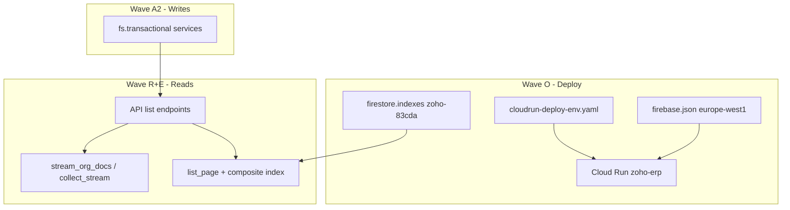

# Design: Firestore Depth Remediation

## Architecture



---

## Wave O: Deploy alignment

### O1 Region

| Component | Region |
|-----------|--------|
| Firebase Hosting rewrite | `europe-west1` (`firebase.json`) |
| Cloud Run service | **`europe-west1`** (change CI from `me-central1`) |
| Firestore | `eur3` (paired) |

### O2 Environment file

Merge `cloudrun-deploy-env.yaml` into deploy workflow:

```yaml
ENVIRONMENT: production
FIREBASE_PROJECT_ID: zoho-83cda
DATABASE_URL: firestore://default
USE_FIRESTORE_QUERY: "true"
SEARCH_PREFIX_ENABLED: "false"  # flip in staging first
SCHEDULER_ENABLED: "true"
CORS_ORIGINS: ...
```

Secrets remain `--set-secrets` for `SECRET_KEY`, `FIELD_ENCRYPTION_KEY`.

### O5 Index deploy

`deploy-firestore.yml` MUST use `project: zoho-83cda` (document in workflow comment + secret name `FIRESTORE_PROJECT_ID`).

---

## Wave R: Reports refactor pattern

### Helper module: `report_queries.py`

```python
def journal_entries_in_range(org_id, start, end) -> Iterator[dict]:
    # Firestore: org_id + date >= start + date <= end + status filter in Python if needed
    ...

def stream_invoices(org_id, *, status_in=None, date_from=None, date_to=None):
    return stream_org_filtered(repo, status_in=status_in, ...)
```

### N+1 mitigation options

| Option | When | Tradeoff |
|--------|------|----------|
| **A. Batch line reads** | Short-term | Still O(n) reads, fewer round trips |
| **B. Denormalized totals on JE header** | Medium | Write path must maintain |
| **C. `gl_account_balances/{period}` materialized** | Long-term | Best for TB/P&L |

**Phase 1:** date-indexed JE query + cap warning; batch `get_lines` in chunks of 50.

### Duplicate aging

- Keep `receivable_aging` implementation (`collect_stream`)
- Make `aged_receivable` call shared `build_aged_ar(org_id)`

---

## Wave Ix: Index manifest additions

Add to `firestore.indexes.json`:

```json
{ "collectionGroup": "expenses", "fields": [
  {"fieldPath": "org_id", "order": "ASCENDING"},
  {"fieldPath": "date", "order": "DESCENDING"}
]},
{ "collectionGroup": "payments_received", ... },
{ "collectionGroup": "payments_made", ... },
{ "collectionGroup": "invoices", "fields": [
  {"fieldPath": "org_id", "order": "ASCENDING"},
  {"fieldPath": "status", "order": "ASCENDING"},
  {"fieldPath": "date", "order": "DESCENDING"}
]},
{ "collectionGroup": "contacts", "fields": [
  {"fieldPath": "org_id", "order": "ASCENDING"},
  {"fieldPath": "display_name", "order": "ASCENDING"}
]}
```

Keep existing `due_date` index for overdue scheduler jobs.

---

## Wave A2: Atomic services (new)

| Service | Encapsulates |
|---------|--------------|
| `warehouse_move_atomic.py` | validate_stock_move, picking done |
| `pos_sync_inventory_atomic.py` | sync path stock deduct |
| `fiscal_close_atomic.py` | year close JE + fiscal year + lock |
| `journal_entry_atomic.py` | JE + line batch + account increments |
| `payroll_post_je_atomic.py` | JE + lines + run link |
| `grn_receive_atomic.py` | PO + lots + stock |
| `po_convert_bill_atomic.py` | bill + lines + PO link |

Pattern: same as `invoice_payments.py` — `@fs.transactional`, `assert_org_doc`, cache invalidation after commit.

---

## Wave E: Export streaming

```python
def export_collection(org_id, collection, writer, *, filters=None):
    repo = repo_for(collection, org_id)
    for doc in repo.stream_org_docs():
        if filters and not matches(doc, filters):
            continue
        writer.writerow(flatten(doc))
```

Progress: SSE or job id for large exports (P2).

---

## Dual-filter invoices fix (Ix5)

**Option A (recommended):** Document API — only one equality filter per request when `USE_FIRESTORE_QUERY=true`.

**Option B:** Two-step query — query by `contact_id`, filter `status` in Python (contact usually smaller set).

---

## What we explicitly do NOT fix in this wave

- Full Odoo-scale GL materialization (R8 P2 only)
- All 18 industry scaffold files (Wave S defer)
- Algolia/Typesense production integration (J3)
- Per-org Redis rate limit middleware (only slowapi global via H2)
