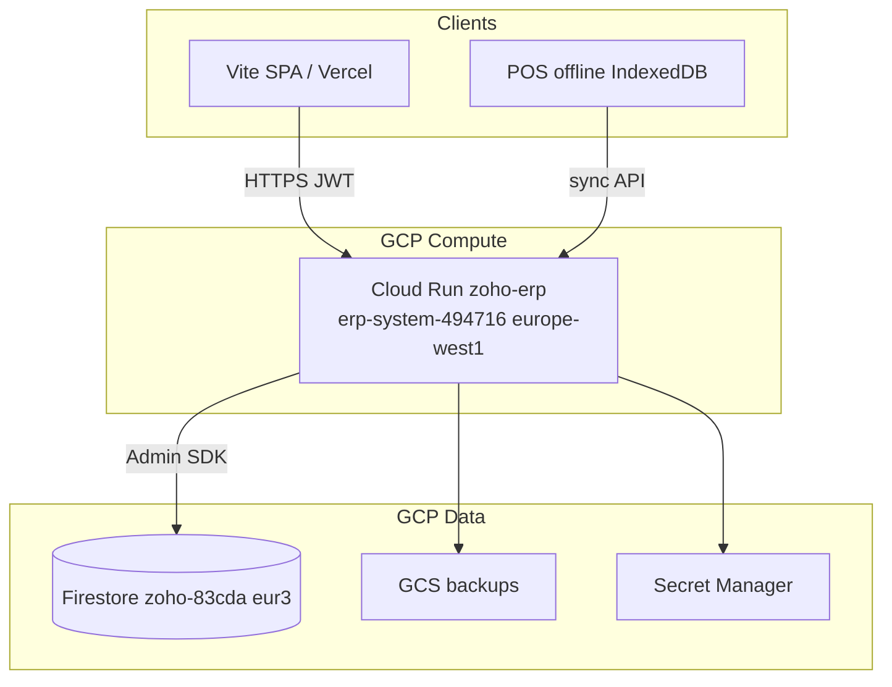

# Design: Firestore Performance & Resilience Wave

## Architecture today



| Layer | Responsibility |
|-------|----------------|
| API | Tenant scope via `user["org_id"]`, RBAC, business logic |
| Repository | CRUD; **legacy** full-org scan in `list()` |
| Integrity services | Atomic checkout/payment; reconcile |
| Rules | Client SDK guard (if used); Admin SDK bypasses |

---

## Wave 0 — Baseline (no code in this wave)

Already shipped — see `data-integrity-wave`. Regression tests:

- `test_repository_org_guard.py`
- `test_reconcile_org.py`, `test_bill_payments.py`
- `test_shopkeeper_*`, `test_platform_reconcile.py`

---

## D1. `list()` evolution — phased

### Phase A — Observability (P0, small diff)

**File:** `backend/app/firestore/base.py`

```python
_LIST_HARD_CAP = 10_000

def list(...):
    ...
    truncated = len(all_items) >= _LIST_HARD_CAP
    if truncated:
        logger.warning("list_truncated collection=%s org_id=%s cap=%s", ...)
    return items, total  # total annotated in meta at API layer
```

**File:** `backend/app/services/firestore_resilience.py` (extend)

```python
class ListResultMeta:
    truncated: bool
    quota_degraded: bool
```

API wrappers for invoices/bills/items append:

```json
{ "items": [], "total": 0, "meta": { "truncated": true, "degraded": false } }
```

On quota: raise `FirestoreQuotaError` OR set `degraded: true` — **design choice: degraded flag** on list responses to avoid breaking all clients with 503.

### Phase B — `list_all_batched()` for jobs (P0)

For reconcile, exports, reports:

```python
def stream_org_docs(self, *, batch_size=500) -> Iterator[dict]:
    query = self.collection.where("org_id", "==", self.org_id)
    last = None
    while True:
        q = query.limit(batch_size)
        if last:
            q = q.start_after(last)
        batch = list(q.stream())
        if not batch:
            break
        for doc in batch:
            yield {"id": doc.id, **doc.to_dict()}
        last = batch[-1]
```

`run_reconcile_for_org()` switches to `stream_org_docs` — removes false negatives when org >10k movements.

### Phase C — Server-side `list_page()` (P1)

New module: `backend/app/firestore/query.py`

```python
def list_page(repo, *, filters: list, order_by: str, direction: str,
              limit: int, cursor_id: str | None) -> PageResult:
    q = repo.collection.where("org_id", "==", repo.org_id)
    for f in filters:
        q = q.where(f.field, f.op, f.value)
    q = q.order_by(order_by, direction=...)
    if cursor_id:
        q = q.start_after(repo.collection.document(cursor_id))
    docs = list(q.limit(limit + 1).stream())
    has_more = len(docs) > limit
    ...
```

**Index:** add to `firestore.indexes.json` per query shape; deploy with rules.

**Rollout order:** invoices → bills → bank_transactions → items → stock_movements → contacts.

Legacy `list()` remains for low-volume modules until migrated.

---

## D2. Atomic flows (integrity extension)

| ID | Service | Pattern |
|----|---------|---------|
| 2.1 | `services/po_receive.py` | transaction: GRN doc + item stock reads + movement writes + PO line qty |
| 2.2 | `services/bill_approve.py` | transaction: bill status + JE refs or batch JE + lines |
| 2.3 | `bank_matching_service.py` | call `create_payment_received_atomic` / `apply_invoice_payment_atomic` instead of separate creates |
| 2.4 | `services/stock_transfer.py` | transaction: both warehouse stock docs |
| 2.5 | `services/inventory_adjustment.py` | transaction: adjustment + movements |

Shared helper: `backend/app/services/firestore_tx.py`

```python
def assert_org(snapshot, org_id: str) -> dict:
    data = snapshot.to_dict() or {}
    if data.get("org_id") != org_id:
        raise TenantMismatchError(...)
    return data
```

---

## D3. Reconcile v2

**File:** `backend/app/services/reconciliation.py`

```python
def compute_stock_drift(item, movements, *, opening: float = 0.0) -> DriftRow | None:
    computed = opening + sum(movements)
```

Item schema (backward compatible):

```python
"opening_stock": 0.0  # optional; default 0
```

**Optional audit collection:**

```
reconcile_runs/{runId}: org_id, started_at, drift_count, drifts[], triggered_by
```

---

## D4. Index alignment

Audit script: `tools/verify_firestore_indexes.py`

- Parse `collection_name` from each `BaseRepository` subclass
- Compare to `firestore.indexes.json` collectionGroup entries
- Fail CI on `stock_moves` vs `stock_movements` mismatch

**Fix index file:**

```json
{
  "collectionGroup": "stock_movements",
  "fields": [
    { "fieldPath": "org_id", "order": "ASCENDING" },
    { "fieldPath": "item_id", "order": "ASCENDING" },
    { "fieldPath": "created_at", "order": "DESCENDING" }
  ]
}
```

---

## D5. Security & rules

No removal of nested `organizations/{orgId}` rules in v1 — dual path.

**Client guidance doc:** `docs/firestore/CLIENT_PATHS.md`

- Backend writes: `db.collection("invoices").doc(id)`
- Client reads: same, with rules `tenantDocRead()`

**users.py fix:**

```python
docs = self.collection.where("org_id", "==", self.org_id).where("email", "==", email).limit(1)
```

If email is globally unique across orgs, document exception in requirements.

---

## D6. Cache hardening

```python
# base.py get()
if data.get("org_id") != self.org_id:
    cache.delete(cache_key)
    return None
```

---

## D7. Soft-delete purge

Scheduler job (existing or new): scan `deleted_at < now-30d` per collection using **batched** `stream_org_docs`, hard delete.

Avoid `list(10000)` for purge.

---

## D8. Counter documents (dashboard)

**Collection:** `org_counters/{orgId}`

```json
{
  "invoices_open": 42,
  "bills_unpaid": 7,
  "updated_at": "..."
}
```

Increment via `firestore.Increment` in same transaction as status change on invoice/bill.

Dashboard `/api/dashboard` reads one doc instead of `invoice_repo.list()`.

---

## D9. Rate limiting (P2)

Optional Redis:

```
RATE_LIMIT_BACKEND=redis
REDIS_URL=...
```

Middleware delegates to shared store when configured.

---

## D10. Ops & monitoring

**Log-based metrics (no new infra v1):**

- Filter Cloud Logging: `list_truncated`, `Firestore quota`
- Alert policy: >10 occurrences / 5 min

**Runbook section:** `OPERATIONS_RUNBOOK.md` § Firestore performance

---

## D11. API v1 alignment

Extend existing:

- `backend/app/api/v1/invoices.py`
- `backend/app/api/v1/pagination.py`

Tenant list endpoints return:

```json
{
  "items": [],
  "next_cursor": "inv_abc",
  "has_more": true,
  "meta": { "truncated": false }
}
```

Deprecate `page` + `offset` in OpenAPI description for v1.

---

## D12. Testing strategy

| Test | Purpose |
|------|---------|
| `test_list_truncated_warning` | cap=10k emits meta |
| `test_list_page_invoices` | mock Firestore query chain |
| `test_po_receive_atomic` | rollback on stock failure |
| `test_reconcile_streaming` | >10k movements mocked |
| `test_users_email_org_scoped` | users repo |
| `test_index_manifest_sync` | indexes.json vs repos |

---

## File map (implementation)

| File | Action |
|------|--------|
| `backend/app/firestore/base.py` | truncation meta, cache delete on mismatch, stream_org_docs |
| `backend/app/firestore/query.py` | new list_page |
| `backend/app/services/reconciliation.py` | opening_stock, stream reconcile |
| `backend/app/services/po_receive.py` | new atomic |
| `backend/app/services/bill_approve.py` | new atomic |
| `backend/app/services/bank_matching_service.py` | use atomic payment helpers |
| `backend/app/firestore/users.py` | org_id on email query |
| `firestore.indexes.json` | fix collection names + new indexes |
| `tools/verify_firestore_indexes.py` | new |
| `docs/firestore/CLIENT_PATHS.md` | new |
| `OPERATIONS_RUNBOOK.md` | topology, cron, alerts |
| `MASTER_AUDIT_REPORTS/firestore-performance-2026-05.md` | sign-off report |

---

## Risk register

| Risk | Mitigation |
|------|------------|
| Changing list() breaks tests expecting total | meta.truncated; gradual migration |
| Index deploy delay | query falls back to Python list with warning |
| Atomic transaction size >500 ops | split batches; document line limits |
| Counter drift | nightly reconcile job |

---

## Out of scope (explicit)

- PostgreSQL migration
- Full Algolia integration
- Rewriting `reports.py` (27 list calls) in one PR — incremental
