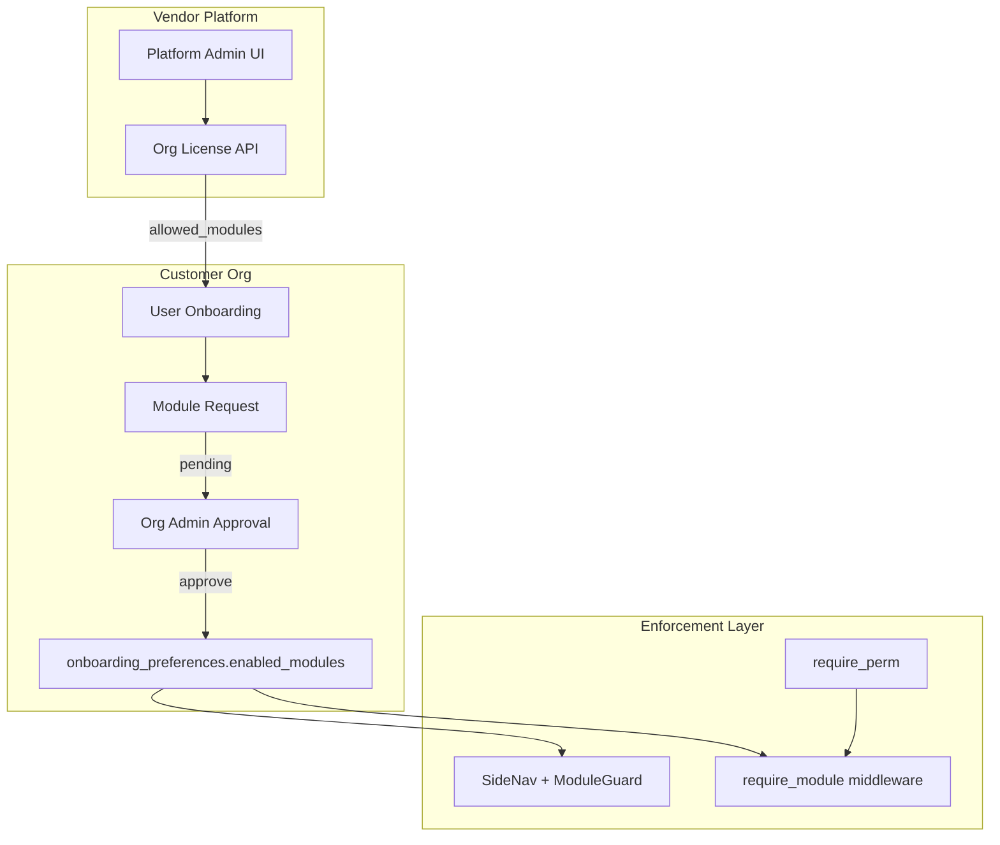
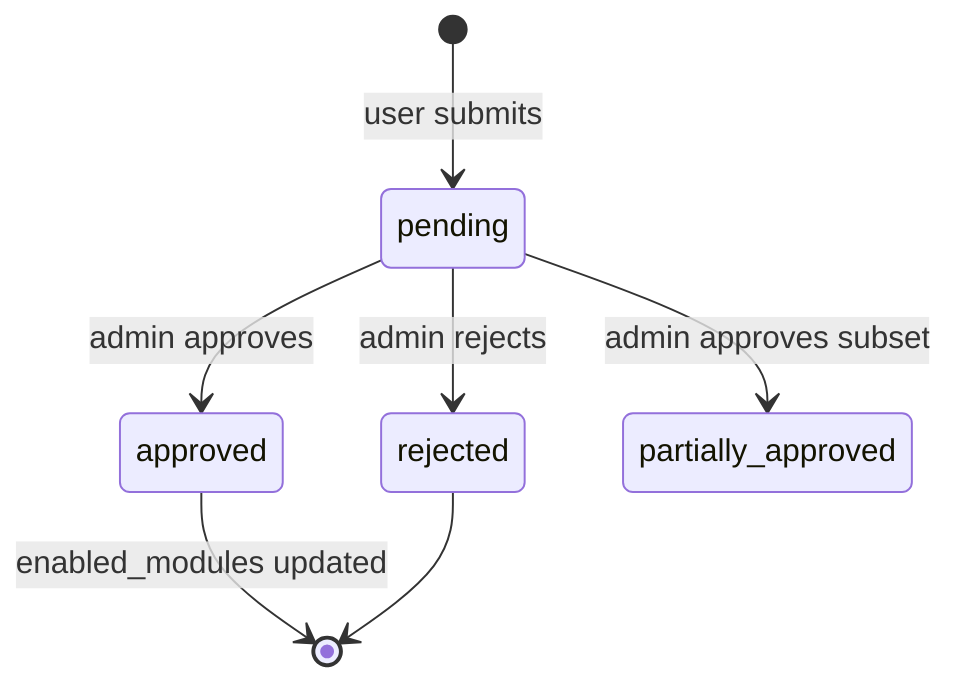

# Design: Module Licensing & Access Requests

## Architecture Overview



**Principle:** Frontend hides; backend denies. License pool caps what can be requested; approval sets what is active.

---

## Reuse (Existing Code)

| Asset | Path | Role |
|-------|------|------|
| Module catalog | `frontend/src/onboarding/industries.ts` | Single source of module keys + labels |
| Onboarding prefs | `backend/app/api/onboarding.py` | Extend, don't replace |
| Store + filter | `frontend/src/onboarding/store.ts`, `SideNav.tsx` | Already filter by `enabledModules` |
| Route guard | `frontend/src/components/ModuleGuard.tsx` | Already redirect disabled routes |
| Path→module map | `frontend/src/layouts/moduleMap.ts` | Extend for new routes |

---

## Backend

### 1. `module_registry.py`

```python
MODULE_ROUTERS = {
    "sales": ["/api/invoices", "/api/quotes", "/api/sales-orders", "/api/credit-notes", ...],
    "purchase": ["/api/bills", "/api/purchase-orders", "/api/vendor-credits", ...],
    "inventory": ["/api/inventory", "/api/items", ...],
    "pos": ["/api/pos", ...],
    # ...
}
ALWAYS_ON = frozenset({"accounting", "banking"})
```

### 2. `require_module(module: str)` dependency

```python
async def require_module(module: str, user=Depends(get_current_user)):
    enabled = get_enabled_modules(user["org_id"])  # cache 60s
    if module in ALWAYS_ON or module in enabled:
        return
    raise HTTPException(403, detail={"code": "module_disabled", "module": module})
```

Apply via router-level `dependencies=[Depends(require_module("sales"))]` on `invoices.router`.

### 3. License service

`backend/app/services/org_license.py`:

- `get_license(org_id) -> License`
- `get_allowed_modules(org_id) -> list[str]`
- `assert_modules_allowed(org_id, requested: list[str])` — 400 if outside pool
- `is_license_valid(org_id) -> bool`

Store on `organizations/{id}.license` (avoid new collection for v1).

### 4. Module request API

New routes in `backend/app/api/onboarding.py` (or `module_requests.py`):

| Method | Path | Perm |
|--------|------|------|
| POST | `/api/onboarding/module-requests` | `modules.request` |
| GET | `/api/onboarding/module-requests` | `modules.approve` |
| GET | `/api/onboarding/module-requests/mine` | auth |
| POST | `/api/onboarding/module-requests/{id}/approve` | `modules.approve` |
| POST | `/api/onboarding/module-requests/{id}/reject` | `modules.approve` |

**Approve logic:**

```python
def approve_request(org_id, request_id, reviewer_id, approved_modules):
    req = repo.get(request_id)
    pool = get_allowed_modules(org_id)
    final = [m for m in approved_modules if m in req["requested_modules"] and m in pool]
    final = list(set(final) | ALWAYS_ON)
    merge_into_preferences(org_id, final)
    repo.update(request_id, status="approved", approved_modules=final, reviewed_by=reviewer_id)
    audit_log(action="modules.approved", ...)
```

### 5. Platform license API

`backend/app/api/platform.py` (new, small):

- `PUT /api/platform/orgs/{org_id}/license` — body `{ bundle_id?, allowed_modules?, expires_at? }`
- Guard: user has `platform.manage` AND `user.platform_admin=true` (env allowlist or role flag)

For single-tenant vendor deploy: platform admin = first org's owner with env `PLATFORM_ADMIN_ORG_IDS`.

---

## Frontend

### 1. Onboarding step 4 change

**Before:** checkboxes directly set `enabledModules` → PUT preferences.

**After (when `require_module_approval`):**

1. Load `allowed_modules` from `GET /api/onboarding/license` (org-scoped).
2. User checks desired modules → `POST module-requests`.
3. Show `PendingApprovalScreen` instead of completing wizard.
4. Poll or websocket optional; v1 = refresh on login.

**When `require_module_approval=false`:** keep current self-select behavior (for self-hosted admins).

### 2. Admin: Module Requests page

`frontend/src/pages/settings/ModuleRequestsPage.tsx`:

- Table: user, date, requested modules (tags), status, actions Approve/Reject
- Approve modal: checkboxes pre-filled from request, admin can uncheck
- Route: `/settings/module-requests` (admin only)

### 3. Platform: Org license editor

`frontend/src/pages/platform/OrgLicenseEditor.tsx`:

- Bundle dropdown → auto-fill allowed modules
- Multi-select override
- Expiry date
- Only visible if `platform.manage`

### 4. Bundles config

`frontend/src/onboarding/bundles.ts` — mirror backend `BUNDLES` dict.

---

## State Machine



Only one **open** pending request per user at a time (409 if duplicate).

---

## Security

- Requested modules MUST ⊆ `allowed_modules` (license pool)
- Approved modules MUST ⊆ requested ∩ allowed
- Users cannot call `PUT /preferences` to self-enable when `require_module_approval=true` (403)
- Platform license changes audit-logged

---

## Example: POS-only customer

1. Vendor sets org license: `bundle_id=pos_only`
2. User onboarding: sees only sales, inventory, pos, accounting, banking
3. User requests: `[sales, inventory, pos]`
4. Admin approves all three
5. `enabled_modules = [accounting, banking, sales, inventory, pos]`
6. Sidebar hides purchase, manufacturing, CRM, Wave modules
7. `POST /api/purchase-orders` → 403 `module_disabled`

---

## Out of Scope (v1)

- Per-user module overrides (org-level only)
- Billing/metering integration
- Auto-approve rules
- Email notifications (in-app only v1)
