# Design Document: Phase 1 — Accounting Hardening

## Overview

This phase touches the most sensitive subsystem in the ERP — the General Ledger. Every change is **additive and validated server-side**, with feature flags to enable safe rollback. The work is structured so that pure-function correctness rules (balance validation, tax math, aged-bucket math) are extracted into testable services, while the existing Firestore repositories continue to handle persistence. New CLI scripts let us verify integrity over real data before and after each change.

The design honours four constraints derived from the codebase:

1. **Firestore-only persistence** — no SQL, no Alembic; correctness via repository pattern + transactions.
2. **No `from __future__ import annotations`** in any file using closure-based router helpers (lessons learned from `_quick()` Wave A bugs).
3. **Python evaluation, not composite indexes** — keep filtering in Python so we don't need new Firestore composite indexes.
4. **All new endpoints respect `require_perm`** (Phase 2 will sweep the rest).

---

## Architecture

```mermaid
graph TB
    subgraph clients [Clients]
        FE[Frontend / API consumer]
        Cron[APScheduler]
    end

    subgraph routers [API Routers]
        JR[journals router<br/>POST /post, /reverse]
        IR[invoices router<br/>POST /post]
        BR2[bills router<br/>POST /post]
        FR[fiscal router<br/>close/reopen/lock-status]
        TR[taxes router<br/>vat-return]
        RR[reports router<br/>aged-ar/ap, partner-ledger]
        FXR[fx router<br/>revaluations]
        DC[delivery-challans router]
        CR[credit-notes router<br/>applications]
    end

    subgraph services [Pure-Function Services]
        AS[accounting.py<br/>validate_je_balance<br/>post_je_atomic<br/>reverse_je]
        NS[numbering_service.py<br/>allocate_next<br/>record_abandoned]
        PS[period_close.py<br/>close_fy<br/>reopen_fy<br/>check_lock]
        TE[tax_engine.py<br/>compute_line_taxes<br/>build_je_tax_lines]
        AR[aged_reports.py<br/>build_aged_buckets<br/>build_partner_ledger]
        FX[fx_service.py<br/>revalue_period]
    end

    subgraph repos [Firestore Repositories]
        JE_R[JournalEntryRepository]
        SEQ_R[NumberingSequenceRepository]
        FY_R[FiscalYearRepository]
        TAX_R[TaxRepository]
        INV_R[InvoiceRepository]
        BILL_R[BillRepository]
        CT_R[ContactRepository]
        FX_R[CurrencyRateRepository]
    end

    subgraph cli [Audit CLI]
        AB[audit_je_balance.py]
        AG[audit_sequence_gaps.py]
        AT[audit_tax_reconciliation.py]
    end

    FE --> JR & IR & BR2 & FR & TR & RR & FXR & DC & CR
    Cron --> FX
    JR --> AS
    IR --> AS & TE & NS & PS
    BR2 --> AS & TE & NS & PS
    FR --> PS
    TR --> TE
    RR --> AR
    FXR --> FX
    DC --> NS
    CR --> AS
    AS --> JE_R
    NS --> SEQ_R
    PS --> FY_R & JE_R
    TE --> TAX_R
    AR --> INV_R & BILL_R & CT_R & JE_R
    FX --> JE_R & INV_R & BILL_R & FX_R
    AB --> JE_R
    AG --> SEQ_R
    AT --> JE_R & TAX_R
```



### Key Design Decisions

- **Pure-function services** — `accounting.validate_je_balance`, `tax_engine.compute_line_taxes`, `aged_reports.build_aged_buckets` are deterministic functions that take dicts and return dicts. They do not import Firestore. This makes them trivially Hypothesis-testable.
- **Firestore transactions for atomicity** — all JE posts and number allocations run inside a `firestore.transactional` block to defeat race conditions.
- **Period lock as a single chokepoint** — `period_close.check_lock(date, org_id)` is the only function any other service calls; no raw `if date < lock_date` checks elsewhere.
- **Feature flag `TAX_ENGINE_V2`** — controls v2-vs-v1 tax behavior on a per-org basis using the existing `feature_flag_service.py`.
- **Dual write of taxes** — invoice posting writes `tax_lines` array on the invoice doc AND emits one JE credit line per tax_id. The VAT return query reads from JE only — no double-counting.
- **Closing JE convention** — Retained Earnings account is configurable in `settings/{org}/accounting` with default mapped to a Liability sub-account `3-RE`. The closing JE has one line per non-zero P&L account.
- **Hypothesis tests for math, integration tests for routes** — fast property tests for pure functions; smaller numbers of integration tests using `TestClient` + Firestore mocks for routers.

---

## Components and Interfaces

### Backend Services

#### `backend/app/services/accounting.py` (new functions added; existing untouched)

```python
# Pure validation
def validate_je_balance(lines: list[dict], currency: str = "IQD") -> None:
    """Raise HTTPException(422, ...) if invalid. No Firestore access."""

# Atomic post
def post_je_atomic(
    org_id: str,
    je_data: dict,
    *,
    skip_lock_check: bool = False,
) -> dict:
    """Validate, check period lock, allocate sequence, write JE — all in one Firestore transaction."""

# Reversal
def reverse_je(org_id: str, je_id: str, reversal_date: str, user_id: str) -> dict:
    """Create a reversing JE; reject if already reversed or both dates locked."""

# JE-from-source-doc helpers
def build_invoice_je(invoice: dict, tax_lines: list[dict], settings: dict) -> list[dict]:
def build_bill_je(bill: dict, tax_lines: list[dict], settings: dict) -> list[dict]:
def build_payment_je(payment: dict, kind: Literal["received","made"]) -> list[dict]:
```

#### `backend/app/services/numbering_service.py` (extend existing)

```python
def allocate_next(
    org_id: str,
    doc_type: str,
    branch_id: Optional[str] = None,
) -> str:
    """Atomic increment via firestore.transactional; returns formatted number string."""

def record_abandoned(org_id: str, doc_type: str, number: str, reason: str) -> None:
def detect_gaps(org_id: str, doc_type: str) -> list[str]:
```

#### `backend/app/services/period_close.py` (extend existing)

```python
def check_lock(org_id: str, date: str, *, allow_equal: bool = False) -> None:
    """Raise HTTPException(409) if date <= lock_date (or < if allow_equal=False).
    Used by every JE-emitting service."""

def close_fiscal_year(org_id: str, fy_id: str, user_id: str) -> dict:
def reopen_fiscal_year(org_id: str, fy_id: str, user_id: str) -> dict:
def get_lock_status(org_id: str, date: str) -> dict:
```

#### `backend/app/services/tax_engine.py` (new file — extracted from `tax_calc.py`)

```python
@dataclass
class TaxComputation:
    subtotal: Decimal
    tax_lines: list[dict]  # [{tax_id, name, rate, amount, type}]
    total: Decimal
    wht_amount: Decimal  # for Iraq WHT split

def compute_line_taxes(
    quantity: Decimal,
    unit_price: Decimal,
    discount_pct: Decimal,
    tax_id: Optional[str],
    tax_repo: TaxRepository,
) -> TaxComputation: ...

def build_je_tax_lines(
    tax_computation: TaxComputation,
    is_sale: bool,  # True = output VAT credited; False = input VAT debited
    settings: dict,
) -> list[dict]: ...
```

#### `backend/app/services/aged_reports.py` (new file)

```python
def build_aged_buckets(
    open_docs: list[dict],  # invoices or bills with due_date and balance_due
    as_of: date,
) -> dict[str, dict]:  # {customer_id: {b_0_30, b_31_60, b_61_90, b_90_plus, total}}

def build_partner_ledger(
    contact_id: str,
    je_lines: list[dict],
    from_date: date,
    to_date: date,
    opening_balance: Decimal,
) -> dict:
```

#### `backend/app/services/fx_service.py` (extend existing)

```python
def revalue_period(
    org_id: str,
    period_end: date,
    *,
    currencies: Optional[list[str]] = None,
    dry_run: bool = False,
    force: bool = False,
) -> dict:
    """Return {period_end, journal_entry: {...}, dry_run, posted_je_id?}"""
```

### API Routers

| Router | Path | Method | Auth | Permission |
|--------|------|--------|------|------------|
| `accounts.py` (existing) | `/api/journals/{id}/post` | POST | required | `accounts.post_je` |
| `accounts.py` | `/api/journals/{id}/reverse` | POST | required | `accounts.reverse_je` |
| `fiscal.py` | `/api/fiscal/years/{id}/close` | POST | required | `accounts.close_fy` |
| `fiscal.py` | `/api/fiscal/years/{id}/reopen` | POST | required | `accounts.close_fy` |
| `fiscal.py` | `/api/fiscal/lock-status` | GET | required | (any authenticated) |
| `fiscal.py` (new endpoints) | `/api/fiscal/budgets` | CRUD | required | `accounts.budget` |
| `taxes.py` | `/api/taxes/vat-return` | GET | required | `reports.read` |
| `reports.py` | `/api/reports/aged-receivable` | GET | required | `reports.read` |
| `reports.py` | `/api/reports/aged-payable` | GET | required | `reports.read` |
| `reports.py` | `/api/reports/partner-ledger` | GET | required | `reports.read` |
| `revaluations.py` (new) | `/api/fx/revaluations` | POST/GET/DELETE | required | `accounts.fx_revalue` |
| `delivery_challans.py` (new) | `/api/delivery-challans` | CRUD | required | `inventory.shipment` |
| `credit_notes.py` | `/api/credit-notes/{id}/applications` | GET/POST | required | `invoices.create` |
| `invoices.py` | `/api/invoices/{id}/apply-retainer` | POST | required | `invoices.create` |

### Frontend (minimal changes)

Phase 1 is backend-heavy; the frontend gets the new endpoints wired into existing pages:

- `frontend/src/pages/Reports.tsx` — add Aged AR/AP and Partner Ledger tabs (already routed in some places; wire to new endpoints)
- `frontend/src/pages/fx/RevaluationsPage.tsx` — already exists; verify uses `/api/fx/revaluations`
- `frontend/src/pages/AccountingClose.tsx` — wizard for fiscal year close, calls `/api/fiscal/years/{id}/close`
- `frontend/src/pages/Settings.tsx` — Numbering tab to manage sequences (already exists; verify allocates correctly)
- `frontend/src/pages/DeliveryChallans.tsx` — new page or fix existing `frontend/src/pages/DeliveryChallans.tsx` to call new backend

---

## Data Models

### `journal_entries/{je_id}` document

```json
{
  "id": "je_abc123",
  "org_id": "org_xyz",
  "number": "JE-000042",
  "date": "2026-05-25",
  "description": "Invoice INV-001",
  "currency": "IQD",
  "exchange_rate": 1.0,
  "source_type": "invoice",
  "source_id": "inv_abc",
  "status": "posted",
  "posted_at": "2026-05-25T10:30:00Z",
  "posted_by": "user_123",
  "reversed_by": null,
  "reverses": null,
  "total_debit": 1050.00,
  "total_credit": 1050.00,
  "lines_count": 3,
  "created_at": "2026-05-25T10:30:00Z",
  "updated_at": "2026-05-25T10:30:00Z"
}
```

### `journal_entries/{je_id}/lines/{line_id}` subcollection

```json
{
  "id": "line_1",
  "account_id": "acc_ar",
  "account_code": "1200",
  "account_name": "Accounts Receivable",
  "debit": 1050.00,
  "credit": 0.00,
  "description": "INV-001 / Customer A",
  "contact_id": "cust_a",
  "analytic_account_id": null,
  "currency_amount": 1050.00,
  "currency": "IQD",
  "tax_id": null
}
```

### `numbering_sequences/{seq_id}` document

```json
{
  "id": "INV_org_xyz",
  "org_id": "org_xyz",
  "doc_type": "invoice",
  "branch_id": null,
  "prefix": "INV-",
  "suffix": "",
  "padding": 6,
  "next_number": 43,
  "reset_period": "yearly",
  "last_reset_year": 2026,
  "active": true,
  "abandoned_count": 2
}
```

### `numbering_sequences/{seq_id}/abandoned/{number}` subcollection

```json
{
  "number": "INV-000007",
  "abandoned_at": "2026-05-20T14:00:00Z",
  "reason": "validation_error: missing customer_id",
  "user_id": "user_123"
}
```

### `fiscal_years/{fy_id}` document

```json
{
  "id": "fy_2025",
  "org_id": "org_xyz",
  "name": "FY 2025",
  "start_date": "2025-01-01",
  "end_date": "2025-12-31",
  "status": "closed",
  "closed_at": "2026-03-15T09:00:00Z",
  "closed_by": "user_admin",
  "closing_je_id": "je_close_2025",
  "retained_earnings_account_id": "acc_re"
}
```

### `currency_rates/{rate_id}` document

```json
{
  "id": "USD_IQD_2026-05-25",
  "org_id": "org_xyz",
  "from_currency": "USD",
  "to_currency": "IQD",
  "date": "2026-05-25",
  "rate": 1310.0,
  "source": "manual",
  "fetched_at": "2026-05-25T08:00:00Z"
}
```

---

## Error Handling

| Error | HTTP | Message Template (en) | Recovery |
|-------|------|------------------------|----------|
| Unbalanced JE | 422 | `"Journal entry unbalanced: debit=Σd, credit=Σc, diff=Δ"` | Client adjusts lines |
| Period locked | 409 | `"Period locked: cannot post on or before YYYY-MM-DD"` | Use later date or reopen FY |
| JE already reversed | 409 | `"Journal entry je_X already reversed by je_Y"` | None |
| Sequence next_number decrease | 422 | `"Cannot decrease next_number from N to M"` | Manual override only |
| Tax compound mode invalid | 422 | `"Compound tax requires children to be ordered"` | Fix tax config |
| Revaluation already done | 409 | `"Period YYYY-MM already revalued; pass force=true to override"` | Add force flag |
| Closing FY with open JEs | 422 | `"FY has N draft JEs; post or delete them before closing"` | Post/delete drafts |

All messages are translated through the existing i18n system (en, ku, ar) at the frontend layer; backend returns English with structured `code` field for translation lookup.

---

## Testing Strategy

### Property-based tests (Hypothesis)

```python
# test_accounting_balance.py
from hypothesis import given, strategies as st

@given(
    n_lines=st.integers(2, 20),
    amounts=st.lists(st.decimals(min_value=0.01, max_value=10000, places=2), min_size=2, max_size=20)
)
def test_balanced_je_passes(n_lines, amounts):
    """∀ valid line set with Σdebit == Σcredit → validate_je_balance does not raise."""
    ...

@given(
    debit_total=st.decimals(min_value=0.01, max_value=10000, places=2),
    credit_total=st.decimals(min_value=0.01, max_value=10000, places=2)
)
def test_unbalanced_je_rejected(debit_total, credit_total):
    """∀ Σdebit ≠ Σcredit → validate_je_balance raises HTTPException(422)."""
    ...
```

### Integration tests (FastAPI TestClient + mock Firestore)

```python
# test_period_lock.py
def test_post_je_after_lock_rejected(test_client, locked_period):
    response = test_client.post("/api/journals", json={...past_date_je...})
    assert response.status_code == 409
    assert "Period locked" in response.json()["detail"]
```

### CLI audit verification

```python
# audit_je_balance.py
# Iterates all orgs → all JEs → reports unbalanced
# Exits 0 if zero unbalanced
```

### CI gate

`.github/workflows/ci.yml` already has a backend job; we extend it with:

```yaml
- name: Run pytest (backend)
  working-directory: backend
  run: |
    python -m venv venv
    venv/bin/pip install -r requirements.txt
    venv/bin/pytest tests/ --tb=short --maxfail=5
```

The build fails if any test fails; the existing compile/import job stays as a fast smoke before pytest.

---

## Migration & Rollback

### Migration steps

1. Deploy backend with feature flag `TAX_ENGINE_V2=false` (default off).
2. Run `audit_je_balance.py` and `audit_sequence_gaps.py` on production data; expect 0 issues if all is well, otherwise create remediation JEs manually.
3. Enable `TAX_ENGINE_V2=true` per-org via `feature_flags` collection.
4. Re-run audits weekly via APScheduler.

### Rollback

- Feature flag flip `TAX_ENGINE_V2` back to false.
- New endpoints (delivery-challans, credit-note applications, fx revaluations) can be removed without data impact (revaluation JEs would remain as historical records, can be reversed manually).
- Period lock check has a per-call override flag (`skip_lock_check=True`) for emergency unlock — restricted to RBAC admin only.

---

## Risks & Mitigations

| Risk | Mitigation |
|------|------------|
| Concurrent JE posts cause duplicate sequence numbers | Firestore transactional increment with retry |
| Tax engine v2 changes existing invoice totals | Feature flag + per-org rollout; v1 fallback path |
| Period lock blocks legitimate corrections | `skip_lock_check` admin override + reversal date logic |
| FX revaluation runs twice for same period | `force` flag + idempotency check |
| Aged reports time out for large orgs | Cursor pagination + cached results in `reports_cache` collection |
| Migration scripts break on production | Dry-run flag everywhere, plus all changes are additive |

---

## Acceptance verification (end of Phase 1)

```powershell
cd backend
.\venv\Scripts\python.exe scripts\audit_je_balance.py        # exit 0
.\venv\Scripts\python.exe scripts\audit_sequence_gaps.py     # exit 0
.\venv\Scripts\python.exe -m pytest tests/ -q                 # 0 failures
cd ..\frontend
node scripts\endpoint-audit.mjs                               # mismatch=0, missing=0
```
