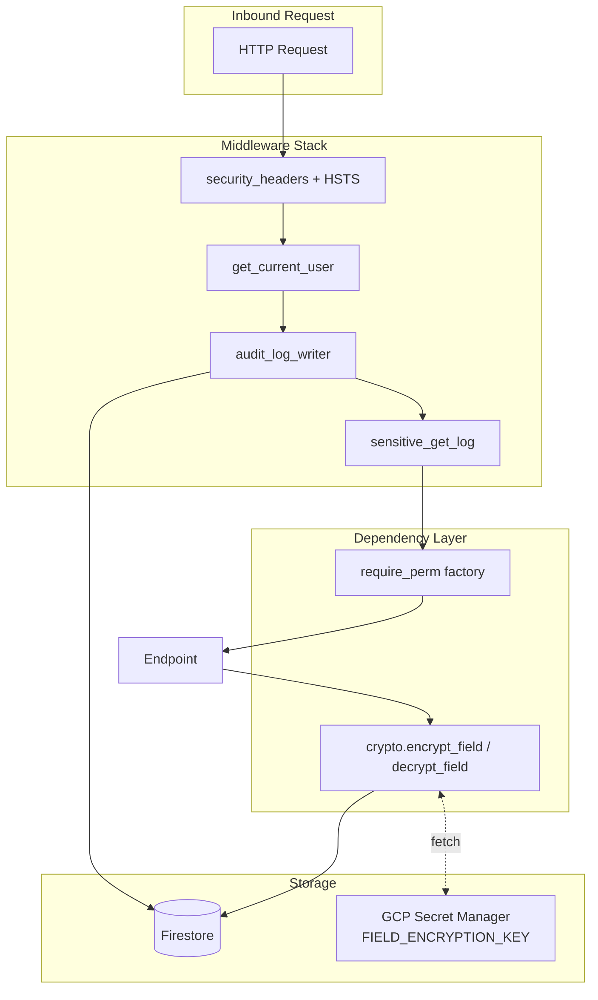

# Design Document: Phase 2 — Security & Compliance

## Architecture



## Components

### `backend/app/services/crypto.py` (new)

```python
class FieldCrypto:
    PREFIX = "enc:v1:"

    def __init__(self, current_key: bytes, previous_keys: list[bytes] | None = None):
        self._fernet = Fernet(current_key)
        self._fallback = MultiFernet([Fernet(k) for k in (previous_keys or [])])

    def encrypt(self, plaintext: str) -> str:
        return self.PREFIX + self._fernet.encrypt(plaintext.encode()).decode()

    def decrypt(self, value: str) -> str:
        if not value.startswith(self.PREFIX):
            return value  # legacy plaintext
        return self._fernet.decrypt(value[len(self.PREFIX):].encode()).decode()
```

Used in repository layer:

```python
class HREmployeeRepository(BaseRepository):
    ENCRYPTED_FIELDS = {"national_id", "bank_account"}
    def get(self, id): ...; for f in ENCRYPTED_FIELDS: doc[f] = crypto.decrypt(doc[f]); ...
```

### `backend/app/services/permissions.py` (extend)

Add new permission codes to `ALL_PERMISSIONS`. Update `DEFAULT_ROLES` mapping. Add `audit_rbac_coverage()` helper that introspects the FastAPI app routes and checks each one.

### `backend/scripts/audit_rbac_coverage.py` (new)

Walks `app.routes`, for each `APIRoute` reads `dependencies` and `dependant.dependencies`, looks for `require_perm("...")` call. Reports unprotected mutating routes.

### `backend/app/api/privacy.py` (extend or rewrite)

Implements `GET /export` and `POST /delete`. Uses repository pattern to walk all collections filtering by `user_id`. Streams JSON or zip.

### `backend/app/middleware/audit.py` (extend)

Add hash-chain logic:

```python
def write_audit_entry(...):
    last_entry = repo.get_last(org_id)  # cached per-process
    prev_hash = last_entry["hash"] if last_entry else "0" * 64
    payload = {ts, user_id, action, resource, prev_hash}
    new_hash = sha256(json.dumps(payload, sort_keys=True).encode()).hexdigest()
    repo.create({**payload, "hash": new_hash})
```

### `firestore.rules` (modify)

```
match /audit_logs/{logId} {
  allow read: if isAdmin();
  allow create: if false;  // only via Admin SDK (server)
  allow update, delete: if false;  // immutable
}
```

(Server uses Admin SDK so writes happen, mutations always denied.)

### `frontend/src/pages/settings/PrivacyPage.tsx` (new)

UI for users to download their data and request deletion (with double-confirm).

## Migration

`backend/scripts/migrate_pii_encryption.py` — for each org, for each `hr_employees` doc, if `national_id` not prefixed with `enc:v1:`, encrypt it in place. Same for other listed fields. `--dry-run` prints counts.

## Rollback

Decryption supports plaintext fallback so we never strand legacy data. If something goes wrong, disable the encryption layer (skip wrap on write); rotation requires both keys retained.
