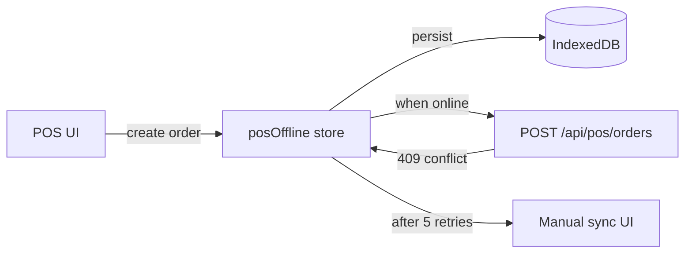

# Design: Phase 4 — POS + Iraq

## POS Offline Architecture



State store: `frontend/src/stores/posOffline.ts` — already exists; needs:
- Idempotency key UUID per order
- Background retry timer with exponential backoff
- Conflict UI dialog component

## Idempotency on the server

`backend/app/middleware/idempotency.py` (new) — checks `X-Idempotency-Key`; if seen in last 24h with same response, return cached response; otherwise execute and cache.

## Iraq Payroll Engine

```python
# backend/app/services/iraq_payroll.py
def compute_payslip(employee, contract, period: date) -> Payslip:
    gross = contract.salary
    ss_employee = gross * Decimal("0.05")
    taxable = gross - ss_employee
    income_tax = compute_iraq_income_tax(taxable)
    net = gross - ss_employee - income_tax
    return Payslip(gross, ss_employee, ss_employer=gross*0.12, income_tax, net)

def compute_iraq_income_tax(taxable_monthly: Decimal) -> Decimal:
    """Apply progressive brackets."""
```

Pure function; testable without Firestore.

## e-Invoice Pipeline

```mermaid
graph TD
    POST[POST /api/invoices/{id}/post] -->|enqueue| Q[einvoice_queue collection]
    SCH[APScheduler 5min] --> DEQ[Dequeue oldest]
    DEQ --> XML[Build XML]
    XML --> SUB[Submit to ITA endpoint]
    SUB -->|success| OK[Mark einvoice_status=submitted]
    SUB -->|transient| RETRY[Increment retries; back-off]
    SUB -->|permanent| FAIL[einvoice_status=rejected; notify admin]
```

XML builder in `backend/app/services/einvoice_xml.py`. XSD bundled at `backend/resources/einvoice.xsd`. Validation in tests via `lxml.etree.XMLSchema`.

## FIB / Zain Cash Adapters

`backend/app/services/iraq_payments/` package:
- `base.py` — abstract `PaymentGateway` interface (`create_session`, `verify_webhook`, `parse_event`)
- `fib.py` — FIB implementation
- `zaincash.py` — Zain Cash implementation

Webhook routes in `backend/app/api/iraq_payments.py` (extend existing).

## Z-Report PDF

`backend/app/services/pdf_generator.py` — extend with `build_z_report(session, lines, totals)` using ReportLab + arabic-reshaper.

## Frontend changes

- `frontend/src/pages/pos/POSTerminal.tsx`: integrate idempotency-key generator
- `frontend/src/components/pos/SyncStatusBadge.tsx`: new
- `frontend/src/components/pos/ConflictDialog.tsx`: new
- `frontend/src/pages/payroll/IraqPayrollRun.tsx`: new wizard
