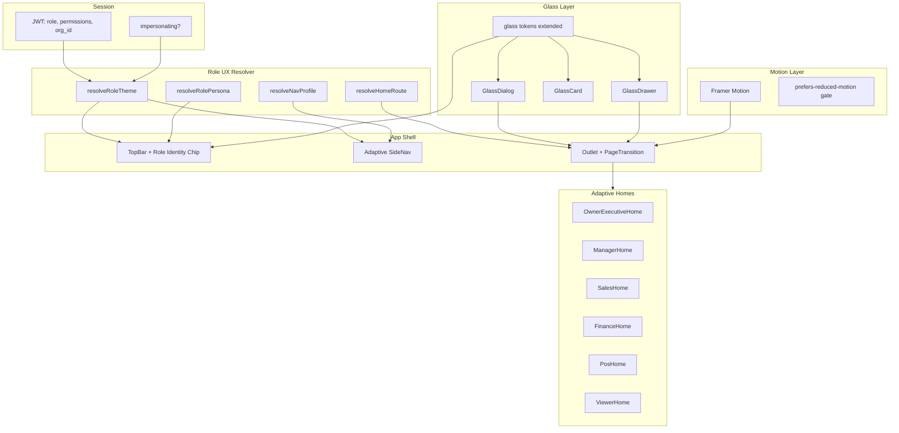
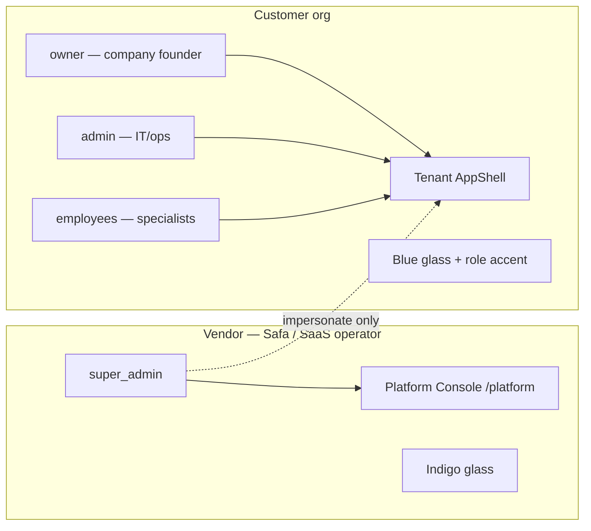
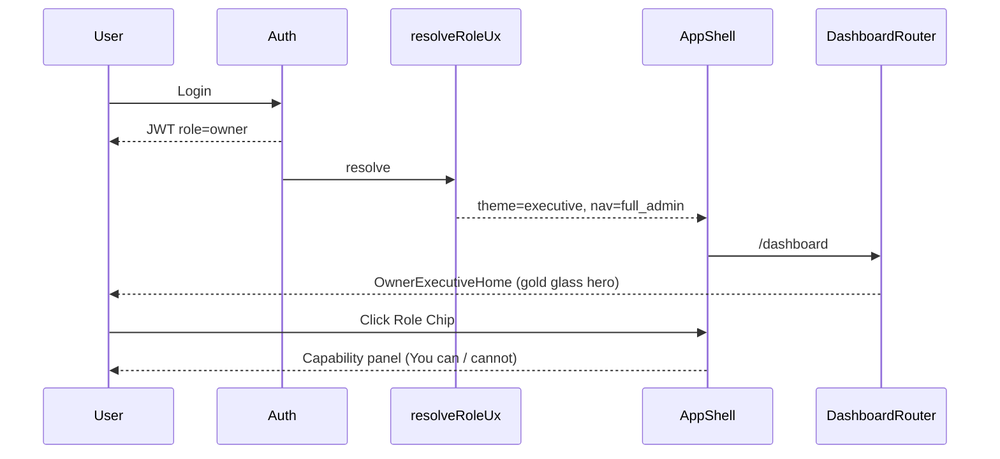

# Design: Role-Adaptive Glass UX

**Version:** 1.0  
**Companion:** `requirements.md`, `tasks.md`

---

## 1. Architecture Overview



**Principles:**

1. **Role resolves chrome, not security** — backend still enforces; UI hides progressively.
2. **One glass system** — tenant + platform share API, different token presets.
3. **Persona > permission string** — users think in jobs, not JWT claims.
4. **Motion serves clarity** — never decorative-only on data-heavy forms.

---

## 2. Who Is «Owner» vs «Vendor» (Design Decision)



| You are… | Login as | See first |
|----------|----------|-----------|
| **ERP product owner (vendor)** | `super_admin` | `/platform` dashboard |
| **Company founder using ERP** | `owner` | Tenant executive dashboard |
| **Both** | Two accounts OR impersonate | Never merge UIs |

**Recommendation for Safa:** Primary account = `super_admin` on platform. Demo customer org user = separate `owner` test account.

---

## 3. Directory Layout

```
frontend/src/
├── theme/
│   ├── tokens.ts                 # extend glass.* surfaces
│   ├── roleThemes.ts             # NEW — per-role accent + routes
│   ├── glassStyles.ts            # NEW — getGlassStyle(), presets
│   └── motionPresets.ts          # NEW — framer variants
├── personas/
│   ├── types.ts                  # RolePersona, NavProfile, Capability
│   ├── rolePersonaRegistry.ts    # role → persona metadata
│   ├── resolveRoleUx.ts          # single entry: theme + home + nav
│   └── __tests__/
├── components/glass/
│   ├── GlassCard.tsx
│   ├── GlassDialog.tsx           # wraps Ant Modal
│   ├── GlassDrawer.tsx           # wraps Ant Drawer
│   ├── GlassPopover.tsx
│   ├── GlassDropdown.tsx
│   ├── GlassConfirm.tsx          # Popconfirm replacement
│   └── GlassSheet.tsx            # mobile bottom sheet
├── components/role/
│   ├── RoleIdentityChip.tsx
│   ├── RoleCapabilityPanel.tsx
│   ├── RoleWelcomeSheet.tsx
│   └── RoleAccentProvider.tsx    # CSS vars --role-accent
├── layouts/
│   ├── AppShell.tsx              # inject RoleAccentProvider
│   ├── TopBar.tsx                # chip integration
│   └── AdaptiveSideNav.tsx       # nav profiles
├── pages/dashboard/
│   ├── DashboardRouter.tsx       # routes to role home
│   ├── OwnerExecutiveHome.tsx
│   ├── ManagerHome.tsx
│   ├── SalesHome.tsx
│   ├── FinanceHome.tsx
│   ├── PosStaffHome.tsx
│   ├── HrHome.tsx
│   ├── PersonalEmployeeHome.tsx
│   └── ViewerHome.tsx
└── hooks/
    ├── useRoleUx.ts              # theme + persona + capabilities
    └── useGlassMotion.ts         # reduced motion aware variants
```

---

## 4. Role Theme Schema

```typescript
// frontend/src/theme/roleThemes.ts

export type RoleThemeId =
  | 'executive'      // owner
  | 'administrator'  // admin
  | 'manager'
  | 'finance'
  | 'sales'
  | 'purchase'
  | 'inventory'
  | 'pos'
  | 'hr'
  | 'projects'
  | 'personal'       // user, hr_employee
  | 'readonly';      // viewer

export interface RoleTheme {
  id: RoleThemeId;
  accent: string;
  accentMuted: string;
  glassBorderGlow: string;   // box-shadow rgba
  heroGradient: string;      // CSS linear-gradient
  defaultRoute: string;
  navProfile: NavProfileId;
  quickActions: QuickAction[];
}

export interface QuickAction {
  id: string;
  labelKey: string;
  icon: string;
  route: string;
  permission?: string;
}
```

### Role → Theme mapping

| Role codes | Theme id | defaultRoute |
|------------|----------|--------------|
| owner | executive | `/dashboard` |
| admin | administrator | `/dashboard` |
| manager | manager | `/dashboard` |
| accountant | finance | `/dashboard` |
| sales, sales_rep | sales | `/crm` |
| purchaser | purchase | `/purchase-orders` |
| inventory, inventory_manager | inventory | `/inventory` |
| cashier, pos_cashier, pos_manager | pos | `/pos` |
| hr, hr_manager | hr | `/hr` |
| project_manager | projects | `/projects` |
| viewer | readonly | `/dashboard` |
| user, hr_employee | personal | `/dashboard` |
| super_admin (tenant impersonation) | administrator | `/dashboard` |

```typescript
export function resolveRoleTheme(role: string | null, permissions: string[]): RoleTheme {
  const mapped = ROLE_CODE_TO_THEME[role ?? 'user'] ?? inferThemeFromPermissions(permissions);
  return ROLE_THEMES[mapped];
}
```

---

## 5. Glass System Design

### 5.1 Extended glass tokens

```typescript
// Add to theme/tokens.ts glass map
export const glass = {
  // existing: topbar, palette, login, modal
  sidebar: { light: {...}, dark: {...} },
  card: { light: {...}, dark: {...} },
  dialog: {
    light: { bg: 'rgba(255,255,255,0.78)', blur: 'blur(28px) saturate(180%)', ... },
    dark: { bg: 'rgba(15,23,42,0.88)', blur: 'blur(28px) saturate(180%)', ... },
  },
  drawer: { ... },
  popover: { ... },
  toast: { ... },
} as const;
```

### 5.2 GlassDialog API

```tsx
<GlassDialog
  open={open}
  onClose={onClose}
  title={t('invoice.new')}
  size="md"              // sm | md | lg | full
  roleAccent            // use --role-accent border glow
  footer={<GlassDialogFooter primary={...} secondary={...} />}
  stackDepth={0}        // 0 = base, 1+ = nested blur increase
>
  {children}
</GlassDialog>
```

**Implementation:** Ant Design `Modal` with `modalRender` + glass class; destroyOnClose; focus trap via `antd` + custom `useFocusTrap`.

### 5.3 Glass layering rules

| Layer | blur | saturation | max stack |
|-------|------|------------|-----------|
| Backdrop | 8px | 120% | 1 |
| Dialog | 28px | 180% | 3 |
| Popover | 16px | 160% | 2 |
| Sidebar | 20px | 160% | 1 |

---

## 6. Role Identity Chip & Capability Panel

```tsx
// TopBar right cluster
<RoleIdentityChip
  user={user}
  role={role}
  theme={roleTheme}
  orgName={org.name}
  impersonating={isImpersonating}
/>

// Popover content
<RoleCapabilityPanel
  persona={persona}
  capabilities={capabilities.can}
  limitations={capabilities.cannot}
  onOpenSettings={() => navigate('/settings?s=profile')}
/>
```

### Capability copy examples (owner)

| You can | You cannot |
|---------|------------|
| Manage users and roles | Change vendor license pool |
| Enable modules (within license) | Access platform infra health |
| Edit org settings | Impersonate other orgs |

### Capability copy (sales)

| You can | You cannot |
|---------|------------|
| Create quotes and invoices | Change fiscal year |
| View sales settings (read-only) | Manage RBAC |

---

## 7. Adaptive Dashboard Router

```tsx
// pages/dashboard/DashboardRouter.tsx
export default function DashboardRouter() {
  const { roleTheme, persona } = useRoleUx();
  switch (roleTheme.id) {
    case 'executive': return <OwnerExecutiveHome />;
    case 'administrator': return <AdminOpsHome />;
    case 'manager': return <ManagerHome />;
    case 'finance': return <FinanceHome />;
    case 'sales': return <SalesHome />;
    case 'pos': return <PosStaffHome />;
    case 'readonly': return <ViewerHome />;
    case 'personal': return <PersonalEmployeeHome />;
    default: return <PersonalEmployeeHome />;
  }
}
```

### Owner Executive Home (wireframe)

```
┌─────────────────────────────────────────────────────┐
│ Hero glass card — gold accent                       │
│ «Welcome back, {name}» — Org health at a glance     │
├──────────────┬──────────────┬──────────────────────┤
│ KPI glass    │ KPI glass    │ Module adoption      │
│ Revenue      │ Cash         │ enabled vs pool      │
├──────────────┴──────────────┴──────────────────────┤
│ Quick actions: Invite user | Module requests | ...  │
└─────────────────────────────────────────────────────┘
```

### Sales Home (wireframe)

```
┌─────────────────────────────────────────────────────┐
│ Pipeline hero — blue accent                         │
├──────────────┬──────────────┬──────────────────────┤
│ Open quotes  │ Due invoices │ CRM leads today      │
├──────────────┴──────────────┴──────────────────────┤
│ Primary: + New Quote                                │
└─────────────────────────────────────────────────────┘
```

---

## 8. Adaptive SideNav Profiles

```typescript
export type NavProfileId =
  | 'full_admin'
  | 'manager_business'
  | 'sales_cluster'
  | 'finance_cluster'
  | 'warehouse_cluster'
  | 'pos_minimal'
  | 'hr_cluster'
  | 'personal_minimal'
  | 'readonly';

// Same modules, different GROUP ORDER and collapsed defaults
const NAV_PROFILES: Record<NavProfileId, NavGroupConfig[]> = { ... };
```

**Example:** POS cashier → SideNav collapsed by default; only POS + Items + Profile visible at top.

---

## 9. Motion Choreography

```typescript
// motionPresets.ts
export const dialogVariants = {
  hidden: { opacity: 0, scale: 0.96, filter: 'blur(4px)' },
  visible: { opacity: 1, scale: 1, filter: 'blur(0px)',
    transition: { duration: 0.2, ease: [0.16, 1, 0.3, 1] } },
  exit: { opacity: 0, scale: 0.98, transition: { duration: 0.15 } },
};

export const pageVariants = {
  initial: { opacity: 0, y: 8 },
  animate: { opacity: 1, y: 0, transition: { duration: 0.35 } },
  exit: { opacity: 0, y: -4, transition: { duration: 0.2 } },
};
```

```tsx
// useGlassMotion.ts
export function useGlassMotion() {
  const reduced = useReducedMotion();
  return reduced ? reducedVariants : fullVariants;
}
```

### Dialog stack blur increment

```typescript
function stackBlur(depth: number): string {
  const px = 28 + depth * 4;
  return `blur(${px}px) saturate(${180 + depth * 10}%)`;
}
```

---

## 10. Platform vs Tenant Glass

| Aspect | Tenant | Platform |
|--------|--------|----------|
| Base hue | Blue `primary500` | Indigo `#6366F1` |
| CSS module | `glassStyles.ts` | `PlatformGlass.module.css` |
| Role accent | Yes (owner gold, etc.) | No — vendor neutral |
| Shell | AppShell | PlatformShell |
| Identity chip | Role + org | «Platform Admin» |

**Do not merge** — import shared `getGlassStyle()` with preset parameter `'tenant' | 'platform'`.

---

## 11. Migration Strategy (Ant → Glass)

```bash
# Audit script
grep -r "Modal\|Drawer\|Popconfirm" frontend/src --include="*.tsx" | grep -v Glass
```

| Priority | Area | Count est. |
|----------|------|------------|
| P0 | PremiumModal, FormDialog | ~20 |
| P1 | Settings dialogs | ~30 |
| P2 | Module forms (invoice, PO) | ~100+ |
| P3 | Confirm deletes | ~50 |

**Phase approach:** Wrapper first (GlassDialog wraps existing), visual pass second, motion third.

---

## 12. Backend Optional: RBAC Summary API

```
GET /api/rbac/me/summary

{
  "role": "owner",
  "persona_id": "executive",
  "display_name_ku": "خاوەن",
  "home_route": "/dashboard",
  "capabilities": [
    { "key": "org.manage", "label_key": "capability.org_manage" }
  ],
  "limitations": [
    { "key": "platform.only", "label_key": "capability.no_platform" }
  ]
}
```

Frontend can compute from registry initially; API adds tamper resistance later.

---

## 13. Integration Points

| Existing file | Change |
|---------------|--------|
| `layouts/AppShell.tsx` | RoleAccentProvider, page transition wrapper |
| `layouts/TopBar.tsx` | RoleIdentityChip |
| `layouts/navigation.tsx` | Nav profile from resolveRoleUx |
| `pages/Dashboard.tsx` | Replace with DashboardRouter |
| `settings/shell/SettingsShell.tsx` | Role accent on nav active state |
| `platform/PlatformShell.tsx` | Ensure no tenant role chip |

---

## 14. Testing Strategy

| Layer | Tests |
|-------|-------|
| Unit | `resolveRoleUx.test.ts` — all built-in roles |
| Unit | `roleThemes.test.ts` — default routes |
| Visual | Chromatic/PW screenshots — owner, sales, viewer homes |
| E2E | Role chip visible; sales no admin nav item |
| a11y | axe on GlassDialog open state |
| Audit | `npm run audit:glass-modals` — zero raw Modal |

---

## 15. Risks

| Risk | Mitigation |
|------|------------|
| Performance (blur) | Cap layers; no blur on scroll body |
| 100+ modal migrations | Wrapper component; incremental PRs |
| Role explosion | Persona clusters + custom role fallback |
| Owner vs admin confusion | Distinct gold chip for owner only |
| RTL glass shadows | Logical properties; visual QA ku |

---

## 16. Mermaid — Login to Role UI


