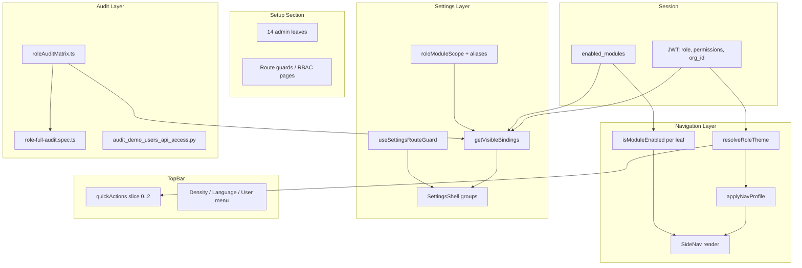

# Design: Role Navbar, Setup & Settings Audit

**Version:** 1.0  
**Companion:** `requirements.md`, `tasks.md`

---

## 1. Architecture



**Principles:**

1. **Three filters:** nav profile → module gate → RBAC/permissions
2. **Single settings registry:** `SECTION_BINDINGS` + `getVisibleBindings()` is source of truth for tab visibility
3. **Alias normalization:** map legacy JWT role codes before specialist scope lookup
4. **Fail quiet on expected 403:** don't fetch admin endpoints without permission

---

## 2. Role → Nav Profile Matrix

| JWT Role | Theme ID | Nav Profile | Setup visible? | Home |
|----------|----------|-------------|----------------|------|
| `owner` | executive | full_admin | ✅ | /dashboard |
| `admin` | administrator | full_admin | ✅ | /dashboard |
| `manager` | manager | manager_business | ✅ | /dashboard |
| `accountant` | finance | finance_cluster | ✅ | /dashboard |
| `sales_rep` | sales | sales_cluster | ✅ | /crm/leads |
| `purchaser` | purchase | warehouse_cluster | ✅ | /purchase-orders |
| `inventory_manager` | inventory | warehouse_cluster | ✅ | /inventory |
| `cashier` | pos | pos_minimal | ✅ (collapsed) | /pos |
| `hr` | hr | hr_cluster | ✅ | /hr |
| `project_manager` | projects | personal_minimal | ✅ | /projects |
| `viewer` | readonly | readonly | ❌ | /dashboard |
| `user` | personal | personal_minimal | ✅ | /dashboard |

---

## 3. Setup Leaves (14)

| Route | Admin-only? | Settings overlap |
|-------|-------------|------------------|
| /custom-fields | yes | — |
| /users | yes | settings?s=users |
| /rbac-roles | yes | settings?s=roles |
| /user-roles | yes | legacy |
| /settings | all | shell entry |
| /settings/numbering | yes | settings tab |
| /automation-rules | yes | settings?s=workflows |
| /audit-log-viewer | yes | settings?s=audit |
| /admin/job-runs | yes | — |
| /studio | yes | — |
| /onboarding | admin | skip overlay demo org |
| /docs | all | help |
| /ui-gallery | all | dev tool |
| /trash | admin | — |

---

## 4. Settings Scope Design

### 4.1 Tier model (existing)

| Tier | Who sees | Edit? |
|------|----------|-------|
| personal | everyone | self |
| org_read | admin, manager, settings.read | read |
| org_write | admin, manager, specialist scope, permissions | conditional |
| platform_only | super_admin off-tenant | platform |

### 4.2 Specialist alias map (NEW)

```typescript
const ROLE_ALIASES: Record<string, string> = {
  sales_rep: 'sales',
  inventory_manager: 'inventory',
  cashier: 'pos_cashier',
  pos_manager: 'pos_cashier',
  hr_manager: 'hr',
  warehouse: 'inventory',
};

function normalizeSettingsRole(role: string): string {
  return ROLE_ALIASES[role] ?? role;
}
```

Extend `ROLE_MODULE_SCOPE`:

```typescript
{
  sales: 'sales',
  sales_rep: 'sales',        // alias
  purchaser: 'purchase',
  inventory: 'inventory',
  inventory_manager: 'inventory', // alias
  warehouse: 'inventory',
  pos_cashier: 'pos',
  cashier: 'pos',            // alias via pos_cashier key
  hr: 'hr',
}
```

Add `hr` to `SPECIALIST_ROLES`.

### 4.3 Settings groups (11)

account · general_app · organization · users · localization · finance · commerce · operations · automation · content · system

---

## 5. TopBar Dropdown Inventory

| Control | Component | Items |
|---------|-----------|-------|
| Quick CTA | TopBar | theme.quickActions[0..1] |
| QuickCreate | TopBar + | global create drawer |
| Org | OrgSwitcher | org list |
| Branch | BranchSwitcher | branch list |
| Density | Dropdown | compact, comfortable, spacious |
| Language | LanguageSwitcher | en, ku, ar |
| User | RoleIdentityChip | profile, settings, logout |
| Capabilities | RoleCapabilityPanel | can/cannot on chip click |

---

## 6. Permission-Gated Fetch Design

**Problem:** `loadForOrg()` always calls `loadPendingAdminCount()` → 403 for 10/12 roles.

**Fix:**

```typescript
// onboarding/store.ts
loadPendingAdminCount: async (canAdmin?: boolean) => {
  if (canAdmin === false) { set({ pendingAdminCount: 0 }); return; }
  // existing fetch...
}

// AppShell or auth bootstrap
const canAdmin = permissions.includes('settings.update') || ['owner','admin'].includes(role);
await loadForOrg(orgId, { canAdminModules: canAdmin });
```

Alternative: read permissions from localStorage JWT decode in store — prefer explicit param from `usePermission` hook caller.

---

## 7. Audit Matrix Module

**File:** `frontend/src/audit/roleAuditMatrix.ts`

Exports:

- `ROLE_NAV_EXPECTATIONS` — role → section keys[]
- `ROLE_SETUP_VISIBLE` — boolean
- `ROLE_SETTINGS_TABS` — role → SectionKey[] (computed via getVisibleBindings with demo modules)
- `SETUP_LEAVES` — readonly string[]
- `assertRoleNavProfile(role, visibleSectionKeys)` — test helper

Used by:

- `frontend/src/audit/__tests__/roleAuditMatrix.test.ts`
- `frontend/e2e/role-full-audit.spec.ts` (import or duplicate constants)

---

## 8. E2E Flow per Role

```
1. API login (skip if 2fa_code_required)
2. Inject session → visit homePath
3. Assert .role-identity-chip
4. Collect visible nav section labels from DOM
5. Compare against ROLE_NAV_EXPECTATIONS (soft assert / log mismatch)
6. If setup visible: visit each setup leaf (domcontentloaded)
7. Visit /settings — collect visible tab labels
8. Open Density + User dropdowns (smoke)
9. Logout — clear storage
10. Write JSON report to e2e/reports/role-audit-{timestamp}.json
```

---

## 9. File Touch Map

| File | Change |
|------|--------|
| `frontend/src/settings/registry/roleModuleScope.ts` | aliases + hr |
| `frontend/src/onboarding/store.ts` | gated pending count |
| `frontend/src/audit/roleAuditMatrix.ts` | NEW matrix |
| `frontend/e2e/role-full-audit.spec.ts` | expanded audit |
| `frontend/src/settings/registry/__tests__/` | alias tests |
| `docs/ux/ROLES.md` | audit commands |
| `.kiro/specs/role-navbar-settings-audit/*` | this spec |

---

## 10. Test Strategy

| Layer | Tool | Coverage |
|-------|------|----------|
| Unit | Vitest | roleModuleScope aliases, audit matrix |
| Registry | Vitest | getVisibleBindings per demo role |
| E2E | Playwright | 10 roles browser + 2 skip 2FA |
| API | Python script | endpoint 200/403 matrix |
