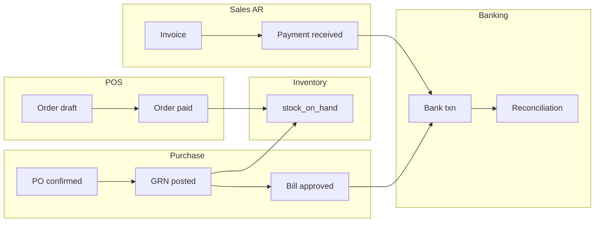

# Design: Shopkeeper Production Core

## Overview

Shopkeeper flows span **five bounded contexts** that must compose without silent data loss:



All cross-context writes use **Firestore repositories** + **integer amounts**. POS inventory is centralized in `pos_inventory.py` (single source of truth for qty parsing).

---

## Wave A — P0 Fixes (this implementation)

### A1. POS line quantity alias

**Problem:** Lines persisted as `qty`; deduction read `quantity` → no stock movement.

**Fix:** In `_calculate_order_totals`, emit both fields:

```python
"qty": qty,
"quantity": qty,
```

**Also:** `pos_inventory.line_quantity(line)` reads `qty` then `quantity` for defense in depth.

**Files:** `backend/app/api/pos.py`, `backend/app/services/pos_inventory.py`

---

### A2. Pay order state guard

**Problem:** `state in ["draft", "paid"]` allows double pay.

**Fix:** Only `draft` may pay; `paid` → HTTP 409. Use `deduct_inventory_for_order()` instead of inlined duplicate loop.

**Files:** `backend/app/api/pos.py`

---

### A3. Offline sync wiring

**Problem:** `flushQueue` posts `/orders` + `/pay` without idempotency.

**Fix:** Batch to `POST /api/pos/orders/sync`:

```typescript
{
  orders: queue.map(item => ({
    temp_id: item.id,
    session_id: item.orderPayload.session_id,
    partner_id: item.orderPayload.partner_id,
    lines: item.orderPayload.lines,
    payments: item.payments,
  }))
}
```

**Files:** `frontend/src/pos/posOfflineQueue.ts`, `POSTerminal.tsx` (unchanged if flush API stable)

---

### A4. Banking reconciliation summary

**Problem:** Used `t.get("type")` instead of `transaction_type`.

**Fix:**

```python
tx_type = t.get("transaction_type") or t.get("type") or "credit"
```

**Files:** `backend/app/api/banking.py`

---

### A5. CSV import balance update

**Problem:** `account.update()` on dict.

**Fix:** Accumulate `running_balance` in loop; single `account_repo.update(account_id, {"current_balance": running_balance})`.

**Files:** `backend/app/api/banking.py`

---

### A6. Duplicate match routes

**Problem:** Two `POST /transactions/{id}/match`.

**Fix:** Rename legacy to `/transactions/{transaction_id}/match-document` (metadata-only match). Keep intelligent matcher on `/match`.

**Files:** `backend/app/api/banking.py`, RBAC audit if path listed

---

### A7. AR payment error surfacing

**Problem:** `except: pass` hides invoice allocation failures.

**Fix:** On `record_payment` failure, `raise HTTPException(422, detail={code, invoice_id})`.

**Files:** `backend/app/api/invoices.py`

---

### A8. PO receive shortcut guard

**Problem:** `/receive` skips GRN → breaks 3-way match for diligent shopkeepers.

**Fix:** If no `goods_receipts` on PO, require `purchase.receive_shortcut` perm + `acknowledge_shortcut: true` in body; else 422 `grn_required`.

**Files:** `backend/app/api/purchase_orders.py`, `permissions.py` (add perm)

---

## Wave B — Tests (tester agent)

| Layer | File | Strategy |
|-------|------|----------|
| Unit | `test_pos_inventory_qty.py` | Mock ItemRepository; deduct with qty-only lines |
| Unit | `test_shopkeeper_core_flow.py` | Pure helpers + banking summary logic extract |
| Vitest | `posOfflineQueue.test.ts` | Assert sync endpoint payload |
| E2E | `shopkeeper_core.spec.ts` | Playwright + API requests for critical paths |

---

## Wave C — Deferred (P1, documented)

| Item | Reason |
|------|--------|
| POS → real invoice creation | Needs InvoiceService integration |
| Session sales JE on close | Needs payment method → GL mapping table |
| Bank match → PaymentReceived + JE | `bank_matching_service` depth |
| `purchasing.require_grn` org setting | Settings schema change |
| Full IndexedDB queue (Phase 4) | PWA storage migration |

---

## Permission addition

```python
"purchase.receive_shortcut": {
    "description": "Mark PO received without GRN (not recommended)",
    "roles": ["owner", "admin"],
}
```

---

## Data contracts

### Order sync item (backend)

| Field | Type | Required |
|-------|------|----------|
| temp_id | string (UUID) | yes |
| session_id | string | yes |
| lines | OrderLineCreate[] | yes |
| payments | PaymentMethodPayment[] | if paid offline |

### Reconciliation summary response

| Field | Meaning |
|-------|---------|
| system_balance | opening + reconciled credits − debits |
| statement_balance | latest recon record |
| difference | system − statement |

---

## Rollback

Each Wave A change is independently revertible. Worst case: POS stock deduction double-fix (alias + helper) is idempotent-safe at line level only if pay guard prevents double pay.
