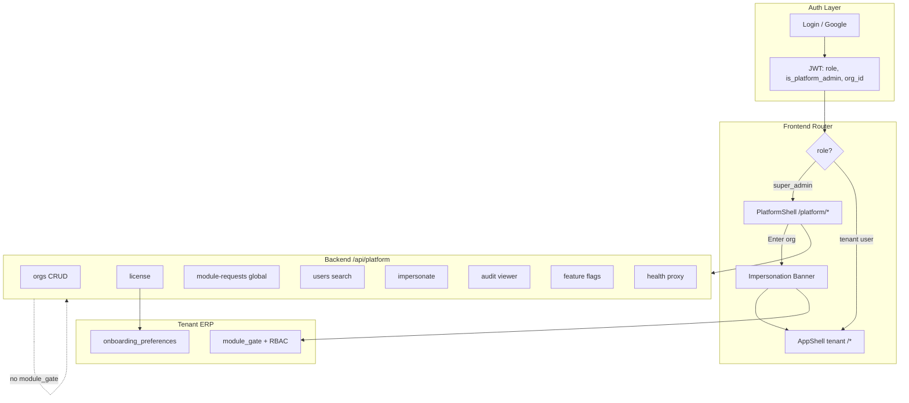
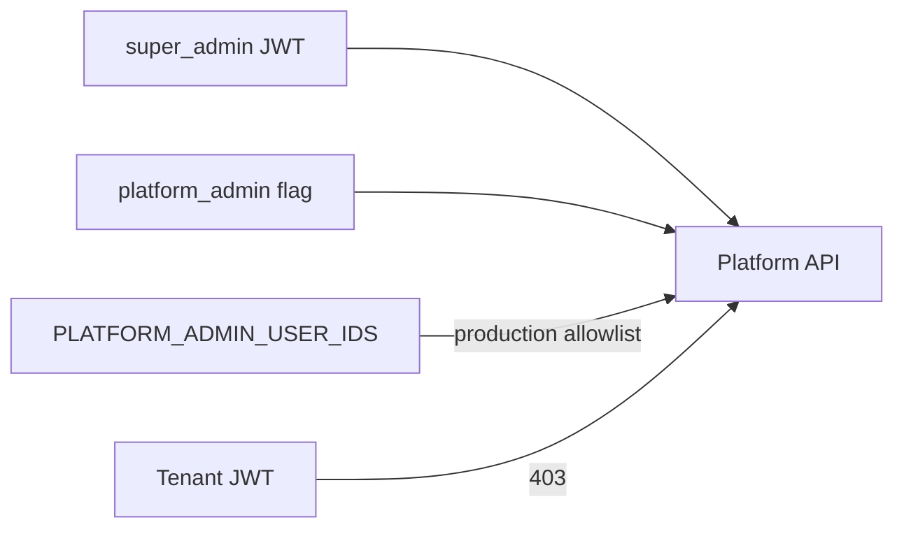

# Design: Super Admin Platform Console

## Architecture Overview



**Principle:** دوو جیهانی جیا — Platform (vendor) و Tenant (customer). Super admin tenant ERP تەنها لە impersonation یان "Enter org" دەبینێت.

---

## Current State (Reuse vs Replace)

| Asset | Path | Action |
|-------|------|--------|
| Platform license API | `backend/app/api/platform.py` | **Extend** → package |
| `require_platform_admin` | `platform.py` | **Keep** + split super-only ops |
| `promote_super_admin.py` | `backend/scripts/` | **Keep** |
| `OrgLicenseEditor` | `frontend/src/pages/platform/` | **Move** → `platform/licenses/` + redesign |
| `usePermission.isSuperAdmin` | `hooks/usePermission.ts` | **Extend** → `usePlatformAccess` |
| Glass tokens | `theme/tokens.ts` | **Extend** → `platformTokens.ts` |
| Tenant AppShell | `layouts/AppShell.tsx` | **Do not modify** for platform nav |
| Module licensing spec | `.kiro/specs/module-licensing-access/` | **Integrate** queue + license UI |

---

## Frontend Architecture

### Route Tree

```
/platform                          → PlatformDashboard
/platform/orgs                       → OrgListPage
/platform/orgs/:orgId                → OrgDetailPage
/platform/orgs/:orgId/license        → LicenseEditorPage (migrate OrgLicenseEditor)
/platform/module-requests            → GlobalModuleRequestsPage
/platform/users                      → GlobalUsersPage
/platform/users/:userId              → UserDetailPage
/platform/audit                      → PlatformAuditPage
/platform/health                     → PlatformHealthPage (wrap SystemHealthPage)
/platform/feature-flags              → FeatureFlagsPage
/platform/announcements              → AnnouncementsPage
/platform/settings                   → PlatformSettingsPage (env read-only, allowlist)
```

**Login redirect** (`App.routes.tsx`):

```tsx
// After login success:
if (isSuperAdmin || isPlatformAdmin) navigate('/platform');
else navigate('/dashboard');
```

**Guards:**

```tsx
const PlatformRoute = ({ children }) => {
  const { isSuperAdmin, isPlatformAdmin } = usePlatformAccess();
  if (!isSuperAdmin && !isPlatformAdmin) return <Navigate to="/dashboard" />;
  return <PlatformShell>{children}</PlatformShell>;
};

const TenantRoute = ({ children }) => {
  const impersonating = useImpersonationStore(s => s.active);
  const { isSuperAdmin } = usePlatformAccess();
  if (isSuperAdmin && !impersonating) return <Navigate to="/platform" />;
  return <AppShell>{children}</AppShell>;
};
```

### Directory Structure

```
frontend/src/platform/
├── shell/
│   ├── PlatformShell.tsx          # glass backdrop, sidebar, topbar
│   ├── PlatformSideNav.tsx        # platform nav only
│   ├── PlatformTopBar.tsx         # search, alerts, profile, exit
│   └── PlatformCommandPalette.tsx
├── theme/
│   ├── platformTokens.ts          # indigo glass palette
│   └── PlatformGlass.module.css
├── dashboard/
│   ├── PlatformDashboard.tsx
│   ├── KpiGrid.tsx
│   └── RecentAuditFeed.tsx
├── orgs/
│   ├── OrgListPage.tsx
│   ├── OrgDetailPage.tsx
│   └── CreateOrgModal.tsx
├── licenses/
│   └── LicenseEditorPage.tsx      # migrated from pages/platform/
├── module-requests/
│   └── GlobalModuleRequestsPage.tsx
├── users/
│   ├── GlobalUsersPage.tsx
│   └── UserDetailPage.tsx
├── audit/
│   └── PlatformAuditPage.tsx
├── impersonation/
│   ├── ImpersonationBanner.tsx
│   └── useImpersonationStore.ts
├── hooks/
│   ├── usePlatformAccess.ts
│   └── usePlatformApi.ts
└── index.ts
```

### Platform Glass Morphism Design System

**Visual identity (distinct from tenant):**

| Token | Tenant ERP | Platform Console |
|-------|------------|------------------|
| Primary | `#1F6FEB` blue | `#6366F1` indigo |
| Shell bg | `#F8FAFC` / dark `#0a0a0f` | Deep space `#030712` + orbs |
| Glass panel | `rgba(255,255,255,0.70)` | `rgba(255,255,255,0.08)` dark-first |
| Blur | 20px | 40px saturate 180% |
| Border | subtle gray | `rgba(255,255,255,0.12)` |
| Accent glow | blue | violet/cyan gradient |

**PlatformShell layout:**

```
┌─────────────────────────────────────────────────────────────┐
│ ░░ ambient orbs + grid (full viewport, fixed)              │
│  ┌──────────┬──────────────────────────────────────────────┐│
│  │ Glass    │ Glass TopBar (search, notifications, user) ││
│  │ SideNav  ├──────────────────────────────────────────────┤│
│  │ 260px    │                                              ││
│  │          │  Main content — glass cards on dark canvas   ││
│  │          │                                              ││
│  └──────────┴──────────────────────────────────────────────┘│
└─────────────────────────────────────────────────────────────┘
```

**Key components:**
- `GlassCard` — platform variant (stronger blur, glow border on hover)
- `KpiStat` — number + sparkline + status pill
- `OrgRow` — org avatar, tier badge, license expiry warning
- `PlatformEmptyState` — illustrated empty queues

**Motion:** Framer Motion page transitions; respect `prefers-reduced-motion`.

---

## Backend Architecture

### Package layout

```
backend/app/api/platform/
├── __init__.py          # router aggregator prefix=/api/platform
├── orgs.py              # list, create, suspend, delete, detail
├── licenses.py          # move from platform.py
├── module_requests.py   # global queue
├── users.py             # global user search/admin
├── impersonate.py       # start/stop impersonation
├── audit.py             # global audit query
├── feature_flags.py
└── announcements.py

backend/app/services/platform/
├── org_admin.py
├── impersonation.py
├── platform_audit.py
└── cross_org_users.py
```

### New API Endpoints (v1)

| Method | Path | Guard | Description |
|--------|------|-------|-------------|
| GET | `/api/platform/orgs` | platform admin | Paginated org list |
| POST | `/api/platform/orgs` | super admin | Create org + owner invite |
| GET | `/api/platform/orgs/{id}` | platform admin | Org detail |
| PATCH | `/api/platform/orgs/{id}` | super admin | Suspend, metadata |
| DELETE | `/api/platform/orgs/{id}` | super admin | Soft delete |
| GET | `/api/platform/module-requests` | platform admin | Global queue |
| POST | `/api/platform/module-requests/{id}/approve` | platform admin | Override approve |
| GET | `/api/platform/users` | platform admin | Search users |
| GET | `/api/platform/users/{id}` | platform admin | User detail |
| POST | `/api/platform/users/{id}/unlock` | super admin | Unlock account |
| POST | `/api/platform/impersonate` | super admin | Start impersonation |
| POST | `/api/platform/impersonate/exit` | auth | End impersonation |
| GET | `/api/platform/audit` | platform admin | Global audit log |
| GET/PUT | `/api/platform/feature-flags` | super admin | Feature flags |
| GET/POST | `/api/platform/announcements` | super admin | Tenant banners |
| GET | `/api/platform/stats` | platform admin | Dashboard KPIs |

Existing: `GET/PUT .../orgs/{id}/license`, `GET /bundles` — move to `licenses.py`.

### Impersonation token flow

```python
def start_impersonation(admin: dict, target_user_id: str) -> TokenResponse:
    target = users_repo.get(target_user_id)
    audit.log("platform.impersonation_start", admin_id=admin["id"], target=target_user_id)
    return issue_tokens(
        target,
        extra_claims={
            "impersonated_by": admin["id"],
            "impersonation": True,
            "exp_minutes": 60,
        },
    )
```

Frontend stores original admin token in `sessionStorage` for restore on exit.

### Data model additions

| Collection | Fields |
|------------|--------|
| `organizations` | + `status: active|suspended|deleted`, `suspended_at`, `deleted_at` |
| `platform_announcements` | `id`, `title`, `body`, `severity`, `start_at`, `end_at`, `created_by` |
| `feature_flags` | `key`, `enabled`, `rollout_percent`, `org_allowlist[]` |
| `impersonation_sessions` | `admin_id`, `target_user_id`, `started_at`, `ended_at`, `jti` |

---

## Security Model



1. **AND logic:** `platform.manage` permission + (`is_platform_admin` OR allowlist user id)
2. **Destructive ops** (delete org, impersonate): require `role=super_admin`
3. **Audit everything** under `platform.*` actions
4. **No SECRET_KEY / credentials** in platform UI or API responses

---

## i18n

Namespace: `platform.json` (ku/en/ar) — all platform strings isolated from tenant locales.

Keys minimum: ~120 (nav, dashboard KPIs, org actions, audit, impersonation banner).

---

## Agent & Workflow Notes

| Phase | Recommended agent | Focus |
|-------|-------------------|-------|
| Discovery | `explore` | Map existing platform.py, auth, routes |
| Backend APIs | `generalPurpose` | platform/ package, tests |
| Platform UI shell | `generalPurpose` | PlatformShell + glass CSS |
| Feature pages | parallel agents | orgs, users, audit |
| E2E | `shell` | playwright platform spec |
| CI | `ci-investigator` | if checks fail |

Spec workflow: `.kiro/specs/super-admin-console/` — requirements → design → tasks (this doc).

---

## Migration Path

1. **Phase 0:** Redirect super_admin to `/platform`; stub dashboard
2. **Phase 1:** PlatformShell + migrate license editor
3. **Phase 2:** Org list/detail + global module queue
4. **Phase 3:** Users, audit, health
5. **Phase 4:** Impersonation + feature flags + announcements
6. **Phase 5:** Polish, E2E, runbook

No breaking change for tenant users — zero impact until super admin uses new console.
