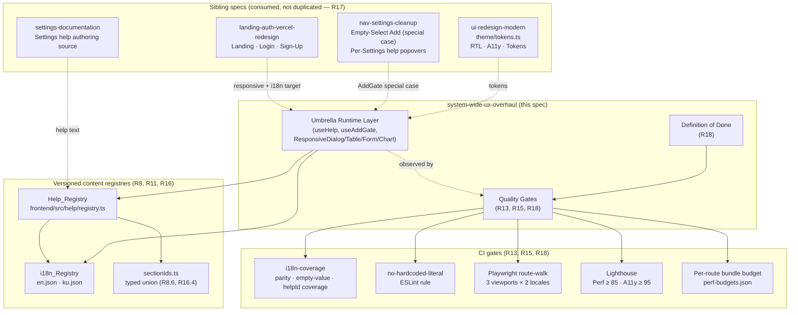
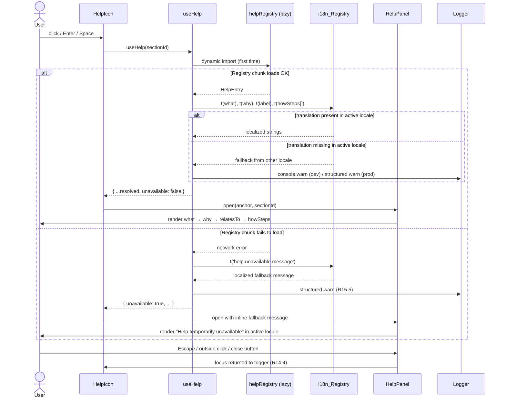

# Design Document — System-Wide UX Overhaul

## Overview

This design implements the **system-wide UX/quality umbrella** specified in `requirements.md` (R1–R18). It enforces five cross-cutting pillars across every Page, Section, Dialog, Form, and Component in ERPIQ:

1. **Full user-friendliness** as a measurable quality bar (R1).
2. **Full mobile responsiveness** via mobile-first Tailwind, container queries, drawer-instead-of-modal, responsive table → card pattern, and safe-area-insets (R2–R5).
3. **A universal Help Icon system** with a single `Help_Registry`, `useHelp(sectionId)` hook, and `Help_Panel` component (R6–R8).
4. **Selective Add** behavior on every Section that supports adding records, via a single `useAddGate(sectionId)` hook and shared `Empty_State` (R9–R10).
5. **Complete bilingual coverage (en ⇄ ku)** with English parity as a hard gate, automated CI coverage, and a single i18n source of truth (R11–R13).

It also wires in cross-cutting **Accessibility (WCAG AA)** (R14), **Performance** (R15), **Content registry maintenance** (R16), **Cross-spec alignment** (R17), and a verifiable **Definition of Done** (R18).

This spec is the **umbrella** above:

- `settings-documentation` — authoring source for Settings sub-section help text. This umbrella **renders** that content; it does not redefine it.
- `nav-settings-cleanup` — Empty-Select Add escape-hatch and per-Settings-section help popovers. This umbrella **promotes** those local rules to system-wide mandates.
- `ui-redesign-modern` — design tokens, RTL, accessibility, command palette. This umbrella **adopts** `theme/tokens.ts` as the source of truth and adds responsive/help/i18n criteria on top.
- `landing-auth-vercel-redesign` — Landing/Auth pages. This umbrella applies the same responsive, a11y, and bilingual rules to those public surfaces.

Per **R17.5**, when a conflict surfaces during implementation, this umbrella spec is the cross-cutting reference and the sibling spec is the local source; conflicts go to design review, never to silent override.

### Traceability Map

Every section in this document carries a **Validates** tag pointing at the originating requirement IDs:

| Design section | Validates |
|---|---|
| Overview | R17 (cross-spec alignment), R18 (DoD scope) |
| Architecture & Foundations | R1, R2, R17 |
| Responsive Patterns Catalog | R2, R3, R4, R5 |
| Help System | R6, R7, R8, R15.5, R17.1 |
| Selective Add System | R9, R10, R17.2 |
| i18n & Bilingual Coverage | R11, R12, R13 |
| Accessibility | R14 |
| Performance | R5.5, R5.6, R15 |
| Quality Gates / CI | R13, R15, R16, R18 |
| Content Registries | R8, R11, R16 |
| Correctness Properties | R1–R14, R18 |
| Error Handling | R1.3, R6.1, R8.4, R12.5, R15.5 |
| Testing Strategy | R13.8, R14.8, R15.1, R18.2 |
| File / Module Layout | R8.1, R8.6, R16.4 |
| Risks & Mitigations | R15, R17 |

---

## Architecture

**Validates: R1, R2, R5, R17**

### High-Level Architecture



The umbrella runtime layer is a thin set of hooks and wrapper components. It does **not** re-implement tokens, modal primitives, or per-Settings-section content; it consumes those from the sibling specs.

### Foundations

**Mobile-first responsive strategy (R2.2, R2.4)**
- Base styles target Mobile_Viewport. Wider viewports are opt-in via Tailwind responsive prefixes.
- Exactly four named breakpoints, sourced from a single `frontend/tailwind.config.ts`:
  - `sm: 640px`
  - `md: 768px`
  - `lg: 1024px`
  - `xl: 1280px`
- No ad-hoc inline media queries. Any non-Tailwind media query lives in `frontend/src/theme/responsive.css` and references the same constants.

**Container queries (R2.3)**
- Components whose layout depends on parent container width — KPI cards, dashboard widgets, sidebar flyouts, embedded forms — use CSS `@container` queries. The container is the immediate `data-container` ancestor declared in the component.
- Tailwind's `@container/xxx` plugin is enabled in `tailwind.config.ts`.

**Safe-area-insets (R2.7)**
- Root layout containers (`AppShell` content region, `AuthLayout`) and full-screen Dialogs apply:
  ```css
  padding-inline-start: env(safe-area-inset-left);
  padding-inline-end: env(safe-area-inset-right);
  padding-block-start: env(safe-area-inset-top);
  padding-block-end: env(safe-area-inset-bottom);
  ```
- Logical properties only — no raw `left`/`right` (R3.8, R14.7).

**Logical CSS / RTL (R3.8, R14.7)**
- Component code uses `inline-start` / `inline-end` / `block-start` / `block-end`, `padding-inline-*`, `margin-inline-*`.
- A `stylelint`/ESLint rule (`no-physical-direction-css`) is configured to flag raw `left:`/`right:`/`margin-left`/`padding-right` etc. outside `theme/tokens.ts` (the existing `rtl-audit` script in `frontend/scripts/` is extended for this — see Risks).
- Document root `dir` is set in `App.tsx`:
  - `ku` → `dir="rtl"`
  - `en` → `dir="ltr"`

**Design token consumption (R17.3)**
- `frontend/src/theme/tokens.ts` is **owned by `ui-redesign-modern`**. This umbrella imports it and treats it as read-only. No token redefinition here.
- Any component-level token needed by this umbrella that is missing in `tokens.ts` is added there by a `ui-redesign-modern` change, not here.

### Decision Rule: Viewport Width, not User-Agent

**Validates: R4.1, R4.5, R4.7**

All "is this Mobile_Viewport?" decisions use `window.matchMedia('(max-width: 640px)')` (or the Tailwind `sm:` boundary), wrapped in a single `useViewport()` hook.

**Forbidden:** any code path that branches on `navigator.userAgent`, `navigator.userAgentData`, "is touch device" detection (`pointer: coarse`), or any heuristic other than viewport width to choose between Mobile and Desktop layouts.

The chart-legend "does not fit" rule (R4.7) compares the chart container's inline-size against the breakpoint, not against device-type strings.

### Cross-Spec Consumption (R17)

| Sibling spec | What this umbrella consumes | What this umbrella does **not** redefine |
|---|---|---|
| `ui-redesign-modern` | `theme/tokens.ts` (palette, spacing, radius, shadows, motion, z-index, typography, layout, a11y), `AppConfigProvider`, `globalStyles.css`, AntD `ConfigProvider` direction handling | Tokens, breakpoints, AntD configuration, palette values |
| `settings-documentation` | The `what` / `why` / `relatesTo` / `howSteps` content for every Settings sub-section | Per-Settings-section text — the Help_Registry references the translation keys this sibling owns (R7.4) |
| `nav-settings-cleanup` | The Empty-Select Add escape-hatch contract and the per-Settings-section help popover specification | The specific deduplicated nav structure or the Settings sub-section list |
| `landing-auth-vercel-redesign` | The landing/auth route surface (`/`, `/login`, `/signup`) where this umbrella's responsive/a11y/i18n rules also apply | The visual identity, hero animations, Apple/Google auth flow, or Vercel deploy config |

---

## Components and Interfaces

**Validates: R1, R2, R3, R4, R5, R6, R7, R8, R9, R10**

### Responsive Patterns Catalog

#### `ResponsiveDialog` — Drawer-Instead-Of-Modal (R3)

**Validates: R3.1, R3.2, R3.3, R3.4, R3.5, R3.6, R3.7, R3.8, R6.6**

```typescript
// frontend/src/components/responsive/ResponsiveDialog.tsx
export interface ResponsiveDialogProps {
  open: boolean;
  onClose: () => void;
  title: TranslationKey;
  primaryAction?: { labelKey: TranslationKey; onClick: () => void; danger?: boolean };
  secondaryAction?: { labelKey: TranslationKey; onClick: () => void };
  /** When true, swipe-down dismissal is disabled (e.g., unsaved-changes guard). */
  suppressSwipeDismiss?: boolean;
  children: React.ReactNode;
}
```

Behavior:
- **Mobile_Viewport (≤ 640 px):** renders as a bottom-sheet. Inline width 100 %, max block height 90 %, drag handle, swipe-down dismissal threshold ≥ 30 % of dialog height (R3.1, R5.4).
- **Above 640 px:** renders as a centered modal with `max-inline-size` from `tokens.ts` (R3.2).
- Sticky header (title + close button), sticky footer (primary + secondary actions). Body is the only scrollable region. Background scroll is locked while open (R3.3, R3.4).
- Focus trap on open; focus returns to trigger on close (R3.5, R14.4).
- On Mobile_Viewport, the primary action sits in the bottom 25 % of the viewport (thumb zone) and is ≥ 44 px tall (R3.6, R5.1).
- Inline-end-anchored side drawers via `inline-start` / `inline-end` only (R3.8).
- Side drawers: 100 % inline width on Mobile_Viewport; max-inline-size from `tokens.ts` on tablet/desktop (R3.7).

Implementation reuses `ui-redesign-modern`'s AntD `Drawer` + `Modal` primitives gated by `useViewport()`; this umbrella adds the drag handle, swipe gesture, and thumb-zone enforcement.

#### `ResponsiveTable` — Table → Stacked Card Pattern (R4)

**Validates: R4.1, R4.2, R4.3, R5.3**

```typescript
export type ColumnPriority = 'high' | 'medium' | 'low';

export interface ResponsiveColumn<T> {
  id: string;
  headerKey: TranslationKey;
  priority: ColumnPriority;            // R4.3 — high columns visible on mobile/tablet
  render: (row: T) => React.ReactNode;
  align?: 'start' | 'center' | 'end';  // logical, not left/right
}

export interface ResponsiveTableProps<T> {
  columns: ResponsiveColumn<T>[];
  data: T[];
  rowActions?: (row: T) => RowAction[];
  loading?: boolean;
  emptyState?: React.ReactNode;
}
```

Behavior:
- **Mobile_Viewport:** each row renders as a card with stacked label/value pairs. Same data, same row actions. Decision is by `useViewport()` width, not user-agent (R4.1).
- **Above Mobile_Viewport:** traditional grid table with sortable columns and sticky header (R4.2).
- When the table has > 5 columns and viewport ≤ Tablet_Viewport, only `priority: 'high'` columns render; the rest sit behind a per-row "Show more" affordance (R4.3).
- Horizontal swipe on a Mobile_Viewport row card reveals the same actions available on desktop right-click/hover, with a tap-only equivalent path for non-gesture users (R5.3).

#### `ResponsiveForm` — Single-Column-On-Mobile Pattern (R4)

**Validates: R4.4, R4.5, R4.8, R5.1, R5.2**

```typescript
export interface ResponsiveFormProps {
  layout: 'single' | 'two-column';   // applies on viewports > 640 px only
  children: React.ReactNode;
}
```

Behavior:
- All form inputs (input, select, button, checkbox, radio, switch, date picker trigger) have `min-block-size: 44px` on Mobile_Viewport (R4.4, R5.1).
- Adjacent Touch_Targets keep ≥ 8 px spacing (R5.2). Enforced via a `formSpacing` token group from `tokens.ts`.
- Forced single-column on Mobile_Viewport regardless of declared `layout` (R4.5).
- Line-item subforms (e.g., invoice line items) render as expandable cards on Mobile_Viewport with the most important fields visible by default and the rest behind an "Edit details" affordance (R4.8).

#### `ResponsiveChart` — Legend Reflow (R4)

**Validates: R4.6, R4.7**

```typescript
export interface ResponsiveChartProps {
  data: ChartDatum[];
  legendItems: { id: string; labelKey: TranslationKey; color: string }[];
  minMobileBlockSize?: number;   // default 240 px (R4.6)
  children: React.ReactNode;     // the chart instance
}
```

Behavior:
- 100 % inline width with `recharts` `<ResponsiveContainer>`.
- Minimum visible block size of 240 px on Mobile_Viewport (R4.6).
- Legend reflow rule: **measure** the legend's intrinsic inline-size with a `ResizeObserver`. If `intrinsicLegendInlineSize > containerInlineSize`, move the legend below the chart and let it wrap (R4.7). Decision is purely by measured inline-size; no UA detection.

#### Touch-Target Sizing & Spacing (R5)

**Validates: R5.1, R5.2**

A shared utility `clickable.css` exposes a `.touchTarget` mixin:

```css
.touchTarget {
  min-block-size: 44px;
  min-inline-size: 44px;
}
.touchTarget + .touchTarget {
  margin-inline-start: 8px;
}
```

For visually smaller controls (e.g., a 16 px close icon), the hit area is extended via padding or a `::before` pseudo-element to reach 44 × 44 px without changing the visual size (R5.1).

#### Decision Rule

**Validates: R4.1, R4.5, R4.7**

A single `useViewport()` hook is the only legal source of truth for "Mobile vs not":

```typescript
// frontend/src/hooks/useViewport.ts
export type Viewport = 'mobile' | 'tablet' | 'desktop' | 'wide';

export function useViewport(): {
  viewport: Viewport;
  isMobile: boolean;       // <= 640 px (sm)
  isTablet: boolean;       // > 640 && <= 1024 px
  isDesktop: boolean;      // > 1024 px
};
```

Implementation: `window.matchMedia` listeners on the four named breakpoints, with SSR-safe defaults. **No** `navigator.userAgent`, `pointer: coarse`, or "isTouch" branching anywhere in component code (P5, P6 in Correctness Properties).

### Help System

**Validates: R6, R7, R8, R15.5, R17.1**

#### Help_Registry Shape (R8.2)

```typescript
// frontend/src/help/sectionIds.ts
export type SectionId =
  | 'settings.currencies'
  | 'settings.fiscal'
  | 'settings.taxes'
  | 'sales.invoices'
  | 'sales.invoices.lineItems'
  | 'dashboard.kpis'
  // … exhaustive union, single source of truth (R8.6, R16.4)
  ;

// frontend/src/help/registry.ts
import type { TranslationKey } from '@/i18n/types';
import type { SectionId } from './sectionIds';

export interface HelpEntry {
  sectionId: SectionId;
  what: TranslationKey;
  why: TranslationKey;
  relatesTo: Array<{ label: TranslationKey; route: string }>;
  howSteps: TranslationKey[];           // length ∈ [2, 7] — R6.3, R7-implicit
}

export type HelpRegistry = Record<SectionId, HelpEntry>;

export const helpRegistry: HelpRegistry = { /* … */ };
```

- Every text field is a `TranslationKey`, never a raw literal (R8.2, R11.5).
- `howSteps` length is constrained to `[2, 7]` at compile time (via a branded type) **and** at CI time (P3).
- Settings sub-section entries reference translation keys whose **values** are owned by `settings-documentation` (R7.4, R17.1). This umbrella is the rendering surface; the sibling spec is the authoring source.

#### `useHelp(sectionId)` Hook (R8.4)

```typescript
// frontend/src/help/useHelp.ts
export interface ResolvedHelp {
  sectionId: SectionId;
  what: string;
  why: string;
  relatesTo: Array<{ label: string; route: string }>;
  howSteps: string[];
  /** True when at least one field fell back from ku → en. */
  fellBack: boolean;
  /** True when the lazy registry chunk failed to load. */
  unavailable: boolean;
}

export function useHelp(sectionId: SectionId): ResolvedHelp;
```

Contract:
- Returns the resolved Help_Content for the active locale (R6.4, R8.4).
- Falls back from ku → en per-key when a Kurdish translation is missing, and emits `console.warn` in development (R8.4, R12.5).
- **Graceful failure (R6.1, R8.4, R15.5):** if the lazy `helpRegistry` chunk fails to load, the hook sets `unavailable: true` and returns translation keys for a minimal "Help is temporarily unavailable. Please try again." fallback message in the active locale, sourced from the always-bundled `i18n_Registry`. The hook **never throws**, **never blocks language switching**, **never force-resets the language**, and **never crashes the section**.
- The Help_Icon checks `unavailable` and either renders nothing or renders the inline fallback message (R6.1).

#### `Help_Panel` Component (R6.6, R6.7, R8.3)

```typescript
// frontend/src/help/HelpPanel.tsx
export interface HelpPanelProps {
  sectionId: SectionId;
  anchorEl: HTMLElement;     // for popover anchoring on desktop
  open: boolean;
  onClose: () => void;
}
```

Behavior:
- **Mobile_Viewport:** bottom-sheet drawer (Drawer_Instead_Of_Modal) (R6.6).
- **Above Mobile_Viewport:** popover anchored to the Help_Icon (R6.6).
- Fixed render order: `what` → `why` → `relatesTo` → `howSteps`, in that order, no exceptions (R6.3).
- `relatesTo` items render as `<Link>` elements that call React Router `navigate()` and scroll the target Section into view via `scrollIntoView({ block: 'start', behavior: prefers-reduced-motion ? 'auto' : 'smooth' })` (R6.8).
- Dismissible by Escape, outside click, or close button (R6.7, R14.4).
- Focus moves into the panel on open and returns to the Help_Icon on close (R6.7, R14.4).
- Help_Panel content is rendered in the Active_Language; ku and en are mutually exclusive on screen (R6.4, R11.6, R11.7).

#### `Help_Icon` Component (R6.1, R6.5, R7.1, R7.5)

```typescript
// frontend/src/help/HelpIcon.tsx
export interface HelpIconProps {
  sectionId: SectionId;
  /** When provided, used instead of the default i18n key for the aria-label suffix. */
  sectionNameKey?: TranslationKey;
}
```

- Renders a `<button>` with `aria-label` resolved from the i18n_Registry, e.g. `helpIcon.ariaLabel` formatted with `sectionName` (R6.5).
- Keyboard-activated by Enter or Space (R6.2, R14.2).
- Renders adjacent to the Section heading (R6.1, R7.1).
- The same component is used for non-Settings Sections **and** for every Settings sub-section, so the visual treatment is identical product-wide (R7.5).
- If the underlying Help_Registry chunk fails to load (`unavailable === true`), the icon renders nothing and a structured `warn` is logged; the surrounding Section continues to render normally (R6.1).

#### Lazy Loading & Offline Degradation (R15.5)

- The `helpRegistry` module is dynamically imported on first Help_Icon activation:
  ```typescript
  const loadRegistry = () => import('./registry');
  ```
- On fetch failure, the inline-fallback path described above runs.
- The fetch is retried on the next Help_Icon activation; it is **not** retried automatically in a loop (P10 — fallback independence).

#### Help_Icon → Help_Panel Sequence



### Selective Add System

**Validates: R9, R10, R17.2**

#### `useAddGate(sectionId)` Hook (R9.5)

```typescript
// frontend/src/components/AddGate/useAddGate.ts
export type AddGateMode = 'mandatory' | 'optional';

export interface AddGateState {
  mode: AddGateMode;
  recordCount: number;
  /** Truthy when a multi-step flow is asking this section to satisfy a step. */
  flow: { id: string; stepId: string; complete: boolean } | null;
  /** Localized message to render in the Empty_State when mandatory. */
  emptyStateCtaKey: TranslationKey;     // e.g. 'addGate.atLeastOneRequired'
  /** Validation key shown when the user attempts to proceed while mandatory. */
  blockedMessageKey: TranslationKey;
  /** Imperative — registers the latest record count for this section. */
  setRecordCount: (n: number) => void;
}

export function useAddGate(sectionId: SectionId): AddGateState;
```

State machine derived from `recordCount` and `flow`:

| Current `recordCount` | Inside incomplete multi-step flow? | `mode` |
|---|---|---|
| `0` | yes | `mandatory` |
| `0` | no | `mandatory` (per R9.3 — empty Section blocks "proceed") |
| `≥ 1` | yes | `optional` |
| `≥ 1` | no | `optional` |

Transition rules:
- `0 → ≥ 1`: auto-demote to `optional`; clear any `blockedMessage` validation marker without page reload (R9.6).
- `≥ 1 → 0`: re-promote to `mandatory` **only if** the section is currently inside an incomplete multi-step flow; outside such a flow, remain `optional` (R9.7).

Behavior:
- The Add action is visible and enabled in both modes (R9.2).
- When `mode === 'mandatory'` and the user attempts to proceed (advance step / submit parent form / leave section), `AddGateProvider` emits a `blocked` event; the parent flow displays the inline message in the Active_Language and focuses the Add button (R9.4).
- The Empty_State of every Section that supports Selective_Add renders an "Add at least one to continue" CTA in the Active_Language when `mode === 'mandatory'` (R9.8).

#### `AddGateProvider` (R10)

```typescript
// frontend/src/components/AddGate/AddGateProvider.tsx
export interface FlowStepBinding {
  flowId: string;
  stepId: string;
  sectionId: SectionId;
  /** Onboarding/multi-step status surfaced in the progress indicator (R10.3). */
  status: 'required-incomplete' | 'optional' | 'completed';
}

export interface AddGateProviderProps {
  flowBindings?: FlowStepBinding[];
  children: React.ReactNode;
}
```

- Tracks every Section's `recordCount` in a shared store keyed by `sectionId`.
- Evaluates the gate at the moment the user attempts to advance a multi-step flow (R10.1) — never speculatively blocks on mount.
- Marks "already configured" steps as **Optional — already configured** in the Active_Language and lets the user skip them (R10.2).
- Surfaces step status in the progress indicator with three values: `required-incomplete`, `optional`, `completed` (R10.3).
- On the final step, lists any unsatisfied required Sections with deep links back to each (R10.4).

#### `Empty_State` Component (R9.8)

```typescript
// frontend/src/components/AddGate/EmptyState.tsx
export interface EmptyStateProps {
  illustration?: React.ReactNode;     // optional icon or illustration (R1.4)
  titleKey: TranslationKey;
  descriptionKey: TranslationKey;
  ctaKey: TranslationKey;             // e.g. 'addGate.addOne' or feature-flag 'comingSoon'
  onCta: () => void;
  /** Pulled from useAddGate — when true, button text uses the mandatory CTA key. */
  mandatory?: boolean;
}
```

- Always renders an illustration/icon, a one-sentence description, and a primary CTA in the Active_Language (R1.4).
- When `mandatory`, the description switches to the mandatory CTA copy ("Add at least one to continue") (R9.8).
- Reused identically by **every** Section that supports adding records, including the special case in `nav-settings-cleanup` where an Empty-Select escape-hatch renders an "Add [Entity]" path (R17.2).

### i18n & Bilingual Coverage

**Validates: R11, R12**

(Detailed contract appears in Data Models below.)

### Settings Sub-Section Help — Cross-Spec Boundary

**Validates: R7, R17.1**

- Every Settings sub-section in the `SectionDef` registry has a corresponding `Help_Registry` entry, including those marked `badge: 'soon'` (R7.1).
- **Authoring source is `settings-documentation`**; the underlying text values for the `what` / `why` / `relatesTo` / `howSteps` translation keys are owned there. This umbrella stores only the keys (R7.4, R17.1).
- Build-time check (in `i18n-coverage` CI job): if a Settings `sectionId` exists in the route registry but is missing from the Help_Registry, fail the build (R7.2).
- Every Settings Help_Content entry includes at least one `relatesTo` link to a non-Settings Section, illustrating cascade (R7.3).

---

## Data Models

**Validates: R8, R9, R11, R16**

### `Help_Registry`

```typescript
// frontend/src/help/sectionIds.ts
export const SECTION_IDS = [
  'settings.currencies',
  'settings.fiscal',
  'settings.taxes',
  // ... exhaustive
] as const;
export type SectionId = typeof SECTION_IDS[number];

// frontend/src/help/registry.ts
export interface HelpEntry {
  sectionId: SectionId;
  what: TranslationKey;
  why: TranslationKey;
  relatesTo: Array<{ label: TranslationKey; route: string }>;
  howSteps: TranslationKey[];   // 2 ≤ length ≤ 7
}
```

Invariants enforced at build time (P3):
- Every `useHelp(id)` call site references an `id` present in `SECTION_IDS`.
- Every entry's translation keys exist in **both** `en.json` and `ku.json` with non-empty values.
- `howSteps.length ∈ [2, 7]`.

### `i18n_Registry`

**Validates: R11, R12, R16**

- Single source of truth: `frontend/src/locales/en.json` and `frontend/src/locales/ku.json`. No other locale source is consulted at runtime (R11.1).
- Identical key sets — symmetric difference is empty (R11.2, P1).
- Non-empty values in both locales. The literal `"TODO"`, the literal `"[missing]"`, `null`, and the empty string `""` are all rejected by CI (R11.3, P1).
- Per-locale dynamic import keyed by Active_Language (R15.6):
  ```typescript
  // frontend/src/i18n.ts
  const loaders: Record<Language, () => Promise<Resource>> = {
    en: () => import('./locales/en.json'),
    ku: () => import('./locales/ku.json'),
  };
  ```
  Only the active locale is loaded on initial render. The inactive locale loads on first language switch.

#### Three-Independent-Paths Fallback (R12.5, P10)

When a translation key resolves to an empty/missing value in the active locale, three independent paths run:

1. **UI fallback** — render the value from the other locale.
2. **Log emission** — `console.warn` in development; structured `warn` log in production telemetry.
3. **CI failure** — `i18n-coverage` job fails the build.

These three paths are coded as **independent** code paths. Failure of any one (e.g., logging infra unavailable) does **not** prevent the others (e.g., UI must still fall back; CI must still flag). This is captured as a property (P10).

#### Hardcoded-Literal Replacements (R12.3, R12.4)

- Every existing `t('users', 'بەکارهێنەران')`-style call is replaced with `t('users', 'Users')`, with the Kurdish translation provided in `ku.json` (R12.3, R8.5 of `nav-settings-cleanup`).
- Kurdish keywords currently embedded in `keywords[]` arrays (e.g., `'یارمەتی'`, `'دۆکیومێنت'`, `'ڕووکار'`) are moved to the i18n_Registry; nav search resolves them per-locale (R12.4, R8.6/8.7 of `nav-settings-cleanup`).

#### Proper-Noun Allowlist (R11.7)

```typescript
// frontend/src/i18n/properNouns.ts
export const PROPER_NOUNS = [
  'Vercel', 'Firebase', 'Google', 'Apple', 'AntD', 'Tailwind',
  'GitHub', 'Stripe', 'iOS', 'Android', 'WCAG', 'ERPIQ',
] as const;
```

These tokens are exempt from the `no-hardcoded-literal` lint rule and from the cross-script visible-text check (R13.8). The allowlist itself is part of the i18n_Registry's policy file and is reviewed in PRs.

#### `data-i18n-test="ignore"` Opt-Out (R13.8)

Test-only DOM nodes (e.g., a hidden `<span data-testid="route-id">/sales/invoices</span>` for Playwright assertions) carry `data-i18n-test="ignore"` and are skipped by the route-walk Playwright assertion. Production-visible nodes never carry this attribute.

### `useAddGate` State

**Validates: R9, R10**

```typescript
interface AddGateRecord {
  sectionId: SectionId;
  recordCount: number;
}

interface FlowState {
  flowId: string;
  steps: Array<{
    stepId: string;
    sectionId: SectionId;
    status: 'required-incomplete' | 'optional' | 'completed';
  }>;
  currentStepId: string;
  complete: boolean;
}

interface AddGateStore {
  records: Record<SectionId, AddGateRecord>;
  flows: Record<string, FlowState>;
  setRecordCount: (sectionId: SectionId, n: number) => void;
  registerFlow: (flow: FlowState) => void;
  advance: (flowId: string) => { ok: boolean; blockedSection?: SectionId };
}
```

State machine (formal):

```
state: { recordCount: number; flow: FlowState | null }
mode(state):
  if flow != null and flow.complete == false:
    return recordCount === 0 ? 'mandatory' : 'optional'
  else:
    return recordCount === 0 ? 'mandatory' : 'optional'

transitions on setRecordCount(n):
  recordCount := n
  if old === 0 && n >= 1:
    clear blockedMessage (R9.6)
  if old >= 1 && n === 0:
    if flow != null && !flow.complete:
      mode := 'mandatory'
    else:
      mode := 'optional'  // (R9.7 — outside flows, stay optional)
```

Note that R9.3 says an empty Section blocks "proceed", but **outside** a multi-step flow there is no "proceed" — the user is free to leave; "mandatory" simply means the Empty_State CTA is the prominent path. The `advance(flowId)` API only blocks inside a flow.

### Per-Locale Bundle Loading

**Validates: R15.6**

```typescript
// frontend/src/i18n.ts (sketch)
import i18next from 'i18next';

i18next.init({
  lng: getInitialLanguage(),
  fallbackLng: 'en',
  load: 'currentOnly',                 // R15.6 — only active locale on init
  partialBundledLanguages: true,
  resources: { },
});

// On first switch to the inactive locale, dynamically import its bundle.
i18next.on('languageChanged', async (lng) => {
  if (!i18next.hasResourceBundle(lng, 'translation')) {
    const mod = await loaders[lng]();
    i18next.addResourceBundle(lng, 'translation', mod.default, true, true);
  }
});
```

### Per-Route Bundle Budgets

**Validates: R5.6, R15**

```json
// frontend/perf-budgets.json
{
  "defaults": {
    "publicGzipKb": 250,
    "authenticatedGzipKb": 350
  },
  "routes": {
    "/": { "gzipKb": 250, "type": "public" },
    "/login": { "gzipKb": 250, "type": "public" },
    "/signup": { "gzipKb": 250, "type": "public" },
    "/dashboard": { "gzipKb": 350, "type": "auth" },
    "/sales/invoices": { "gzipKb": 350, "type": "auth" }
  },
  "noRegressionDeltaPoints": 3
}
```

CI reads this file in the `bundle-budget` job and fails when any measured route exceeds its configured budget (R5.6). Tunable without editing the spec or workflow.

### Help-Bundle Splitting

**Validates: R15.5**

- `frontend/src/help/registry.ts` is excluded from the initial chunk via Vite `rollupOptions.output.manualChunks` (`help` named chunk).
- The `helpRegistry` module is fetched on first Help_Icon activation via dynamic `import()`.
- Inactive locale JSON is **not** bundled with the help chunk — locale loading is independent so a stale help chunk does not pin a locale.


---

## Correctness Properties

*A property is a characteristic or behavior that should hold true across all valid executions of a system — essentially, a formal statement about what the system should do. Properties serve as the bridge between human-readable specifications and machine-verifiable correctness guarantees.*

PBT applies to this feature: the umbrella enforces logical invariants over (a) the i18n_Registry as a JSON pair, (b) the Help_Registry as a typed structure, (c) the AddGate state machine, (d) static analysis of the TSX source for hardcoded literals and physical-direction CSS, and (e) the rendered DOM across the route × viewport × locale matrix. Every property below is universally quantified, traceable to a requirement, and runnable in CI.

UI rendering values that vary per page (visual identity, hero animations, pixel-perfect layout) are deliberately **not** PBT targets — those are example/snapshot tests defined in the Testing Strategy section.

### Property 1: i18n key-set parity

*For all* translation keys `k`, `k ∈ en.json ⇔ k ∈ ku.json`, and the value at `en.json[k]` and `ku.json[k]` is non-empty (rejects `""`, `null`, `"TODO"`, `"[missing]"`).

**Validates: Requirements 11.1, 11.2, 11.3, 13.2, 13.3, 13.7, 16.1, 16.2**

### Property 2: No hardcoded user-visible literal

*For all* user-visible string occurrences in `frontend/src/**/*.{ts,tsx}` — including JSX text content; the JSX attributes `title`, `aria-label`, `placeholder`, `alt`; and the props `label`, `tooltip`, `description`, `message`, `text` on AntD/shadcn-ui components — the string is reached through `t()` **or** is a member of the proper-noun allowlist (`Vercel`, `Firebase`, `Google`, `Apple`, …) **or** is on the safe-skip identifier list (`data-testid`, route paths, class names).

**Validates: Requirements 11.4, 11.7, 12.3, 12.4, 13.4, 13.5**

### Property 3: Help registry coverage

*For all* `sectionId` values referenced via `useHelp(sectionId)` in any `.tsx` file, `sectionId ∈ helpRegistry`. *For all* entries `e ∈ helpRegistry`, `e.what`, `e.why`, every `e.relatesTo[i].label`, and every `e.howSteps[j]` are present in **both** `en.json` and `ku.json` with non-empty values, and `2 ≤ e.howSteps.length ≤ 7`. *For all* Settings sub-section `sectionId` values listed in the Settings `SectionDef` registry, an entry exists in `helpRegistry` and `e.relatesTo.length ≥ 1`.

**Validates: Requirements 6.3, 7.1, 7.2, 7.3, 8.1, 8.2, 8.5, 8.6, 13.6, 16.4**

### Property 4: AddGate monotonicity and transition correctness

*For all* AddGate states `s = (recordCount: n, flow: f)`:

- `mode(s) = mandatory` iff `n = 0` (the universal "empty section ⇒ mandatory" rule).
- *For all* transitions from `s = (0, f)` to `s' = (n', f)` with `n' ≥ 1`: `mode(s') = optional`, the `blockedMessage` validation marker is cleared, and no page reload is required.
- *For all* transitions from `s = (n, f)` with `n ≥ 1` to `s' = (0, f)`: `mode(s') = mandatory` iff `f` is non-null and `f.complete = false`; otherwise `mode(s') = optional`.

**Validates: Requirements 9.2, 9.3, 9.5, 9.6, 9.7, 10.1**

### Property 5: Responsive invariant (no horizontal page overflow)

*For all* routes `r` in the application route registry and *for all* viewports `v ∈ {320, 768, 1280}` and *for all* active locales `L ∈ {en, ku}`, after the route mounts and data settles, `document.scrollingElement.scrollWidth ≤ document.scrollingElement.clientWidth`.

**Validates: Requirements 2.1, 2.5, 4.1, 18.1, 18.2**

### Property 6: Language purity in rendered text

*For all* user-visible text nodes `t` in the rendered DOM — excluding nodes with `display: none`, `visibility: hidden`, `aria-hidden="true"` ancestors, and `data-i18n-test="ignore"` — when `Active_Language = en`, `t` contains no Kurdish-script characters except those listed in the proper-noun allowlist; symmetrically, when `Active_Language = ku`, `t` contains no Latin-script characters except those in the same allowlist.

**Validates: Requirements 11.6, 11.7, 12.1, 12.2, 13.8**

### Property 7: Touch target sizing and spacing

*For all* `Touch_Target` elements `e` rendered on a Mobile_Viewport (≤ 640 px), the bounding hit area of `e` satisfies `width ≥ 44 px ∧ height ≥ 44 px` (computed from the box plus any `::before` extension or padding); and *for all* pairs of adjacent `Touch_Target` elements `(e₁, e₂)` (siblings inside the same interactive region), the inline-axis or block-axis distance between their hit-area edges is `≥ 8 px`.

**Validates: Requirements 4.4, 5.1, 5.2**

### Property 8: Dialog focus discipline

*For all* Dialog (modal, drawer, popover) instances `d`:

- When `d.open = false → true`, focus moves to the first interactive element inside `d`'s subtree within one tick.
- While `d.open = true`, Tab and Shift+Tab cycles only across focusable nodes within `d`'s subtree (focus trap).
- When `d.open = true → false`, focus returns to the element that triggered the open (recorded at open time).

*For all* moments at which **no** Dialog is currently open, focus is **not** trapped — Tab and Shift+Tab traverse the natural document tab order.

**Validates: Requirements 3.5, 6.7, 14.4**

### Property 9: Definition-of-Done conjunction (route-level)

*For all* routes `r` in the application route registry, `r` is "done" if and only if **all four** of the following hold simultaneously:

1. **No overflow at 320 px:** `scrollWidth ≤ clientWidth` for `r` rendered at `viewport = 320`.
2. **Help coverage:** every Section on `r` has a Help_Icon whose `sectionId` resolves to a non-failing `helpRegistry` entry (excluding sections inside an active `unavailable` fallback at fetch time).
3. **AddGate coverage:** every Section on `r` that exposes an "Add"/"Create" primary action wires that action through `useAddGate(sectionId)`.
4. **i18n parity:** every user-visible text node on `r` resolves through `t()` (modulo proper-noun allowlist), in both `en` and `ku`.

A new route added to the registry must satisfy this conjunction at the moment it is merged; CI fails the build otherwise.

**Validates: Requirements 18.1, 18.2, 18.4, 18.5**

### Property 10: Fallback independence (three-paths)

*For all* missing-translation events (an `i18n` key resolves to empty in the active locale) **and** *for all* lazy-help-bundle failures (the `helpRegistry` chunk fails to load), the three response paths — **(a) UI fallback** (render value from the other locale, or render the inline help-unavailable message), **(b) log emission** (`console.warn` in dev, structured `warn` in prod), and **(c) CI signal** (the `i18n-coverage` job records the gap) — are independent: failure of any one of `{a, b, c}` does not suppress the others. Equivalently, for any subset `S ⊊ {a, b, c}` whose paths fail, the paths in `{a, b, c} \ S` still execute their effect.

**Validates: Requirements 6.1, 8.4, 12.5, 15.5**

### Coverage Matrix (Properties → Requirements)

| Property | Requirements covered |
|---|---|
| P1 | R11.1, R11.2, R11.3, R13.2, R13.3, R13.7, R16.1, R16.2 |
| P2 | R11.4, R11.7, R12.3, R12.4, R13.4, R13.5 |
| P3 | R6.3, R7.1, R7.2, R7.3, R8.1, R8.2, R8.5, R8.6, R13.6, R16.4 |
| P4 | R9.2, R9.3, R9.5, R9.6, R9.7, R10.1 |
| P5 | R2.1, R2.5, R4.1, R18.1, R18.2 |
| P6 | R11.6, R11.7, R12.1, R12.2, R13.8 |
| P7 | R4.4, R5.1, R5.2 |
| P8 | R3.5, R6.7, R14.4 |
| P9 | R18.1, R18.2, R18.4, R18.5 |
| P10 | R6.1, R8.4, R12.5, R15.5 |

---

## Error Handling

**Validates: R1.3, R6.1, R8.4, R12.5, R15.5**

### Data-fetch failures (R1.3)

Every data-fetching component renders an inline error state with a localized message and a "Retry" action when its fetch fails. No silent fallback to an empty state. The error state is rendered through the same `EmptyState` shell with `mandatory=false` and a retry CTA, ensuring consistent layout structure (no blank-white screens).

### Help bundle / locale fetch failure (R6.1, R8.4, R15.5)

When the dynamic `helpRegistry` import fails:

- `useHelp` returns `{ unavailable: true, ...inlineFallback }`.
- `Help_Icon` either hides or renders an inline "Help temporarily unavailable. Please try again." message in the active locale, sourced from the always-bundled `i18n_Registry`.
- The surrounding Section continues to render normally — the failure does **not** crash the section, hide it, or block the user from switching language.
- A structured `warn` is logged to production telemetry. The fetch is retried on the next Help_Icon activation; no automatic retry loop.

When the dynamic locale-bundle import fails (e.g., `ku.json` chunk fails on first switch to Kurdish):

- The active locale falls back to the previously-loaded locale (typically `en`).
- A structured `warn` is logged.
- The language switcher displays a transient toast in the previous locale: "Could not load language pack. Please try again."
- The user remains on the previous locale; no crash, no blank screen.

### Translation-key misses (R12.5)

Any `t(key)` that resolves to an empty value triggers the **three-independent-paths** response (P10):

1. **UI fallback** — render the value from the other locale.
2. **Log emission** — `console.warn` in development; structured `warn` log in production.
3. **CI signal** — `i18n-coverage` job records the gap; release is blocked.

These three paths are coded independently; failure of one does not suppress the others.

### Multi-step flow advance blocked by AddGate (R9.4, R10.4)

When `AddGateProvider.advance(flowId)` is invoked while a required Section in the flow is empty, it returns `{ ok: false, blockedSection }`. The flow's parent component:

- Renders an inline validation message in the Active_Language (R9.4).
- Focuses the Add button in the blocked Section.
- Does **not** advance the step.

On the final step, every still-unsatisfied required Section is listed with a deep link in the summary (R10.4).

### Unsaved-changes guard (R1.8)

`ResponsiveDialog` and parent forms register an unsaved-changes flag with React Router's `useBlocker`. When triggered, a confirmation Dialog (also a `ResponsiveDialog`, with `suppressSwipeDismiss` set) asks the user to confirm discarding changes; canceling restores the previous route.

---

## Testing Strategy

**Validates: R13, R14.8, R15.1, R18.2**

### Dual approach

- **Unit / example tests** cover specific behaviors, edge cases, and component contracts.
- **Property-based tests** cover universal invariants from P1–P10, each with **minimum 100 iterations**.
- The two are complementary: example tests catch concrete bugs, property tests catch general violations.

### Property-based testing

- Library: `fast-check` (TypeScript). Already a dev dependency in `frontend/`; this umbrella does **not** introduce a new PBT library. (Test files like `frontend/src/ui-redesign-modern.pbt.test.ts` and `frontend/src/pbt.properties-31-43.test.ts` already use this convention.)
- Each property test runs ≥ 100 iterations.
- Each property test carries a JSDoc tag identifying the design property:
  ```typescript
  /**
   * Feature: system-wide-ux-overhaul, Property 4: AddGate monotonicity and transition correctness
   */
  test.prop([gate.addGateStateArb()])('AddGate is mandatory iff recordCount === 0', (s) => {
    expect(mode(s) === 'mandatory').toBe(s.recordCount === 0);
  });
  ```
- Property tests are organized one-per-property in `frontend/src/system-wide-ux-overhaul.pbt.test.ts`, with shared generators in `frontend/src/help/__generators__/` and `frontend/src/components/AddGate/__generators__/`.

### Unit / example tests

| Area | Test |
|---|---|
| `useViewport` | Mock `matchMedia`, verify viewport classification at boundaries (320, 640, 641, 768, 1024, 1280, 1281). |
| `ResponsiveDialog` | Sticky header/footer on overflow body; scroll lock on background; primary action bottom-25%-of-viewport on mobile (R3.1, R3.3, R3.6). |
| `ResponsiveTable` | High-priority columns retained on mobile; "Show more" reveal on mobile-card row (R4.3). |
| `ResponsiveChart` | Legend reflow when measured intrinsic legend inline-size > container; min block size 240 px on mobile (R4.6, R4.7). |
| `EmptyState` | Renders illustration, description, primary CTA, all from `t()` (R1.4). |
| `Help_Panel` | Render order what → why → relatesTo → howSteps; dismissible by Escape, outside click, close button (R6.3, R6.7). |
| `useHelp` | Graceful failure on chunk-load reject; locale fallback ku → en with `console.warn` in dev (R8.4, R15.5). |
| `AddGateProvider.advance` | Blocks on empty required section; "Optional — already configured" path; final-step summary (R9.4, R10.2, R10.4). |
| `i18n.changeLanguage` | Inactive locale loaded on first switch; failure path falls back to previous locale (R15.6). |

### Integration tests (Playwright)

- **Route-walk** (R18.2): walks every entry in the route registry on viewports `{320, 768, 1280}` × locales `{en, ku}`. Asserts:
  - P5 — no horizontal overflow on `document.scrollingElement`.
  - P6 — visible-text-node language matches active locale (skipping `display: none`, `visibility: hidden`, `aria-hidden="true"`, `data-i18n-test="ignore"`).
  - P9 — every Section has a Help_Icon resolving to a registry entry; every "Add"-supporting Section uses `useAddGate`.
- **Auth flow on Vercel-hosted environment** (delegated to `landing-auth-vercel-redesign`'s suite; this umbrella only adds the responsive/i18n assertions to those routes).

### Lighthouse CI (R14.8, R15.1)

- Mobile profile: Slow 4G (1.6 Mbps / 150 ms RTT), mid-tier CPU throttle.
- Routes measured: home (`/`), login (`/login`), dashboard (`/dashboard`), settings (`/settings`), and any `list` route (`/sales/invoices`, `/inventory/items`, …).
- Performance ≥ 85; Accessibility ≥ 95.
- No-regression delta: Performance must not drop more than 3 points from the recorded baseline. Baseline is committed in `frontend/perf-baseline.json` and updated only via PR review.

### Axe accessibility smoke tests

- Run on the same routes via `@axe-core/playwright`.
- Zero serious or critical violations; warns are tracked but do not block.

### Static analysis

- **ESLint rule `no-hardcoded-literal`** (P2): scans `frontend/src/**/*.{ts,tsx}` for user-visible string literals not reached through `t()` or in the allowlist. Path: `frontend/eslint-rules/no-hardcoded-literal.js`.
- **ESLint / Stylelint rule `no-physical-direction-css`** (P9 indirectly, R3.8 directly): forbids raw `left:`/`right:`/`margin-left`/`padding-right`/`text-align: left|right` outside `frontend/src/theme/tokens.ts` and the existing `rtl-audit` exemption list.
- **Lint rule `no-ua-layout-detection`**: forbids `navigator.userAgent`, `navigator.userAgentData`, and `matchMedia('(pointer: coarse)')` in any file under `frontend/src/components/responsive/**` or `frontend/src/layouts/**`. The decision rule is viewport-width only.

---

## Quality Gates / CI

**Validates: R13, R15, R18**

### CI jobs (additions to existing `.github/workflows/ci-quality.yml`)

This umbrella **extends** the existing `ci-quality.yml` workflow rather than introducing a parallel pipeline (avoids duplicate sibling-spec workflow stanzas).

#### `i18n-coverage` (R13.1–R13.7)

Runs on every PR and on `main`. Fails when any of:

- Symmetric difference of `en.json` and `ku.json` key sets is non-empty.
- Any value is `""`, `null`, `"TODO"`, or `"[missing]"`.
- Any `useHelp(id)` reference in `.tsx` has no entry in `helpRegistry`.
- Any `helpRegistry` entry references a translation key missing in either locale.
- Any `helpRegistry` entry has `howSteps.length` outside `[2, 7]`.

Output:

- Coverage summary in CI logs: total keys per locale, completion percentage, missing-key list.
- **Per-locale release readiness gate (R13.7):** every individual locale must hit 100 %. Release is blocked if any single locale (e.g., `ku`) reports < 100 %, even if the average across locales is higher. The gate is the **per-locale minimum**, never an average.

Implementation: `frontend/scripts/i18n-coverage.mjs`. Invoked as `npm run i18n:coverage`.

#### `no-hardcoded-literal` lint (R13.4, R13.5)

Custom ESLint rule. Path: `frontend/eslint-rules/no-hardcoded-literal.js`. Wired into `eslint.config.mjs`.

- Scans JSX text content and the JSX attributes `title`, `aria-label`, `placeholder`, `alt`.
- Scans component props named `label`, `tooltip`, `description`, `message`, `text`.
- Allowlist of safe-to-skip identifiers: `data-testid` values, route paths, class names, the proper-noun list.

#### `help-registry-coverage` (sub-job of `i18n-coverage`)

Verifies P3 conditions including the Settings sub-section requirement (every Settings `sectionId` from the route registry has an entry in `helpRegistry` with at least one `relatesTo` link).

#### `route-walk` (Playwright) (R13.8, R18.2)

Extends the existing `nav-sweep` job. Walks every route in the route registry on viewports `{320, 768, 1280}` × locales `{en, ku}`. Asserts P5, P6, P9. Inspects only **user-visible** text nodes; explicitly skips `display: none`, `visibility: hidden`, `aria-hidden="true"` ancestors, and `data-i18n-test="ignore"` nodes. Cross-script characters appearing only in hidden elements, test scaffolding, or proper-noun allowlist entries do not trigger a failure.

#### `bundle-budget` (R5.6, R15.1)

Reads `frontend/perf-budgets.json`. Per-route gzipped initial-JS-bundle measurement via Vite's `rollup-plugin-visualizer`-derived metadata. Fails when any measured route exceeds its configured budget. Tunable without editing the spec or workflow.

#### `lighthouse` (R14.8, R15.1, R15.2, R15.3, R15.4)

Extends the existing `lighthouse` job:

- Runs on Slow 4G mobile profile.
- Routes: `/`, `/login`, `/dashboard`, `/settings`, plus a sample `list` route.
- Performance ≥ 85; Accessibility ≥ 95.
- LCP ≤ 2.5 s on `/` and `/login`.
- CLS ≤ 0.1 on every measured route.
- INP ≤ 200 ms on `/dashboard` and the sample list route.
- No-regression delta: Performance not below `perf-baseline.json - 3`.

#### Release-readiness report (R18.4)

Generated by `frontend/scripts/release-readiness.mjs` after the above jobs complete. Per-route columns:

| Column | Threshold |
|---|---|
| Help_Icon coverage % | 100 % |
| AddGate coverage % | 100 % |
| i18n parity % | 100 % per locale |
| Lighthouse Performance | ≥ 85 |
| Lighthouse Accessibility | ≥ 95 |

Release is blocked if any cell falls below its threshold (R18.3, R18.4).

#### New-route safeguard (R18.5)

The route-walk and `help-registry-coverage` jobs run on **every** PR, including PRs that add a new route. If the new route fails any of the four DoD checks (P9), the build fails — the quality bar holds going forward.

### CI workflow shape

A single new file extends the existing workflow with the four new jobs (`i18n-coverage`, `route-walk`, `bundle-budget`, `release-readiness`); the existing `lighthouse` and `nav-sweep` jobs are extended in-place. No duplication of sibling-spec workflow stanzas (e.g., the `nav-audit` and `rtl-audit` jobs already added by `nav-settings-cleanup` and prior work are reused).

---

## File / Module Layout

**Validates: R8.1, R8.6, R16.4, R17 (no duplication)**

```
frontend/
├── src/
│   ├── help/
│   │   ├── registry.ts                     # Help_Registry (R8.1, R8.3)
│   │   ├── sectionIds.ts                   # SectionId union (R8.6, R16.4)
│   │   ├── useHelp.ts                      # useHelp(sectionId) hook (R8.4)
│   │   ├── HelpPanel.tsx                   # popover/drawer renderer (R6.3, R6.6)
│   │   └── HelpIcon.tsx                    # ⓘ button (R6.1, R6.5, R7.5)
│   ├── components/
│   │   ├── AddGate/
│   │   │   ├── useAddGate.ts               # useAddGate(sectionId) hook (R9.5)
│   │   │   ├── AddGateProvider.tsx         # multi-step integration (R10)
│   │   │   └── EmptyState.tsx              # shared Empty_State (R1.4, R9.8)
│   │   └── responsive/
│   │       ├── ResponsiveDialog.tsx        # drawer-instead-of-modal (R3)
│   │       ├── ResponsiveTable.tsx         # table → cards (R4.1–R4.3)
│   │       ├── ResponsiveForm.tsx          # single-column on mobile, ≥44 px (R4.4–R4.5, R4.8)
│   │       └── ResponsiveChart.tsx         # legend reflow (R4.6, R4.7)
│   ├── hooks/
│   │   └── useViewport.ts                  # single viewport-width source (R2.4, R4.1)
│   ├── i18n/
│   │   ├── properNouns.ts                  # cross-script allowlist (R11.7)
│   │   └── types.ts                        # TranslationKey type
│   ├── locales/
│   │   ├── en.json                         # i18n source of truth — en (R11.1)
│   │   └── ku.json                         # i18n source of truth — ku (R11.1)
│   └── theme/
│       └── tokens.ts                       # CONSUMED, NOT redefined — owned by ui-redesign-modern (R17.3)
├── perf-budgets.json                       # per-route bundle budgets (R5.6, R15)
├── perf-baseline.json                      # Lighthouse no-regression baseline (R15.1)
├── eslint-rules/
│   └── no-hardcoded-literal.js             # custom ESLint rule (R13.4, R13.5)
└── scripts/
    ├── i18n-coverage.mjs                   # P1, P3 enforcement (R13)
    ├── i18n-report.mjs                     # `npm run i18n:report` (R16.2)
    ├── help-report.mjs                     # `npm run help:report` (R16.3)
    └── release-readiness.mjs               # per-route readiness report (R18.4)

.github/
└── workflows/
    └── ci-quality.yml                      # EXTENDED in-place — no parallel workflow (R17, R18.3)
```

Notes:

- `frontend/src/theme/tokens.ts` is **owned by `ui-redesign-modern`**. This umbrella imports it and treats it as read-only (R17.3). No token redefinition.
- Per-Settings-section help **content** is owned by `settings-documentation`; this umbrella stores the keys in `helpRegistry` and the values in `en.json` / `ku.json` are populated by the sibling spec's authoring step (R7.4, R17.1).
- The Empty-Select Add escape-hatch from `nav-settings-cleanup` reuses `EmptyState` with the AddGate `mandatory=true` path (R17.2). No duplicate component.
- The Landing/Login/Sign-Up pages from `landing-auth-vercel-redesign` use `ResponsiveDialog`, `ResponsiveForm`, `useHelp` (where applicable), and `useViewport` from this umbrella (R17.4).
- The CI workflow file is **extended in-place**; no duplicate sibling-spec stanzas (R17, R18.3).

---

## Risks & Mitigations

**Validates: R15, R17**

### Risk 1: Cross-spec drift

**Risk:** Sibling specs (`settings-documentation`, `nav-settings-cleanup`, `ui-redesign-modern`, `landing-auth-vercel-redesign`) and this umbrella diverge on tokens, content, or contracts.

**Mitigation:**
- R17.5 escalation rule — conflicts go to design review; this umbrella is the cross-cutting reference, the sibling is the local source.
- Design-review handoff: a shared "spec-alignment" PR template lists the four sibling specs and asks reviewers to flag overlap.
- The `release-readiness.mjs` script lists which sectionIds are owned by which sibling, so an audit at release time catches drift.

### Risk 2: Help bundle / locale fetch failure

**Risk:** Lazy-loaded help bundle or locale JSON fails (network, CDN, offline).

**Mitigation:**
- `useHelp` returns `{ unavailable: true, ...inlineFallback }` on chunk failure (R6.1, R8.4, R15.5).
- Inline fallback message lives in the always-bundled i18n_Registry, so it is rendered in the active locale.
- Surrounding Section continues to render normally — no crash, no hide, no language reset (R6.1, R8.4).
- Locale-bundle failure falls back to the previously-loaded locale with a transient toast.
- Property P10 ensures the three fallback paths are independent.

### Risk 3: Performance regression

**Risk:** New responsive wrappers, help registry, AddGate, and i18n infrastructure regress mobile performance.

**Mitigation:**
- Per-route bundle budgets in `frontend/perf-budgets.json`, enforced in CI (R5.6, R15.1).
- Help bundle and locale JSON are lazy-loaded; only the active locale is in the initial chunk (R15.5, R15.6).
- Lighthouse no-regression delta gate (≤ 3 point Performance drop vs baseline) enforced per route (R15.1).
- LCP/CLS/INP budgets enforced in the `lighthouse` CI job (R15.2, R15.3, R15.4).

### Risk 4: Translation drift

**Risk:** New keys land in `en.json` without `ku.json` counterparts (or vice versa) and slip past review.

**Mitigation:**
- `i18n-coverage` job fails on symmetric-difference non-emptiness (P1, R13.2).
- Per-locale 100 % gate at release time — never an average (R13.7).
- `npm run i18n:report` script for editors to spot truncation candidates and gaps (R16.2).
- CHANGELOG entry pattern flags every new/removed key per release (R16.5).

### Risk 5: RTL leakage from raw `left`/`right` CSS

**Risk:** A developer adds `margin-left: 16px` or `text-align: right` somewhere, breaking RTL.

**Mitigation:**
- Stylelint rule `no-physical-direction-css` flags raw physical-direction properties outside the existing `rtl-audit` exemption list (R3.8, R14.7).
- ESLint rule on inline styles in `.tsx` files for the same patterns.
- `rtl-audit` script in CI is already running (`continue-on-error: true` today); this umbrella tightens it to **blocking** once the existing pre-existing violations in `LandingPage.tsx`, `POSFloorPlan.tsx`, and `KitchenDisplay.tsx` are fixed (per the existing TODO in `ci-quality.yml`).
- Property P9 indirectly catches RTL leakage at the route-walk visual level.

### Risk 6: User-agent-based layout decisions creeping in

**Risk:** A future change re-introduces `navigator.userAgent` or `pointer: coarse` checks for mobile/desktop branching.

**Mitigation:**
- Lint rule `no-ua-layout-detection` forbids these in `frontend/src/components/responsive/**` and `frontend/src/layouts/**`.
- `useViewport()` is the only legal source of truth — code review checklist enforces this.
- Property P5's failures, when they occur, point reviewers at the layout decision logic.

---

## Phase Completion

The Design phase ends here. Per the workflow, the next phase (Tasks) will be triggered by user action in the UI; this agent does not advance to it automatically.

This design covers every requirement R1–R18, with traceability via the **Validates** tags on each section and the Property → Requirement Coverage Matrix. It treats the four sibling specs as consumed contracts (R17), defines the umbrella runtime layer (`useHelp`, `useAddGate`, the four `Responsive*` wrappers, `useViewport`), pins the i18n contract to a single source of truth, and wires an automated release-readiness gate that holds the Definition of Done (R18) on every PR.
