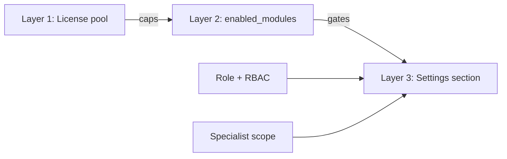
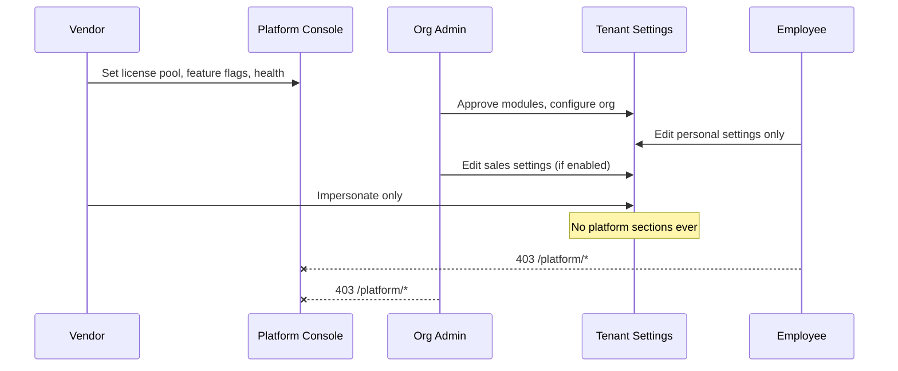
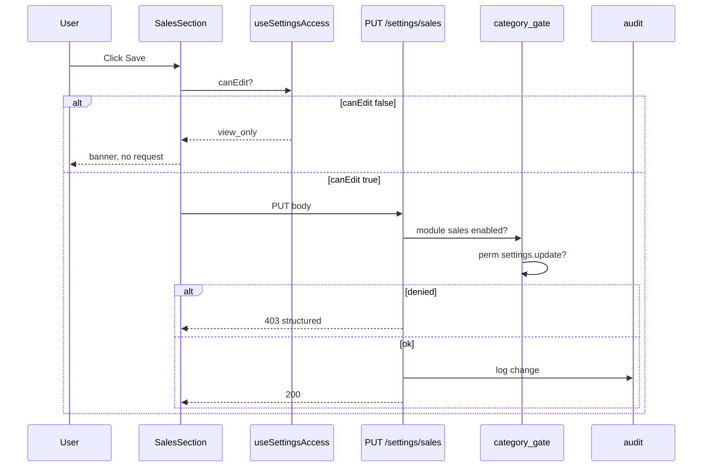

# Design: Tenant User Settings v2

**Version:** 2.0  
**Companion:** `requirements.md`, `tasks.md`

---

## 1. Architecture Overview

```mermaid
flowchart TB
  subgraph inputs [Inputs]
    Auth[AuthStore: role, perms, impersonating]
    Onb[onboardingStore: enabledModules]
    Lic[org license: allowed_modules, expires]
  end

  subgraph registry [Single Registry]
    Reg[moduleSettingsRegistry]
    Scope[ROLE_MODULE_SCOPE]
    Plat[platformOnlySections]
  end

  subgraph tenant_ui [Tenant AppShell /settings]
    Hook[useSettingsAccess]
    Vis[useVisibleSections]
    Guard[SettingsRouteGuard]
    Shell[SettingsShell]
    Nav[SettingsNav]
    Panel[Lazy Section Component]
    Banner[SettingsGateBanner]
  end

  subgraph client_api [Client API Layer]
    Bag[useSettingsBag]
    Me[/api/users/me]
    Sys["/api/system/settings/{cat}"]
    Sec["/api/onboarding/settings-sections"]
  end

  subgraph tenant_api [Tenant Backend]
    Gate[settings_category_gate]
    Perm[permissions service]
    Svc[settings_service]
    Audit[audit log]
  end

  subgraph platform [Platform Console - isolated]
    PF[/platform/feature-flags]
    PH[/platform/health]
    PL[/platform/orgs/:id/license]
  end

  Auth --> Hook
  Onb --> Hook
  Lic -.-> Onb
  Reg --> Hook
  Scope --> Hook
  Hook --> Vis
  Vis --> Nav
  Guard --> Hook
  Shell --> Nav
  Shell --> Panel
  Panel --> Bag
  Bag --> Sys
  Hook --> Banner
  Sec -.->|optional validate| Vis

  Sys --> Gate --> Perm
  Gate --> Svc
  Svc --> Audit

  platform -.->|never tenant nav| tenant_ui
```

### Design principles

| # | Principle | Implementation |
|---|-----------|----------------|
| 1 | Platform hide, backend deny | `platform_only` tier + `require_platform_admin` |
| 2 | Registry-driven | `SECTION_BINDINGS` + `CATEGORY_MODULE` sync |
| 3 | Progressive access | personal → org_read → org_write |
| 4 | Module-first | `isModuleEnabled` before any module section |
| 5 | Specialist least privilege | `ROLE_MODULE_SCOPE` narrows read |
| 6 | org_read immutable | `canEdit` never true for `org_read` tier |
| 7 | Reuse existing | `useSettingsBag`, `settings_service`, Platform Console |

---

## 2. Current State vs v2 Target

| Area | Current (v1) | v2 target |
|------|--------------|-----------|
| Page gate | Open to all ✅ | Remove legacy `hasSettingsAccess` usages |
| Nav filter | tier + module + perm ✅ | + specialist scope |
| `useSettingsAccess.canEdit` | admin bypasses org_read ⚠️ | Fix: org_read never editable |
| Specialist read | Not implemented | sales → sales only read |
| `feature_flags` | Removed from nav ✅ | Optional read-only mirror |
| `Settings.tsx` | ~5200 lines monolith | < 200 lines entry |
| Backend gate | category module + perm ✅ | + read_only_section for activity |
| Registry sync | manual | CI diff script |
| Server nav validation | optional endpoint exists | enforce on mount (recommended) |
| Feature flag env | `VITE_TENANT_SETTINGS_V2` | remove |

---

## 3. Three-Layer Access Model



| Layer | Source | Who changes |
|-------|--------|-------------|
| License pool | `organizations.license.allowed_modules` | Platform admin |
| Enabled | `onboarding_preferences.enabled_modules` | Org admin approve |
| Section visible | Registry + Layer 2 + role | System computed |

---

## 4. Frontend Package Layout

```
frontend/src/settings/
├── registry/
│   ├── types.ts                    # SectionKey, SettingsTier, SectionBinding
│   ├── moduleSettingsRegistry.ts   # SECTION_BINDINGS, getVisibleBindings, canEditBinding
│   ├── roleModuleScope.ts          # NEW: ROLE_MODULE_SCOPE, isSpecialistScopedRead
│   ├── platformOnlySections.ts     # PLATFORM_ONLY_KEYS, PLATFORM_ONLY_ROUTES
│   └── __tests__/
│       ├── moduleSettingsRegistry.test.ts
│       └── roleModuleScope.test.ts
├── hooks/
│   ├── useSettingsAccess.ts        # canView, canEdit, denyReason — FIX org_read
│   ├── useVisibleSections.ts       # bindings + i18n + icons + groups
│   └── useSettingsSectionsSync.ts  # NEW: optional server validation
├── shell/
│   ├── SettingsShell.tsx
│   ├── SettingsNav.tsx
│   ├── SettingsRouteGuard.tsx
│   └── SettingsEditContext.tsx     # canEdit for SaveBar + forms
├── sections/
│   ├── personal/
│   │   ├── ProfileSection.tsx
│   │   ├── SecuritySection.tsx
│   │   ├── NotificationsSection.tsx
│   │   └── PreferencesSection.tsx
│   ├── organization/
│   ├── users/
│   ├── localization/
│   ├── finance/
│   ├── commerce/                   # sales, crm, purchases, ...
│   ├── operations/                 # hr, payroll, projects, marketing
│   ├── automation/
│   ├── content/
│   ├── system/
│   │   ├── ModulesSection.tsx
│   │   ├── ActivitySection.tsx     # read-only enforced
│   │   ├── SystemInfoSection.tsx   # trimmed — no infra
│   │   └── FeatureFlagMirror.tsx   # NEW optional read-only
│   └── index.ts                    # SectionKey → React.lazy map
├── components/
│   ├── ModuleSettingsCard.tsx
│   ├── SettingsGateBanner.tsx
│   ├── SettingsModulesEmptyState.tsx
│   └── RequestModuleCTA.tsx
├── utils/
│   └── settingsCommandItems.ts
└── index.ts

frontend/src/pages/Settings.tsx     # export default SettingsShell only
```

---

## 5. Registry Schema (Authoritative)

```typescript
// frontend/src/settings/registry/types.ts

export type SettingsTier = 'personal' | 'org_read' | 'org_write' | 'platform_only';

export type SettingsRole =
  | 'viewer' | 'user' | 'manager' | 'admin' | 'owner' | 'super_admin'
  | 'sales' | 'purchaser' | 'inventory' | 'accountant' | 'warehouse'
  | 'pos_cashier' | null;

export interface SectionBinding {
  key: SectionKey;
  tier: SettingsTier;
  group: SectionGroup;
  labelKey: string;
  fallbackLabel: string;
  /** OR semantics — visible if ANY enabled */
  moduleGate?: readonly ModuleKey[];
  /** Required for write; read uses tier + settings.read */
  permission?: string;
  /** Maps to GET/PUT /api/system/settings/{category} */
  bagCategory?: string;
  /** Alternate route instead of ?s= panel */
  route?: string;
  /** Platform destination if platform_only */
  platformRoute?: string;
  /** If set, only these specialist roles get scoped read (Requirement 10) */
  specialistReadRoles?: readonly SettingsRole[];
}

export interface SectionAccessResult {
  canView: boolean;
  canEdit: boolean;
  denyReason: SettingsDenyReason;
}
```

### Registry ↔ Backend sync table

| SectionKey | bagCategory | CATEGORY_MODULE (backend) | CATEGORY_WRITE_PERM |
|------------|-------------|---------------------------|---------------------|
| sales | sales | sales | settings.update (default) |
| fiscal | fiscal | accounting | settings.fiscal |
| activity | — (read API) | — | read_only_section |
| numbering | numbering | OR tuple | settings.numbering |
| ... | ... | ... | ... |

**CI script:** `scripts/check-settings-registry-sync.ts` compares frontend `bagCategory` keys to Python `CATEGORY_MODULE`.

---

## 6. Role Module Scope (NEW)

```typescript
// frontend/src/settings/registry/roleModuleScope.ts

/** Primary module a specialist role may read settings for (view-only). */
export const ROLE_MODULE_SCOPE: Partial<Record<NonNullable<SettingsRole>, ModuleKey>> = {
  sales: 'sales',
  purchaser: 'purchase',
  inventory: 'inventory',
  warehouse: 'inventory',
  pos_cashier: 'pos',
};

/** Finance sections accountant may access beyond personal. */
export const ACCOUNTANT_FINANCE_SECTIONS: readonly SectionKey[] = [
  'fiscal', 'budgets', 'taxes', 'banking', 'currencies',
];

export function isSpecialistScopedRead(
  role: SettingsRole,
  binding: SectionBinding,
  enabledModules: ModuleKey[] | null,
): boolean {
  const scopedModule = role ? ROLE_MODULE_SCOPE[role] : undefined;
  if (!scopedModule) return false;
  if (!isModuleEnabled(scopedModule, enabledModules ?? [])) return false;
  // Section must belong to scoped module
  if (binding.moduleGate?.includes(scopedModule)) return true;
  if (binding.key === MODULE_PRIMARY_SECTION[scopedModule]) return true;
  return getSectionsForModule(scopedModule).some((s) => s.key === binding.key);
}
```

### Visibility pipeline (updated)

```
SECTION_BINDINGS
  → exclude platform_only (tenant mode)
  → filter moduleGate (OR + ALWAYS_ON via isModuleEnabled)
  → filter tier:
      personal → all auth
      org_read → manager | settings.read | admin view
      org_write → admin | settings.update | section perm | specialist scoped read
  → filter specialist scope (org_write sections):
      if specialist role → only matching module sections (+ finance for accountant)
      if viewer/user → personal + modules only
  → drop empty groups
  → render
```

---

## 7. useSettingsAccess (v2 fix)

### Bug in v1

```typescript
// CURRENT — WRONG: admin can edit org_read (activity)
const canEdit =
  canEditBinding(binding, role, permissions) ||
  isTenantOrgAdmin ||
  hasPerm(binding.permission || 'settings.update');
```

### v2 correct logic

```typescript
export function useSettingsAccess(sectionKey: SectionKey): SectionAccessResult {
  // ... auth, binding, platform_only, module checks ...

  const visible = getVisibleBindings(enabledModules, role, permissions, true);
  const canView = visible.some((s) => s.key === sectionKey);
  if (!canView) {
    return { canView: false, canEdit: false, denyReason: 'permission_denied' };
  }

  // org_read: NEVER editable — including admin
  if (binding.tier === 'org_read') {
    return { canView: true, canEdit: false, denyReason: 'view_only' };
  }

  if (binding.tier === 'personal') {
    return { canView: true, canEdit: true, denyReason: null };
  }

  // org_write
  const canEdit =
    canEditBinding(binding, role, permissions) ||
    (isTenantOrgAdmin && binding.tier === 'org_write');

  // Specialist: view only even on org_write sections
  if (isSpecialistRole(role) && isSpecialistScopedRead(role, binding, enabledModules)) {
    return { canView: true, canEdit: false, denyReason: 'view_only' };
  }

  if (!canEdit) {
    return { canView: true, canEdit: false, denyReason: 'view_only' };
  }

  return { canView: true, canEdit: true, denyReason: null };
}
```

### SettingsEditContext

```typescript
// Propagate canEdit to SaveBar + useSettingsBag
const { canEdit } = useSettingsAccess(activeSection);
<SettingsEditContext.Provider value={{ canEdit }}>
  {children}
</SettingsEditContext.Provider>

// useSettingsBag wrapper
const save = canEdit ? originalSave : noop;
```

---

## 8. SettingsRouteGuard behavior

| Condition | Action |
|-----------|--------|
| `!isAuthenticated` | redirect `/login?return=/settings` |
| unknown `?s=` | redirect first visible + toast `settings.gate.unknown_section` |
| `platform_only` | redirect `profile` + toast `settings.gate.platform_only` |
| module disabled | redirect `modules` + toast + `RequestModuleCTA` |
| permission denied | redirect `profile` + toast `settings.gate.permission_denied` |
| valid | render section |

```typescript
function firstVisibleSection(role, modules, perms): SectionKey {
  const visible = getVisibleBindings(modules, role, perms, true);
  return visible[0]?.key ?? 'profile';
}
```

---

## 9. Modules Tab Design

```mermaid
flowchart TD
  MT[Modules Tab] --> Pool[License Pool Cards - read-only]
  MT --> En[Enabled Module Cards]
  MT --> Req[Request Access Cards]
  En --> OS[Open settings → ?s=primary]
  Req --> MR[/settings/module-requests]
  Pool --> CV[Contact vendor - no edit]
```

```tsx
// ModuleSettingsCard states
type ModuleCardState = 'enabled' | 'in_pool_not_enabled' | 'not_in_pool';

<Card state={state}>
  {state === 'enabled' && (
    <Button to={`/settings?s=${primarySection}`}>{t('settings.modules.open_settings')}</Button>
  )}
  {state === 'in_pool_not_enabled' && (
    <Button to="/settings/module-requests">{t('settings.modules.request_access')}</Button>
  )}
  {state === 'not_in_pool' && (
    <Text muted>{t('settings.modules.not_in_license')}</Text>
  )}
</Card>
```

---

## 10. Feature Flag Read-Only Mirror (optional)

```tsx
// frontend/src/settings/sections/system/FeatureFlagMirror.tsx
// Shown only to admin/owner under modules or system — NOT in main nav as editable section

function FeatureFlagMirror() {
  const { data } = useQuery('/api/feature-flags/effective'); // GET only
  return (
    <ReadOnlyTable
      columns={['flag', 'enabled', 'rollout%']}
      footer={<Link to="/support">{t('settings.flags.contact_vendor')}</Link>}
    />
  );
}
```

Backend: existing GET may remain org-scoped read; POST/DELETE gated by `is_platform_admin` (already F5).

---

## 11. Backend Design

### 11.1 settings_category_gate.py (extend)

```python
# Read-only categories — no PUT even for admin
READ_ONLY_CATEGORIES: frozenset[str] = frozenset({"activity"})

def require_settings_write(user: dict, category: str) -> None:
    if category in READ_ONLY_CATEGORIES:
        raise HTTPException(403, detail={"code": "read_only_section", "category": category})
    _require_settings_write(user, category)
    require_module_for_category(category, user["org_id"])
    perm = CATEGORY_WRITE_PERM.get(category, "settings.update")
    if not user_has_perm(user, perm) and user.get("role") not in ("admin", "owner"):
        raise HTTPException(403, detail={"code": "permission_denied", "perm": perm})
```

### 11.2 Specialist read on GET (optional v2.1)

For GET, allow specialist if:
- category maps to their module in `ROLE_MODULE_CATEGORY`
- role in specialist set
- module enabled

```python
SPECIALIST_ROLE_MODULE = {
    "sales": "sales",
    "purchaser": "purchase",
    # ...
}

def _can_read_category(user: dict, category: str) -> bool:
    if _has_settings_read(user):
        return True
    role = user.get("role")
    mod = SPECIALIST_ROLE_MODULE.get(role)
    if mod and category_belongs_to_module(category, mod):
        return is_module_enabled(user["org_id"], mod)
    return False
```

### 11.3 settings-sections API response

```json
GET /api/onboarding/settings-sections

{
  "sections": [
    { "key": "profile", "can_view": true, "can_edit": true },
    { "key": "sales", "can_view": true, "can_edit": false, "deny_reason": "view_only" },
    { "key": "crm", "can_view": false, "can_edit": false, "deny_reason": "module_disabled" }
  ],
  "enabled_modules": ["sales", "inventory", "pos"],
  "role": "manager"
}
```

Implementation: mirror frontend `getVisibleBindings` logic in Python shared module OR generate from JSON registry export (long-term).

### 11.4 Module approve seed

```python
# onboarding approve handler
from app.services.settings_category_gate import seed_defaults_for_module

for mod in approved_modules:
    seed_defaults_for_module(org_id, mod)
```

Uses `_MODULE_DEFAULT_CATEGORIES` already in gate service.

### 11.5 Error response schema (normative)

```json
{
  "detail": {
    "code": "module_disabled | permission_denied | license_expired | read_only_section | platform_only",
    "module": "sales",
    "perm": "settings.fiscal",
    "category": "activity"
  }
}
```

---

## 12. Platform vs Tenant Interaction



---

## 13. usePermission v2 changes

```typescript
// Deprecate hasSettingsAccess for page gate — all auth users enter Settings
// Keep isTenantOrgAdmin for edit shortcuts within org_write only

export function usePermission() {
  // ...
  /** @deprecated Use useSettingsAccess(sectionKey) */
  hasSettingsAccess: isAuthenticated, // always true for auth users on /settings

  hasPerm(permission: string): boolean {
    if (!isAuthenticated) return false;
    if (isTenantOrgAdmin) return true; // org-scoped only
    // * wildcard — org scope, NOT platform.admin
    if (permission.startsWith('platform.')) return false; // unless is_platform_admin
    // ...
  }
}
```

Super admin without impersonation: `isTenantOrgAdmin = false`, `hasSettingsAccess = true` only if they navigate to tenant (discouraged).

---

## 14. Command Palette integration

```typescript
// frontend/src/settings/utils/settingsCommandItems.ts

export function getSettingsCommandItems(ctx: CommandContext): CommandItem[] {
  const visible = getVisibleBindings(ctx.enabledModules, ctx.role, ctx.permissions, true);
  return visible.map((b) => ({
    id: `settings:${b.key}`,
    label: t(b.labelKey, b.fallbackLabel),
    action: () => navigate(b.route ?? `/settings?s=${b.key}`),
    group: 'settings',
  }));
}
```

Platform console has separate palette — no tenant settings items when in PlatformShell.

---

## 15. Section → Component → API map

| SectionKey | Component file | Primary API |
|------------|----------------|-------------|
| profile | personal/ProfileSection | PUT /api/users/me |
| security | personal/SecuritySection | /api/auth/2fa, password |
| notifications | personal/NotificationsSection | user prefs |
| preferences | personal/PreferencesSection | user prefs |
| sales | commerce/SalesSection | GET/PUT settings/sales |
| crm | commerce/CrmSection | settings/crm |
| fiscal | finance/FiscalSection | settings/fiscal |
| modules | system/ModulesSection | onboarding API |
| module_requests | route → ModuleRequestsPage | onboarding module-requests |
| numbering | route → NumberingSequences | settings/numbering |
| activity | system/ActivitySection | GET /api/audit/activity (read-only) |
| system | system/SystemInfoSection | client-only metadata |
| ~~feature_flags~~ | removed / mirror only | platform API |

Full extraction list: see tasks.md Phase E.

---

## 16. Testing Strategy

### 16.1 Unit tests (frontend)

| File | Cases |
|------|-------|
| `moduleSettingsRegistry.test.ts` | sales-only org; ALWAYS_ON; shared OR sections; platform excluded |
| `roleModuleScope.test.ts` | sales sees sales not crm; accountant finance |
| `useSettingsAccess.test.ts` | org_read admin cannot edit; specialist view-only |
| `SettingsRouteGuard.test.tsx` | redirect matrix |

### 16.2 Unit tests (backend)

| File | Cases |
|------|-------|
| `test_settings_category_gate.py` | module OR; ALWAYS_ON |
| `test_settings_permissions.py` | manager GET; user PUT 403 |
| `test_settings_specialist_read.py` | NEW: sales GET sales 200, GET crm 403 |
| `test_feature_flags_tenant_write.py` | admin * cannot POST |
| `test_settings_read_only.py` | NEW: PUT activity 403 |

### 16.3 E2E (Playwright)

| Spec | Scenario |
|------|----------|
| `settings.spec.ts` | viewer personal only |
| `settings-modules.spec.ts` | admin sales-only |
| `settings-specialist.spec.ts` | NEW: sales role read sales |
| `settings-platform.spec.ts` | no feature_flags nav; system-health redirect |

### 16.4 Matrix test generator (recommended)

```typescript
// Generate cartesian: roles × moduleSets × sections
// Assert canView/canEdit matches requirements §14 scenarios A-D
```

---

## 17. Rollout Plan

| Phase | Scope | Risk |
|-------|-------|------|
| K | Fix org_read + specialist scope | Low — behavior correction |
| L | Complete E extraction | Medium — regression |
| M | Server settings-sections sync | Low |
| N | Feature flag mirror + env cleanup | Low |
| O | Full E2E matrix + docs | Low |

No feature flag for v2 — ship K fixes before large E extraction PRs.

---

## 18. Risks & Mitigations

| Risk | Impact | Mitigation |
|------|--------|------------|
| Admin loses activity edit | Low (intended) | Document; audit policy in `audit` section |
| Specialist sees too much | Medium | ROLE_MODULE_SCOPE tests |
| Monolith split regressions | High | One section group per PR; snapshot tests |
| Registry drift FE/BE | Medium | CI sync script |
| JWT stale permissions | Medium | Refresh on Settings mount |
| Bookmarked dead links | Low | Redirect + i18n toast |

---

## 19. Key Files

| File | v2 change |
|------|-----------|
| `frontend/src/settings/hooks/useSettingsAccess.ts` | Fix org_read; specialist |
| `frontend/src/settings/registry/roleModuleScope.ts` | NEW |
| `frontend/src/hooks/usePermission.ts` | Deprecate page gate; platform perm isolation |
| `frontend/src/pages/Settings.tsx` | Thin entry after Phase E |
| `backend/app/services/settings_category_gate.py` | READ_ONLY_CATEGORIES; specialist GET |
| `backend/app/api/onboarding.py` | settings-sections compute parity |
| `scripts/check-settings-registry-sync.ts` | NEW optional CI |
| `docs/settings/SETTINGS.md` | v2 matrix + scenarios |

---

## 20. Mermaid — Full request flow (save)


