تێبینی گرنگ: لە مۆدی **شادۆ پلانساز** هیچ ئامرازی نووسینی فایل بەردەست نییە (تەنها read/search). لەبەر ئەوە پلانە تەواوەکە لێرە بە inline دادەنێم — دەتوانیت copy بکەیت بۆ فایلی `MASTER_AUDIT_REPORTS\_MASTER_ROADMAP_TO_100.md`، یاخود بگۆڕە بۆ مۆدی **شادۆ دەڤەلۆپەر / Agent** و من فایلەکە دروست دەکەم.

---

# 🗺️ MASTER ROADMAP TO 100% — Zoho ERP

> **ئامانج:** سیستەمی ٧٩٠ ڕووتە بگەیەنرێتە **~٣,٥٤٧ ڕووتە / ٦٤٠ پەڕە / ٤٢٦ collection** بۆ ١٠٠٪ ERP کامڵ.
> **سەرچاوە:** `MASTER_AUDIT_REPORTS/ERP_COMPLETE_COVERAGE_RESEARCH.md` + `_CONSOLIDATED_SPRINT_PLAN.md`
> **ڕێکەوت:** 2026-04-24 | **نووسەر:** شادۆ پلانساز

---

## 1. Executive Summary

| پێوەر | ئێستا | ئامانج | گەپ |
|---|---|---|---|
| Backend Endpoints | 790 | ~3,547 | **+2,757** |
| Frontend Pages | 89 | ~640 | **+551** |
| Firestore Collections | ~85 | ~426 | **+341** |
| External Integrations | ~12 | ~240 | **+228** |
| Coverage % | ~22% | **100%** | 78pt |
| Modules چالاک | 35 | **72** | +37 vertical+generic |

- **سپرینتە تەواوەکان (DONE):** 1–35 (Foundation + Quick Wins + ECC + Marketing/E-commerce/Project foundations)
- **سپرینتە نوێ (TODO):** **٣٦ → ٦٧** (٣٢ سپرینتی نوێ)
- **خەماڵە:** ~840 effort-day = ~14 مانگ بە ٣ developer + ٣٢ ئەیگێنت
- **مووناسبە بۆ:** هەر جۆرە بزنس (SME → Enterprise → Vertical-specific)

---

## 2. Module Priority Matrix

| Priority | Module | Sprint(s) | +Endpoints | +Pages | بۆچی |
|---|---|---|---|---|---|
| **P0** | Helpdesk + SLA | 36 | 68 | 13 | enterprise standard |
| **P0** | Field Service + Dispatch | 37 | 62 | 11 | logistics critical |
| **P0** | Subscription Mgmt | 38 | 54 | 9 | recurring revenue |
| **P0** | Documents + DMS + Sign | 39 | 48 | 8 | foundation |
| **P0** | Knowledge + Wiki | 40 | 42 | 7 | self-service |
| **P0** | Quality + Maintenance | 41 | 105 | 19 | MRP completion |
| **P0** | PLM + Repairs | 42 | 93 | 17 | manufacturing depth |
| **P0** | Recruitment + Appraisals + LMS | 43 | 88 | 18 | HR completion |
| **P0** | Studio (No-Code Builder) | 44 | 68 | 12 | customization |
| **P1** | Live Chat + Chatbot | 45 | 53 | 9 | customer engagement |
| **P1** | Social Media Marketing | 46 | 48 | 9 | marketing depth |
| **P1** | SMS + WhatsApp + VoIP expand | 47 | 92 | 16 | omnichannel |
| **P1** | Email Marketing expand | 48 | 22 | 4 | already partial |
| **P1** | Events + Surveys + Appointments | 49 | 144 | 26 | engagement triad |
| **P1** | eLearning + Certifications | 50 | 52 | 9 | training |
| **P1** | Rental Business | 51 | 40 | 7 | new vertical-light |
| **P1** | AI Features (forecast/OCR/anomaly) | 52 | 35 | 6 | competitive edge |
| **P1** | Mobile App (PWA + RN shell) | 53 | 65 | 14 | mobile-first |
| **P1** | IoT Integration (sensors/printers) | 54 | 38 | 7 | hardware bridge |
| **P2** | Healthcare/Clinics | 55–56 | 85 | 16 | vertical opportunity |
| **P2** | Hospital Mgmt + Pharmacy | 57–58 | 173 | 33 | vertical depth |
| **P2** | Hotel/Hospitality + Channel Mgr | 59–60 | 95 | 18 | tourism growth |
| **P2** | Restaurant complete (KDS+delivery) | 61 | 65 | 12 | POS extension |
| **P2** | Construction + Job Costing | 62 | 88 | 17 | KRG growth |
| **P2** | Real Estate + Lease Mgmt | 63 | 72 | 14 | property mgmt |
| **P2** | Education/School + LMS | 64 | 78 | 15 | schools market |
| **P3** | Logistics/Transport (TMS) | 65 | 82 | 16 | Fleet extension |
| **P3** | Agriculture | 66 | 62 | 12 | rural niche |
| **P3** | NGO + Government | 67 | 123 | 24 | public sector |

---

## 3. Sprint Skeleton (٣٦ → ٦٧)

> **Convention:** هەر سپرینت = 1–3 session. Verify gate دوای هەر سپرینت: `npm run build` + `python -c "from app.main import app; print(len(app.routes))"` + smoke + RBAC matrix.

### Wave A — Generic Enterprise Modules (Sprints 36–44, P0)

| # | Title | Lead Agent | Support | Fix-IDs | Skills | Deps | +EP/+Pg | Verify | Sess |
|---|---|---|---|---|---|---|---|---|---|
| **36** | Helpdesk Module (tickets, SLA, escalation, CSAT, KB-link) | ERP CRM | زۆهۆ باکئێند، زۆهۆ فرۆنتئێند، شادۆ ئاژێنت‌شیلد | FIX-1000–1040 | backend/api-design-fastapi، frontend/react19-patterns، testing/tdd-workflow | S15 (Chatter)، S20 (Automation) | 68 / 13 | E2E: ticket create→assign→SLA timer→resolve→CSAT | 3 |
| **37** | Field Service (dispatch, routes, mobile worker app, signature) | ERP Project | ERP Integration، شادۆ دیزاینەر | FIX-1041–1080 | frontend/react19-patterns، harness/token-optimization | S25، S36 | 62 / 11 | dispatch board renders، mobile signature works | 3 |
| **38** | Subscription Mgmt (recurring billing, dunning, MRR/ARR, churn) | ERP Sales | زۆهۆ ئەکاونتینگ، ERP CRM | FIX-1081–1110 | backend/firestore-patterns، meta/verification-loop | S9، S22 | 54 / 9 | E2E: subscribe→renew→invoice→dunning→cancel | 2 |
| **39** | Documents + DMS + e-Signature (versioning, OCR, workflows) | ERP UX | ERP Integration، شادۆ ئاژێنت‌شیلد | FIX-1111–1145 | backend/firestore-patterns، security/security-review-owasp | S15 | 48 / 8 | upload→version→sign→audit trail | 2 |
| **40** | Knowledge + Wiki (articles, categories, full-text search, comments) | شادۆ دۆکیومێنتەر | شادۆ ناوەڕۆک، ERP UX | FIX-1146–1175 | docs/documentation-lookup، frontend/react19-patterns | S15 | 42 / 7 | search returns ranked results، RTL articles render | 2 |
| **41** | Quality Mgmt + Maintenance (checks, alerts, CAPA, MTBF/MTTR) | ERP Inventory | شادۆ تێستەر، زۆهۆ داتابەیس | FIX-1176–1230 | backend/python-patterns، testing/test-coverage | S14، S26 | 105 / 19 | quality fail blocks shipment، MO maintenance window | 3 |
| **42** | PLM + Repairs (ECO, versions, repair orders, warranty) | ERP Inventory | ERP Sales، شادۆ دەڤەلۆپەر | FIX-1231–1275 | backend/python-patterns، quality/plankton-code-quality | S41 | 93 / 17 | ECO approval workflow، repair→invoice | 3 |
| **43** | HR Phase 3: Recruitment + Appraisals + LMS + Skills | ERP HR | شادۆ کۆچ، ERP UX | FIX-1276–1320 | frontend/react19-patterns، meta/continuous-learning-v2 | S27 | 88 / 18 | candidate Kanban→hire، 360 review، course completion | 3 |
| **44** | Studio (no-code builder: custom fields/views/workflows) | ERP UX | شادۆ مێشک، ERP Brain | FIX-1321–1370 | frontend/typescript-strict، quality/autonomous-loops | S20، S31 | 68 / 12 | user adds custom field→appears in form/list/report | 3 |

### Wave B — Communication & Engagement (Sprints 45–50, P1)

| # | Title | Lead Agent | Support | Fix-IDs | Skills | Deps | +EP/+Pg | Verify | Sess |
|---|---|---|---|---|---|---|---|---|---|
| **45** | Live Chat + Chatbot Builder (widget, routing, canned, AI fallback) | ERP CRM | ERP Integration، شادۆ هارنیس | FIX-1371–1400 | harness/cost-aware-pipeline، frontend/react19-patterns | S36، S52 | 53 / 9 | widget embeds، chatbot answers FAQ، escalates | 2 |
| **46** | Social Media Marketing (FB/IG/X/LinkedIn multi-post + analytics) | ERP Marketing | شادۆ سۆشیال، ERP Integration | FIX-1401–1430 | docs/documentation-lookup، meta/search-first | S23 | 48 / 9 | schedule post→publish→fetch engagement | 2 |
| **47** | SMS + WhatsApp + VoIP omnichannel (click-to-call، call logs) | ERP Integration | ERP Localization Iraq، شادۆ ئاژێنت‌شیلد | FIX-1431–1490 | security/security-review-owasp، backend/api-design-fastapi | S22، S28 | 92 / 16 | SMS bulk، WhatsApp template approve، VoIP call logged | 3 |
| **48** | Email Marketing expansion (segmentation، A/B، automation deep) | ERP Marketing | زۆهۆ باکئێند | FIX-1491–1510 | meta/verification-loop | S23 | 22 / 4 | A/B winner auto-promote، segment recompute | 1 |
| **49** | Events + Surveys + Appointments (registration، tickets، booking) | ERP Marketing | شادۆ ناوەڕۆک، ERP UX | FIX-1511–1580 | frontend/react19-patterns، backend/firestore-patterns | S22 | 144 / 26 | event ticket→QR، survey→responses، appointment→sync | 3 |
| **50** | eLearning + Certifications (courses، lessons، quizzes، certs PDF) | ERP HR | شادۆ ناوەڕۆک، ERP UX | FIX-1581–1615 | frontend/react19-patterns، docs/documentation-lookup | S43 | 52 / 9 | course→lesson→quiz→certificate PDF (RTL) | 2 |

### Wave C — Vertical-Light + Platform Expansion (Sprints 51–54, P1)

| # | Title | Lead Agent | Support | Fix-IDs | Skills | Deps | +EP/+Pg | Verify | Sess |
|---|---|---|---|---|---|---|---|---|---|
| **51** | Rental Business (contracts، calendars، deposits، damages) | ERP Sales | ERP Inventory، زۆهۆ ئەکاونتینگ | FIX-1616–1640 | backend/python-patterns | S38 | 40 / 7 | rental booking→pickup→return→damage charge | 2 |
| **52** | AI Features (forecasting، anomaly، recommendations، doc OCR) | ERP UX | ERP Integration، شادۆ هارنیس | FIX-1641–1670 | harness/cost-aware-pipeline، harness/token-optimization | S33، S34 | 35 / 6 | invoice OCR fills fields، sales forecast chart | 2 |
| **53** | Mobile App (PWA hardening + React Native shell + offline sync) | ERP UX | ERP DevOps، شادۆ دەڤەلۆپەر | FIX-1671–1720 | frontend/react19-patterns، quality/plankton-code-quality | S30 | 65 / 14 | install on iOS/Android، offline POS+CRM sync | 3 |
| **54** | IoT Integration (sensors، ESC/POS expand، cameras، scales) | ERP Integration | ERP POS، شادۆ ئاژێنت‌شیلد | FIX-1721–1750 | backend/api-design-fastapi، security/agentshield-rules | S32 | 38 / 7 | sensor→event→automated action fires | 2 |

### Wave D — Healthcare & Hospitality Verticals (Sprints 55–61, P2)

| # | Title | Lead Agent | Support | Fix-IDs | Skills | Deps | +EP/+Pg | Verify | Sess |
|---|---|---|---|---|---|---|---|---|---|
| **55** | Healthcare Foundation (patients، appointments، EMR، insurance) | ERP Brain | ERP Odoo Researcher، شادۆ دۆکس‌لووکەر، زۆهۆ داتابەیس | FIX-1751–1790 | backend/firestore-patterns، security/security-review-owasp | S39، S44 | 50 / 9 | patient→appointment→Rx→insurance claim | 3 |
| **56** | Healthcare Advanced (lab orders، imaging، patient portal، HL7-lite) | ERP Brain | ERP Integration، شادۆ ئاژێنت‌شیلد | FIX-1791–1825 | security/agentshield-rules | S55 | 35 / 7 | lab result attached، portal access (PHI encrypted) | 2 |
| **57** | Hospital Mgmt (admissions، wards، doctor scheduling، OR booking) | ERP Brain | ERP HR، ERP Project | FIX-1826–1880 | backend/python-patterns، quality/autonomous-loops | S55 | 105 / 20 | admit→ward→discharge→bill | 3 |
| **58** | Pharmacy (Rx mgmt، drug interactions، expiry FEFO، controlled subs) | ERP Inventory | ERP Localization Iraq، شادۆ ئاژێنت‌شیلد | FIX-1881–1925 | security/agentshield-rules، backend/firestore-patterns | S55 | 68 / 13 | Rx→stock check→FEFO pick→controlled register | 2 |
| **59** | Hotel/Hospitality core (rooms، reservations، check-in/out، housekeeping) | ERP Sales | ERP POS، ERP UX | FIX-1926–1985 | frontend/react19-patterns، backend/python-patterns | S38، S51 | 60 / 12 | reserve→check-in→folio→check-out→invoice | 3 |
| **60** | Hotel Channel Manager + Yield Mgmt + Spa booking | ERP Integration | ERP Marketing، ERP Sales | FIX-1986–2020 | docs/documentation-lookup | S59 | 35 / 6 | OTA sync (Booking/Airbnb mock)، dynamic pricing | 2 |
| **61** | Restaurant Complete (KDS، self-order kiosk، delivery integration) | ERP POS | ERP Integration، شادۆ دیزاینەر | FIX-2021–2085 | frontend/react19-patterns | S17، S32 | 65 / 12 | KDS receives order، Talabat webhook→POS order | 3 |

### Wave E — Construction / Real Estate / Education (Sprints 62–64, P2)

| # | Title | Lead Agent | Support | Fix-IDs | Skills | Deps | +EP/+Pg | Verify | Sess |
|---|---|---|---|---|---|---|---|---|---|
| **62** | Construction (job costing، site mgmt، BOQ، subcontractors، progress billing) | ERP Project | زۆهۆ ئەکاونتینگ، ERP Inventory | FIX-2086–2170 | backend/python-patterns، meta/verification-loop | S25، S38 | 88 / 17 | project→BOQ→subcontract PO→milestone invoice | 3 |
| **63** | Real Estate (properties، leases، tenants، maintenance، commissions) | ERP CRM | ERP HR، زۆهۆ ئەکاونتینگ | FIX-2171–2240 | backend/firestore-patterns | S38، S62 | 72 / 14 | lease→rent schedule→payment→maintenance ticket | 3 |
| **64** | Education/School (students، fees، grades، attendance، parent portal، LMS) | ERP HR | ERP Sales، شادۆ ناوەڕۆک | FIX-2241–2315 | frontend/react19-patterns، backend/python-patterns | S43، S50 | 78 / 15 | enroll→fee invoice→grade→transcript PDF | 3 |

### Wave F — Logistics / Agriculture / NGO+Gov (Sprints 65–67, P2/P3)

| # | Title | Lead Agent | Support | Fix-IDs | Skills | Deps | +EP/+Pg | Verify | Sess |
|---|---|---|---|---|---|---|---|---|---|
| **65** | Logistics/TMS (route planning، GPS، driver mgmt، POD، freight billing) | ERP Project | ERP Integration، ERP Sales | FIX-2316–2395 | backend/api-design-fastapi، harness/cost-aware-pipeline | S37، S54 | 82 / 16 | route optimize، driver app POD→invoice | 3 |
| **66** | Agriculture (crops، livestock، field mgmt، seasonal، weather API) | ERP Brain | ERP Inventory، ERP Odoo Researcher | FIX-2396–2455 | docs/documentation-lookup، backend/firestore-patterns | S41 | 62 / 12 | crop cycle→harvest→inventory، livestock health log | 3 |
| **67** | NGO + Government (donations، grants، fund accounting، procurement، citizen portal) | زۆهۆ ئەکاونتینگ | ERP CRM، ERP Localization Iraq، شادۆ ئاژێنت‌شیلد | FIX-2456–2575 | backend/python-patterns، security/security-review-owasp | S38، S44 | 123 / 24 | donation→receipt→grant report، tender→award | 4 |

### **Sprint 68 — Final 100% Verification**

| Field | Value |
|---|---|
| Lead | شادۆ ئیڤاڵ + شادۆ |
| Support | شادۆ تێستەر، زۆهۆ تێستەر، شادۆ ئاژێنت‌شیلد، شادۆ کۆچ |
| Skills | testing/e2e-playwright، meta/verification-loop، security/agentshield-rules، meta/continuous-learning-v2 |
| Deps | ALL |
| Verify | 100% smoke + Lighthouse PWA + RBAC matrix + i18n audit + security clean + lessons promoted to `/memories/instincts/` |
| Sess | 2 |

---

## 4. Agent Assignments Matrix (هەموو ٣٢ ئەیگێنت بەکار هاتوون)

| Agent | Sprints (Lead) | Sprints (Support) |
|---|---|---|
| **ERP Brain** | 55, 56, 57, 66 | 44, 67 |
| **ERP CRM** | 36, 45, 63 | 38, 49 |
| **ERP DevOps** | (production each wave) | 19, 53, 68 |
| **ERP E-commerce** | (covered S24) | 38, 51 |
| **ERP HR** | 43, 50, 64 | 27, 57 |
| **ERP Integration** | 47, 54, 60 | 36, 37, 39, 45, 46, 65 |
| **ERP Inventory** | 41, 42, 58 | 51, 62, 66 |
| **ERP Localization Iraq** | (cross-cut) | 47, 58, 67 |
| **ERP Marketing** | 46, 48, 49 | 60 |
| **ERP Migration** | (covered S29) | data-imports per vertical |
| **ERP Odoo Researcher** | (research each vertical) | 55, 66 |
| **ERP POS** | 61 | 54 |
| **ERP Project** | 37, 62, 65 | 57 |
| **ERP Sales** | 38, 51, 59 | 60, 63 |
| **ERP Security** | (security gates each sprint) | 39, 47, 56, 58 |
| **ERP UX** | 39, 44, 52, 53 | 43, 49, 50, 59 |
| **زۆهۆ ئەکاونتینگ** | 67 | 38, 51, 57, 62, 63 |
| **زۆهۆ باکئێند** | (every backend sprint) | 36, 38, 48, etc. |
| **زۆهۆ مێشک** | (orchestration) | 44 |
| **زۆهۆ داتابەیس** | (schema design each new module) | 41, 55, 66 |
| **زۆهۆ فرۆنتئێند** | (every frontend sprint) | 36, 64, etc. |
| **زۆهۆ ریسێرچەر** | (competitor scan per vertical) | 55, 57, 64 |
| **زۆهۆ تێستەر** | (smoke each sprint) | 41, 68 |
| **شادۆ مێشک** | (master orchestration) | 44 |
| **شادۆ پلانساز** | (this plan + per-wave re-plan) | — |
| **شادۆ دەڤەلۆپەر** | (cross-cutting features) | 42, 53 |
| **شادۆ تێستەر** | 68 | 41 |
| **شادۆ ئەدا** | (covered S33; perf gates) | post-each P0 |
| **شادۆ DevOps** | (CD per release) | 53 |
| **شادۆ دیزاینەر** | (UI polish per wave) | 37, 61 |
| **شادۆ ناوەڕۆک** | (i18n every sprint) | 40, 49, 50, 64 |
| **شادۆ سۆشیال** | 46 | — |
| **شادۆ داتابەیس** | (Firestore schema reviews) | per new module |
| **graphic-designer** | (logos، print، vertical branding) | 59, 64 |
| **Explore** | (codebase exploration before each sprint) | all |
| **شادۆ مێمۆری** | (memory hygiene each wave) | all |
| **شادۆ کۆچ** | (lessons after each sprint) | 43, 68 |
| **شادۆ ئاژێنت‌شیلد** | (security audit each sprint) | 36, 39, 47, 54, 56, 58, 67 |
| **شادۆ هارنیس** | (token opt for big sprints 41/49/57/67) | 37, 45, 52, 65 |
| **شادۆ ئیڤاڵ** | 68 | post-each sprint verify |
| **شادۆ ئۆرکێسترەیتەر** | (multi-agent coordination 41,49,57,67) | all P2 verticals |
| **شادۆ دۆکیومێنتەر** | 40 | each sprint doc update |
| **شادۆ دۆکس‌لووکەر** | (live docs lookup per vertical) | 55, 65, 66 |
| **شادۆ سکیڵ‌میکەر** | (promote learnings: e.g. `vertical-module-pattern`) | post-Wave D، E، F |

---

## 5. Skill Map (بەپێی Sprint)

| Skill | Sprints |
|---|---|
| `meta/karpathy-guidelines` | **ALL** (always-on) |
| `meta/verification-loop` | 38, 48, 62, 68 |
| `meta/continuous-learning-v2` | 43, 68 + post-each-sprint |
| `meta/strategic-compact` | 41, 49, 57, 67 (long sessions) |
| `meta/search-first` | 46 + before each new vertical |
| `backend/python-patterns` | 41, 42, 51, 57, 59, 62, 64, 66 |
| `backend/firestore-patterns` | 38, 39, 55, 58, 63, 66, 67 |
| `backend/api-design-fastapi` | 36, 47, 54, 65 |
| `frontend/typescript-strict` | 44 + every frontend sprint |
| `frontend/react19-patterns` | 36, 37, 39, 44, 49, 50, 53, 59, 61, 64 |
| `frontend/antd-rtl-patterns` | every frontend sprint (i18n+RTL) |
| `testing/tdd-workflow` | 36 + bug-fix loops |
| `testing/test-coverage` | 41, 68 |
| `testing/e2e-playwright` | 68 + critical flows (36, 38, 55, 59, 61) |
| `security/security-review-owasp` | 39, 47, 55, 67 |
| `security/agentshield-rules` | 36, 47, 54, 56, 58, 67 + each sprint gate |
| `harness/token-optimization` | 37, 41, 53 (big sprints) |
| `harness/cost-aware-pipeline` | 45, 52, 65 (AI/integration heavy) |
| `docs/documentation-lookup` | 40, 46, 50, 55, 60, 65, 66 |
| `quality/plankton-code-quality` | 42, 53 |
| `quality/autonomous-loops` | 44, 57 |
| `devops/deployment-windows` | 53, 68 |

---

## 6. Verification Gate (پاش هەر سپرینت)

```powershell
# 1. Backend route count + smoke
cd c:\Users\SAFA\zoho\backend
venv\Scripts\python.exe -c "from app.main import app; print('routes=', len(app.routes))"
venv\Scripts\python.exe test_all.py

# 2. Frontend full build (نا تەنها tsc --noEmit)
cd c:\Users\SAFA\zoho\frontend
npm run build

# 3. Security scan (شادۆ ئاژێنت‌شیلد)
# 102 rules across new endpoints

# 4. RBAC matrix (require_perm coverage report)

# 5. i18n audit (بێ key لە ku.json + en.json)

# 6. Memory update
# /memories/session/parity-execution.md ← log sprint outcome
# شادۆ کۆچ → /memories/instincts/ (lessons learned)
```

**Sprint exit criteria:**
- ✅ Build green (TS strict، no `any`)
- ✅ Smoke pass (هەموو endpoint نوێ ٢٠٠ یان دیاریکراو)
- ✅ RBAC enforced (require_perm + org_id scope)
- ✅ i18n complete (ku + en)
- ✅ Security clean (zero high/critical agentshield)
- ✅ Memory + docs updated
- ✅ Karpathy 4 satisfied

---

## 7. Dependency Graph

```mermaid
graph TD
    S15[S15 Chatter+Activities] --> S36[S36 Helpdesk]
    S20[S20 Automation] --> S36
    S20 --> S44[S44 Studio]
    S22[S22 Email] --> S38[S38 Subscription]
    S22 --> S48[S48 Email Mkt]
    S22 --> S49[S49 Events+Surveys]
    S25[S25 Project] --> S37[S37 Field Service]
    S25 --> S62[S62 Construction]
    S26[S26 MRP+Quality] --> S41[S41 Quality+Maint]
    S31[S31 Multi-Co] --> S44
    S15 --> S39[S39 Documents+Sign]
    S15 --> S40[S40 Knowledge]
    S39 --> S55[S55 Healthcare]
    S39 --> S67[S67 NGO+Gov]
    S41 --> S42[S42 PLM+Repairs]
    S41 --> S66[S66 Agriculture]
    S27[S27 HR2] --> S43[S43 HR3]
    S43 --> S50[S50 eLearning]
    S43 --> S64[S64 Education]
    S38 --> S51[S51 Rental]
    S38 --> S59[S59 Hotel]
    S38 --> S62
    S38 --> S63[S63 Real Estate]
    S30[S30 PWA] --> S53[S53 Mobile]
    S33[S33 Perf] --> S52[S52 AI]
    S32[S32 IoT/Hardware] --> S54[S54 IoT expand]
    S32 --> S61[S61 Restaurant]
    S37 --> S65[S65 TMS]
    S54 --> S65
    S55 --> S56[S56 HC Adv]
    S55 --> S57[S57 Hospital]
    S55 --> S58[S58 Pharmacy]
    S59 --> S60[S60 Channel Mgr]
    S62 --> S63
    S36 --> S45[S45 LiveChat]
    S52 --> S45
    S23[S23 Marketing] --> S46[S46 Social]
    S23 --> S49
    S28[S28 Iraq Pay] --> S47[S47 SMS+WA+VoIP]
    S22 --> S47
    S44 --> S55
    S44 --> S67
    classDef done fill:#9f9,stroke:#363
    class S15,S20,S22,S23,S25,S26,S27,S28,S30,S31,S32,S33 done
```



---

## 8. Karpathy 4 + NEVER List

### Karpathy 4 (always-on per `karpathy-guidelines.md`)
1. **Think Before Coding** — هەر سپرینت assumption لیست بکات پێش کۆد
2. **Simplicity First** — کەمترین کۆد، نا abstraction زیاد، نا "we might need it"
3. **Surgical Changes** — تەنها فایلە پەیوەستەکان، نا drive-by refactor
4. **Goal-Driven Verification** — reproduce → fix → verify (per Fix-ID)

### NEVER list (هیچ کات)
- ❌ `serviceAccountKey.json` لە git commit
- ❌ `&&` لە PowerShell — `;` بەکار بهێنە
- ❌ Skip لە `npm run build` — تەنها `tsc --noEmit` کێشە دەشارێتەوە
- ❌ Composite indexes — هەموو filtering لە Python
- ❌ ENGLISH-only error messages — کوردی + ئینگلیزی پێویستە
- ❌ Vertical sprint بێ شادۆ ئۆرکێسترەیتەر (multi-agent)
- ❌ Healthcare/Pharmacy/NGO بێ encryption (PHI/PII/donor data)
- ❌ `--no-verify` git push، `--force` بێ ڕەزامەندی بەکارهێنەر
- ❌ Studio/no-code بێ sandbox + RBAC tight (`44`)
- ❌ AI features بێ token budget (`52` پێویستە cost-aware-pipeline)
- ❌ IoT/Hardware sprint بێ شادۆ ئاژێنت‌شیلد (firmware boundary خەتەرە)
- ❌ Mobile App بێ offline-first design (POS lessons learned)
- ❌ Vertical module بێ ERP Odoo Researcher + شادۆ دۆکس‌لووکەر سەرەتا

---

## 9. Cross-Cutting Continuity (هەر waveـدا چالاکە)

- **شادۆ ئاژێنت‌شیلد** — security gate دوای هەر سپرینت
- **شادۆ ئیڤاڵ** — verification + grading
- **شادۆ کۆچ** — lessons → `/memories/instincts/`
- **شادۆ سکیڵ‌میکەر** — promote repeated patterns بۆ skill نوێ (مثلا `vertical-module-pattern.md`)
- **شادۆ دۆکیومێنتەر** — README + module-docs نوێبکرێنەوە
- **شادۆ هارنیس** — token budget بۆ سپرینتە گەورەکان
- **زۆهۆ تێستەر** — `test_all.py` فراوان بکرێت بۆ هەر module نوێ
- **ERP Localization Iraq** — Iraq compliance check بۆ هەر module (پاراسوولە، باج، KRG)

---

## 📋 پوختەی کۆتایی

1. **ڕێی فایلی پلانی نوێ:** `c:\Users\SAFA\zoho\MASTER_AUDIT_REPORTS\_MASTER_ROADMAP_TO_100.md` *(پێویستە دروست بکرێت — مۆدی پلانساز ئامرازی نووسینی نییە)*
2. **سپرینتی نوێ:** **٣٦ → ٦٨** = **٣٣ سپرینت**
3. **کۆی Endpoints زیاد دەکرێن:** **+~٢,٧٥٠** (٧٩٠ → ~٣,٥٤٧)
4. **کۆی Pages زیاد دەکرێن:** **+~٥٥٠** (٨٩ → ~٦٤٠)

### ٥ سپرینتی هەرە گرنگ یەکەم بکرێن
1. **S36 Helpdesk** — enterprise standard، dependency بۆ S45/S55
2. **S41 Quality+Maintenance** — MRP completion (Manufacturing UI تەواو دەکات)
3. **S43 HR3 (Recruitment+Appraisals+LMS)** — gateway بۆ S50 + S64
4. **S44 Studio (no-code)** — gateway بۆ هەر vertical (S55, S67)
5. **S39 Documents+Sign** — foundation بۆ Healthcare/NGO/Gov

### ٣ خاڵی ترسناک کە دەبێت ئاگاداری لێبکرێت
1. ⚠️ **Vertical sprints (S55–S67) compliance gap** — Healthcare (HIPAA/HL7-lite)، Pharmacy (controlled substances)، NGO (donor PII)، Gov (procurement transparency). **شادۆ ئاژێنت‌شیلد + ERP Localization Iraq دەبێت لە هەر یەکیاندا چالاک بن**، ئەگەر نا legal risk گەورە دروست دەبێت.
2. ⚠️ **Studio (S44) = double-edged sword** — کاتێک user دەتوانێت custom field/workflow دروست بکات، sandbox + RBAC tight + audit trail پێویستە، ئەگەر نا یەک bad config دەتوانێت هەموو tenant ـەکان بشکێنێت.
3. ⚠️ **Token + cost explosion لە AI/IoT/Mobile (S52, S54, S53)** — شادۆ هارنیس + cost-aware-pipeline دەبێت پێش هەر یەکێکیان بانگ بکرێت. Mobile + Offline sync بە تایبەتی conflict resolution خەتەرە (POS already learned this).