# Zoho ERP — System Logic & Workflow Diagrams

> دیاگرامی تەواوی کارکردنی سیستەم — هەر بەشێک چۆن بە بەشەکانی تر دەبەستێتەوە.
> Generated: Apr 26, 2026

---

## 1. High-Level Architecture (Layered View)

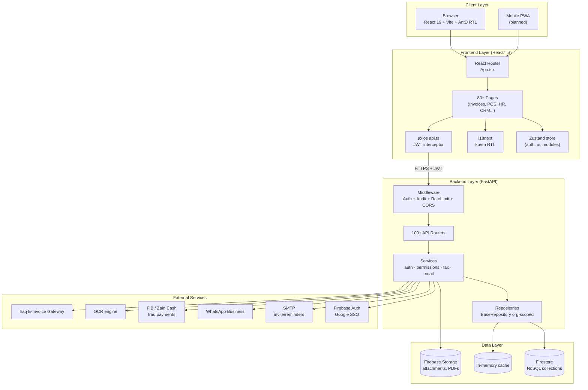

---

## 2. Authentication & Onboarding Flow

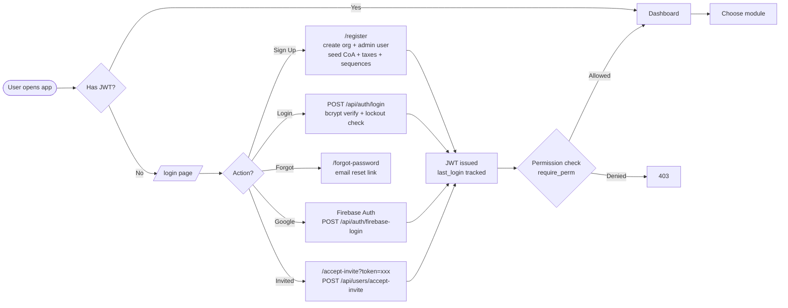

---

## 3. Core Module Map (Domains)

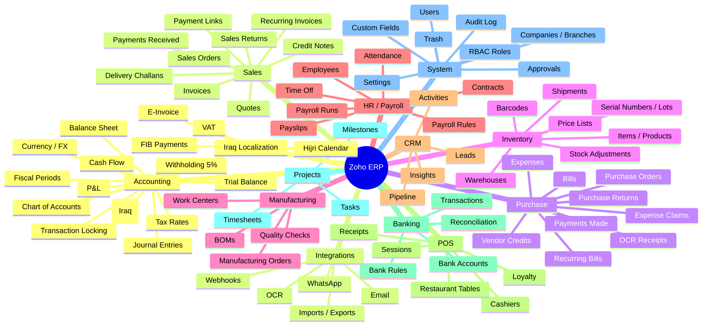

---

## 4. Sales-to-Cash Flow (Quote-to-Payment)

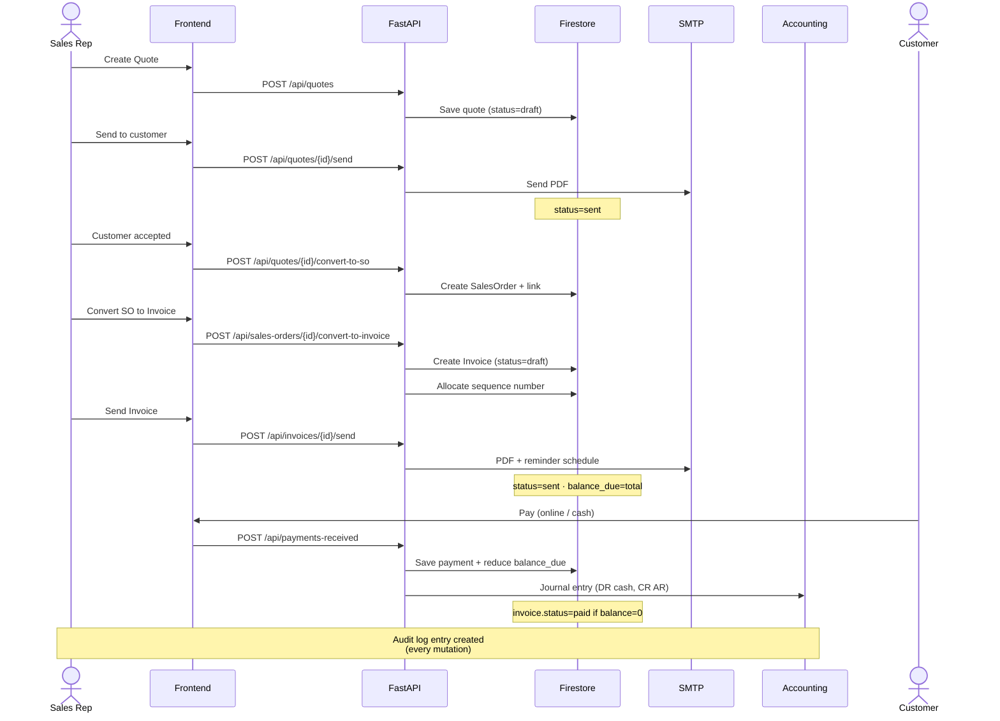

---

## 5. Procure-to-Pay Flow (PO → Bill → Payment)

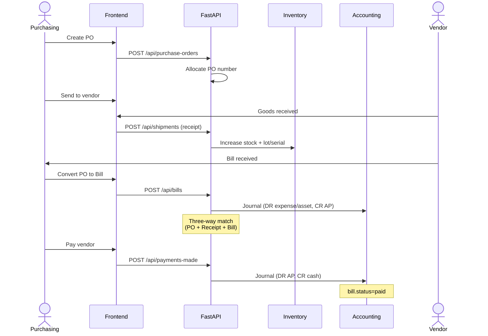

---

## 6. RBAC + Audit Logging

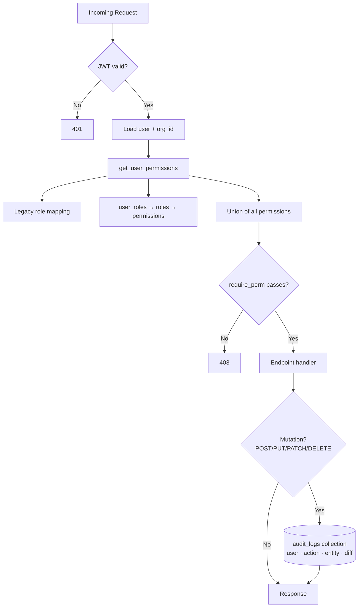

---

## 7. POS Session Lifecycle

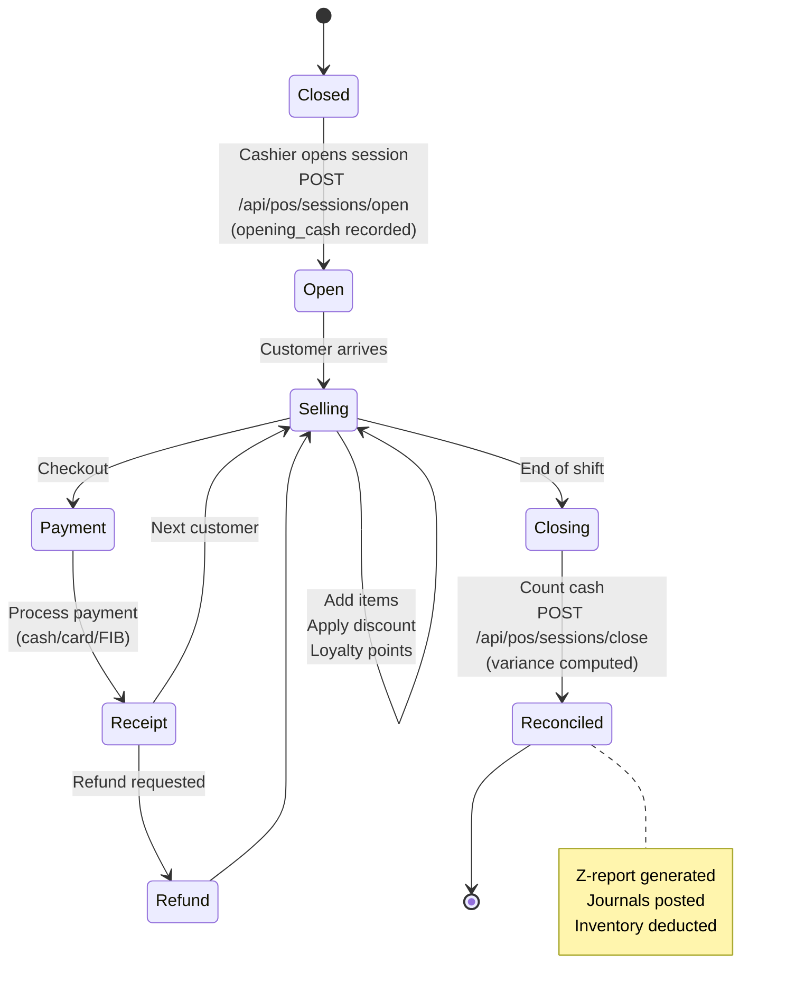

---

## 8. Inventory & Stock Movement

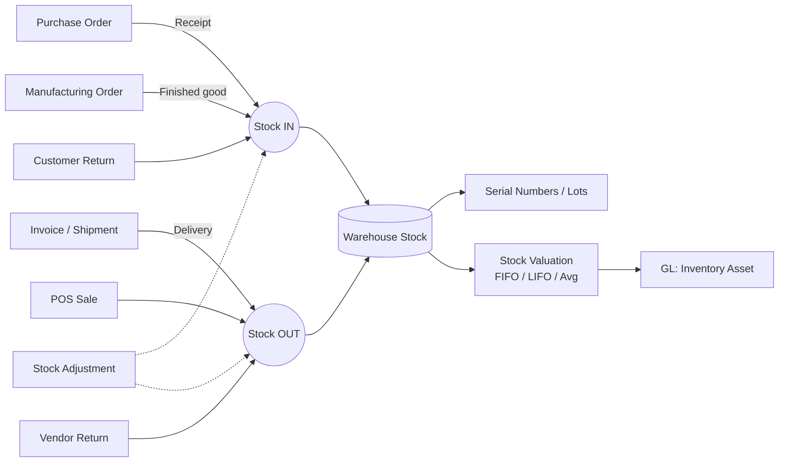

---

## 9. Iraq Localization — Withholding & E-Invoice

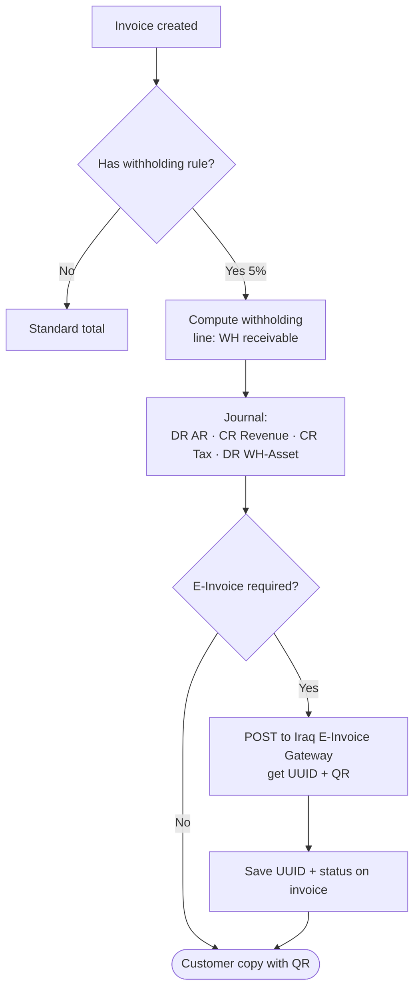

---

## 10. Frontend Page Tree (Top Routes)

```mermaid
flowchart LR
    APP[App.tsx] --> PUB[Public Routes]
    APP --> PROT[Protected /]
    PUB --> LOGIN[/login]
    PUB --> SIGN[/signup]
    PUB --> FORG[/forgot-password]
    PUB --> RES[/reset-password]
    PUB --> INV[/accept-invite]
    PROT --> AppLayout
    AppLayout --> SIDEBAR[Sidebar nav<br/>navigation.tsx]
    AppLayout --> TOPBAR[Topbar + Search]
    AppLayout --> OUTLET[Outlet]
    OUTLET --> DASH[Dashboard]
    OUTLET --> SALES_G[Sales group<br/>Quotes/SO/Invoices/Recurring/Credits]
    OUTLET --> PURCH_G[Purchase group<br/>PO/Bills/VC/Expenses]
    OUTLET --> ITEMS_G[Items + Price Lists + Inventory + Warehouses]
    OUTLET --> BANK_G[Banking + Reconciliation + Rules]
    OUTLET --> ACCT_G[Accounts + Journals + Taxes]
    OUTLET --> REP_G[Reports + Advanced + Consolidated]
    OUTLET --> POS_G[POS Sessions + POS Sale]
    OUTLET --> HR_G[HR Dashboard + Employees + Attendance + Payroll]
    OUTLET --> CRM_G[Pipeline + Leads + Activities + Insights]
    OUTLET --> MFG_G[BOMs + Orders + Work Centers]
    OUTLET --> SETUP_G[Users + Roles + Branches + CustomFields + Settings]
    OUTLET --> IRAQ[Iraq Localization + E-Invoice + Tax Returns]
```

---

## 11. Data Model Relationships (Top Entities)

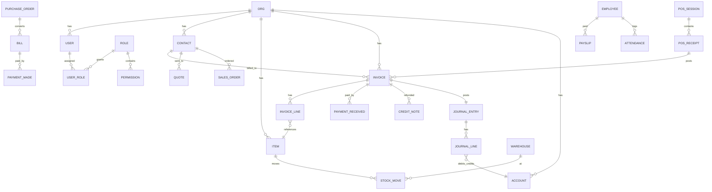

---

## 12. End-to-End Lifecycle (One-page summary)

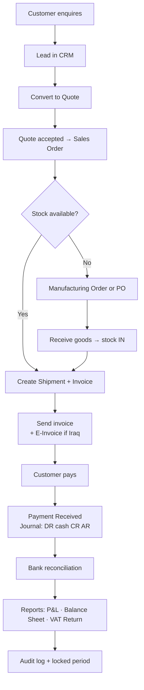

---

## Notes
- هەموو endpoint ـەکان ـ`org_id`-scoped لەسەر JWT.
- BaseRepository pattern لە Python filtering دەکات (نا composite indexes).
- Audit middleware خۆکار log دەکات بۆ هەموو POST/PUT/PATCH/DELETE.
- RBAC: `user_roles → roles → permissions` + legacy `user.role` fallback.
- بۆ پلانی فراوانتر، بڕوانە `MASTER_PLAN.md` و `ERP_MASTER_PLAN.md`.
